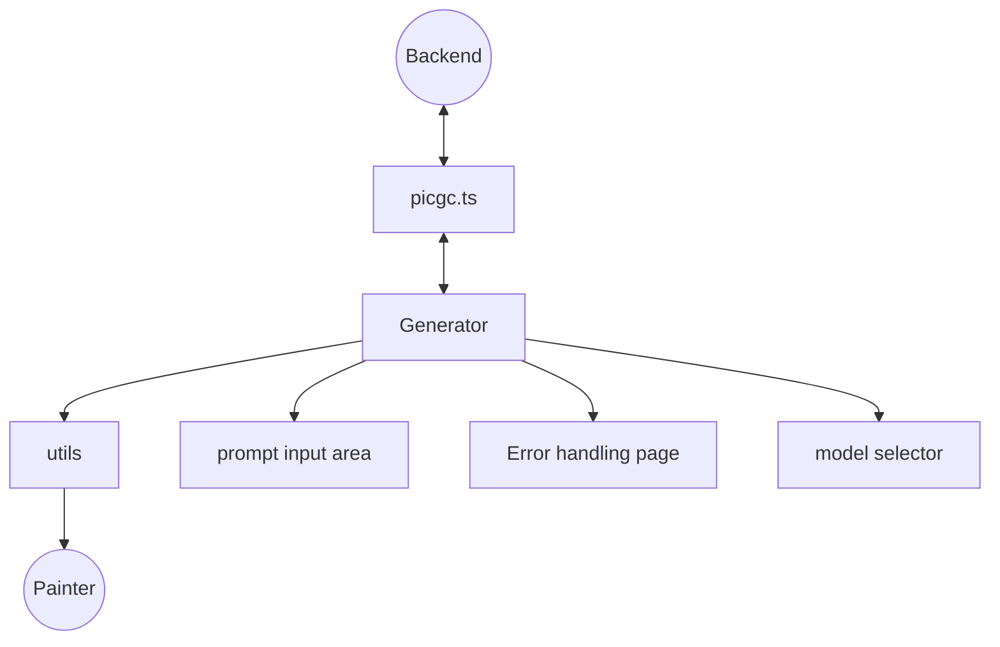

# AIGC Architecture Design
## I. Generator
The generator is the core component of the AIGC module, responsible for rendering the entire AI generation interface. It also invokes encapsulated APIs to initiate interactions with the backend and manages the logic of AI content generation. Error handling is implemented through a try-catch block that triggers the error-handling logic defined in error.vue.
## II. error.vue – Error Handling Page
The error component provides an error-handling interface for the generator. By invoking its functions and passing parameters, the generator can display the appropriate error page and present the user with corresponding error messages.
## III. modelSelector – Model Selector
The model selector is primarily a dropdown menu component. It allows users to choose styles and other presets, which are then passed as parameters to the backend through the generator.
## IV. Prompt Organization Area
This section lets users choose how to input prompts and complete the prompt-entry process:
1.	Preset prompts – Provides a “fill-in-the-blank” style interaction. Once completed by the user, the prompt is concatenated into a full string and sent to the generator for requests.
2.	Free-form prompt input – Users can directly enter custom prompts.
## V. src/apis/picgc.ts – API Layer
This module encapsulates all backend AI interaction requests and exposes them for use by the generator.
* Architecture Diagram

