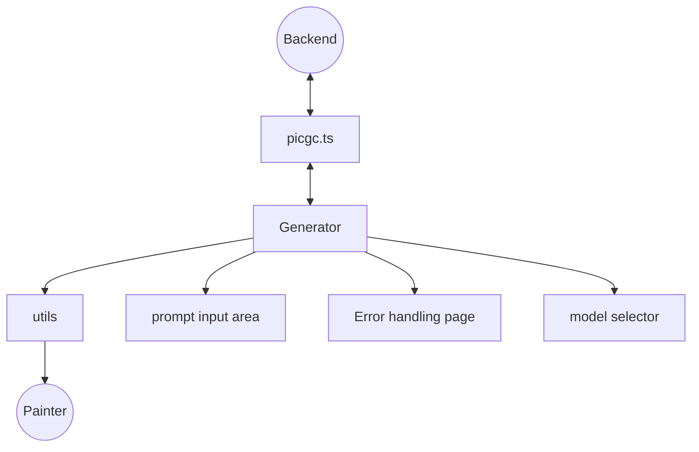

# AIGC架构设计
## 一、generator生成器
生成器是aigc部分的主组件，负责整个ai生成组件的渲染。同时，负责调用封装好的接口，发起与后端的交互。并处理AI生成的相关逻辑。错误处理部分，则通过try-catch调用error.vue中的错误处理逻辑。
## 二、error.vue 错误处理页面
error作为错误处理组件，提供接口函数给generator使用。通过调用和参数传递，呼出相应的错误页面，给用户提供相应的错误信息。
## 三、modelSelector 模型选择器
主要是一个下拉菜单组件。给用户提供风格等预设，作为发后端的接口参数给generator使用。
## 四、prompt组织区域
此区域用于给用户选择提示词输入方式，并完成提示词输入流程。
1.预设提示词：提供类似“完形填空”的效果。将用户填写完的prompt拼成整个字符串给generator发请求用
2.自由输入提示词
## 五、src/apis/picgc.ts api层
将与后端ai交互的请求封装，供给generator使用
* 架构设计图

