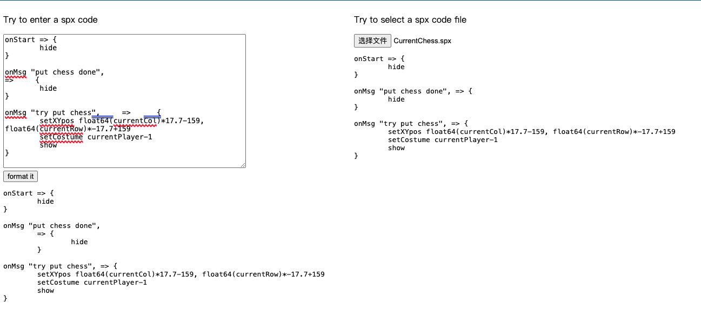

<!--
 * @Author: Zhang Zhi Yang
 * @Date: 2024-01-18 14:53:19
 * @LastEditors: Zhang Zhi Yang
 * @LastEditTime: 2024-01-18 15:16:45
 * @FilePath: /offlineFmt/README.MD
 * @Description: 
-->
# Offline SPX Format
## Introduction
This project allows users to format text content offline by uploading files or typing spx code to get formatting results or error results.
index.html is as follows:


## Features
* Format Code：Users can format spx code offline.
* Error prompt：When the spx code is wrong, the error prompt will be displayed

## How to Installation and Running
**mac user**
```bash
sh ./build.sh
```
windows
```bash
./build.sh
```
Then deploy the static directory in the server environment