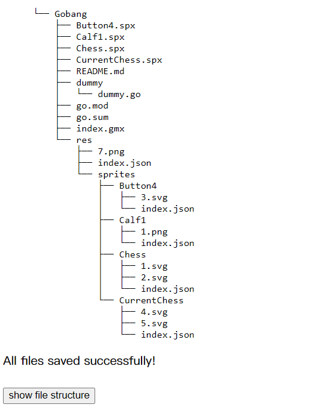
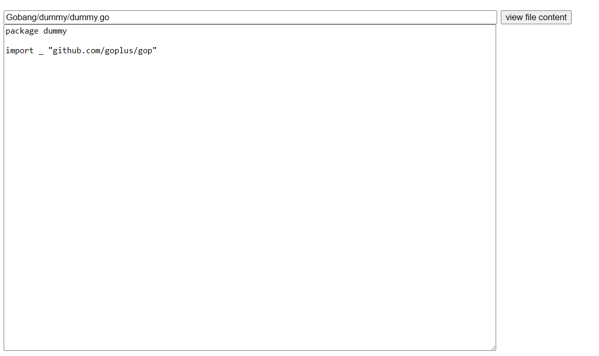

# Offline SPX Project

## Introduction

This project allows users to compile SPX projects offline by uploading folders and then run and view them on the Web.
Users can upload the entire project folder, view the file structure and content, and run the project directly in the
browser.

index.html is as follows:


## Features

- Folder Upload: Users can upload the entire SPX project folder.
- File Structure Viewing: After uploading, users can browse the tree structure of the folder.
- File Content Viewing: Users can view the content of each file uploaded.
- Online Execution: Users can run the SPX project in the web browser and view the results.

## How to Use

### Folder Upload


- Click the "Select Folder" button.
- Choose your SPX project folder and upload it.

### View File Structure and Content

- After a successful upload, the file structure will be displayed on the page in a tree format.

  
- Enter the file's project path (starting with the project name) to view the content in the respective area.

  

### Run Project Online


- Ensure that your project files include all necessary files for execution.
- Input the project name
- Click the "play project" button to start the project in the browser.
- The execution results will be displayed in the designated output area.

## Installation and Running

```sh
./build.sh
cp $GOROOT/misc/wasm/wasm_exec.js ./
```

run http server