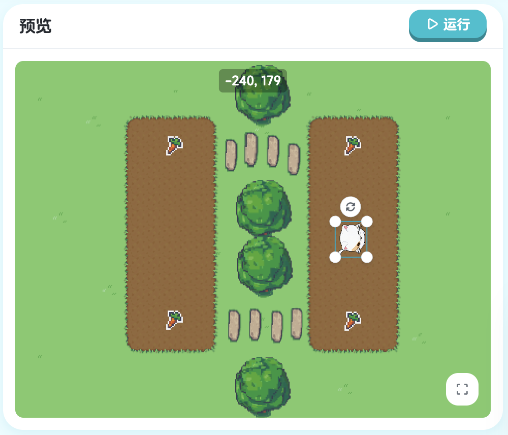

# XBuilder游戏编程教材

## 第一章：初步 - 基础动作

在这一章中，我们将学习最基本的精灵动作：转向和步进。

### 1.1 第一个程序

让我们从最简单的开始。点击"运行"按钮，看看会发生什么：

- onStart: 


> 课程地址：https://x.qiniu.com/editor/curator/Coding-Course-1/sprites/Kiko/code

```xgo
onStart => {
    step 160
}
```

这段代码让精灵向前走160步。

### 1.2 修改步数

现在试试修改步数参数，比如改成200：

> 课程地址：https://x.qiniu.com/editor/curator/Coding-Course-2/sprites/Kiko/code

```xgo
onStart => {
    step 160
}
```

修改为：

```xgo
onStart => {
    step 200
}
```

### 1.3 转向与步进

当精灵没有朝向萝卜时，需要先转向，并修改步数参数，为160：

> 课程地址：https://x.qiniu.com/editor/curator/Coding-Course-3/sprites/Kiko/code

```xgo
onStart => {
    turn Right
	step 120
}
```

修改为：

```xgo
onStart => {
    turn Right
	step 160
}
```

### 1.4 使用转向绕过障碍

当遇到障碍物时，我们可以通过转向来绕过，以下例子，需要再添加向左，并向前走 160 步：


> 课程地址：https://x.qiniu.com/editor/curator/Coding-Course-4/sprites/Kiko/code

```xgo
onStart => {
	turn Right
	step 190
}
```

修改为：

```xgo
onStart => {
	turn Right
	step 190
    turn Left
    step 160
}
```

### 1.5 使用数字作为参数转向

除了使用方向常量，我们也可以用数字表示角度，以下例子，需要将 -30 改为 -45：


> 课程地址：https://x.qiniu.com/editor/curator/Coding-Course-6/sprites/Kiko/code

```xgo
onStart => {
	turn -30
	step 300
}
```

修改为：

```xgo
onStart => {
	turn -45
	step 300
}
```

### 1.6 更复杂的路径

现在让我们创建一个更复杂的移动路径：


> 课程地址：https://x.qiniu.com/editor/curator/Coding-Course-7/sprites/Kiko/code

```xgo
onStart => {
    turn Right
    step 180
    turn Left
    step 200
    turn Left
    step 180
}
```

## 第二章：对象 - 与游戏对象交互

在这一章中，我们将学习如何与游戏中的其他对象进行交互。

### 2.1 转向对象

使用 `turnTo` 可以让精灵面向指定的对象：


> 课程地址：https://x.qiniu.com/editor/curator/Coding-Course-8/sprites/Kiko/code

```xgo
onStart => {
	turnTo 萝卜
	step 200
}
```

### 2.2 理解对象交互

`turnTo` 让精灵转向目标对象，`stepTo` 让精灵走向目标对象。这比手动计算角度和距离要简单得多。以下例子，需要在 stepTo 前，增加 turnTo 转向 


> 课程地址：https://x.qiniu.com/editor/curator/Coding-Course-10/sprites/Kiko/code

```xgo
onStart => {
	stepTo 萝卜
}
```

修改为：

```xgo
onStart => {
    turnTo 萝卜
	stepTo 萝卜
}
```

### 2.3 更复杂的路径

通过组合多个 `turnTo`，`stepTo` 让精灵走向多个目标对象。


> 课程地址：https://x.qiniu.com/editor/curator/Coding-Course-11/sprites/Kiko/code

```
onStart => {
	turnTo 萝卜1
	stepTo 萝卜1
}
```

修改为：

```
onStart => {
	turnTo 萝卜1
	stepTo 萝卜1

    turnTo 萝卜2
	stepTo 萝卜2

    turnTo 萝卜3
	stepTo 萝卜3
}
```

## 第三章：循环 - 重复执行代码

循环让我们可以重复执行相同的代码，避免写重复的语句。

### 3.1 基础循环

使用 `repeat` 可以重复执行代码块：


> 课程地址：https://x.qiniu.com/editor/curator/Coding-Course-15/sprites/Kiko/code

```xgo
onStart => {
	repeat 5, => {
		turn -60
		step 100
	}
}
```

### 3.3 带停止条件的循环

我们可以在循环中使用条件判断，xpos 代表精灵的 x 轴坐标：


> 课程地址：https://x.qiniu.com/editor/curator/Coding-Course-28/sprites/Kiko/code

```xgo
onStart => {
	repeatUntil xpos > 80, => {
		step 10
	}
}
```

## 第四章：变量 - 存储和使用数据

变量就像是一个盒子，可以存储数据供我们使用。

### 4.1 定义和使用变量


> 课程地址：https://x.qiniu.com/editor/curator/Coding-Course-19/sprites/Kiko/code

```xgo
onStart => {
	var x float64 = 100
	step x
}
```

需求改为：

```xgo
onStart => {
	var x float64 = 160
	step x
}
```

### 4.2 在循环中修改变量

变量的值可以在程序运行过程中改变：


> 课程地址：https://x.qiniu.com/editor/curator/Coding-Course-25/sprites/Kiko/code

```xgo
onStart => {
    var x float64 = 145

    repeat 3, => {
        turn Right
        step x
        step -x
        turn Left
        step 161
        x = x + 10
    }
}
```

需求改为：

onStart => {
    var x float64 = 145

    repeat 3, => {
        turn Right
        step x
        step -x
        turn Left
        step 161
        x = x + 70
    }
}

每次循环，`x` 的值都会增加70，使得步数逐渐增大。

## 第五章：函数调用 - 使用内置功能

XBuilder提供了许多内置函数来帮助我们编写游戏。命令与函数区别：
- 命令：参数可以使用括号括起来，也可以不需要，默认不需要
- 函数：参数必须使用括号括起来。

### 5.1 距离计算

使用 `distanceTo` 函数可以计算到目标对象的距离：


> 课程地址：https://x.qiniu.com/project/curator/Coding-Course-30-1

```xgo
onStart => {
    var n = distanceTo(萝卜)
    step n
}
```

### 5.2 随机数生成

使用 `rand` 函数可以生成随机数：


> 课程地址：https://x.qiniu.com/project/curator/Coding-Course-30-2

```xgo
onStart => {
    var x = rand(10, 20)
    step x
    var n = distanceTo(萝卜1)
    step n
}
```

## 第六章：数组 - 管理多个对象

数组让我们可以存储和管理多个相似的对象。

### 6.1 通过索引访问元素

有三个萝卜，但萝卜2没有成熟，不能采摘，所以需要通过索引访问萝卜1和萝卜3.


> 课程地址：https://x.qiniu.com/editor/curator/Coding-Course-30-3/sprites/Kiko/code

```xgo
onStart => {
    var radishs = ["萝卜", "萝卜2", "萝卜3"] // 萝卜2 没成熟不能采摘
    turnTo radishs[0]
    stepTo radishs[0]

    turnTo radishs[2]
    stepTo radishs[2]
}
```

数组的索引从0开始，`radishs[0]` 表示第一个元素，`radishs[2]` 表示第三个元素。

### 6.2 遍历数组

### 3.2 遍历对象列表

使用 `for...in` 可以遍历数组：


> 课程地址：https://x.qiniu.com/editor/curator/Coding-Course-18/sprites/Kiko/code

```xgo
onStart => {
    for v in ["萝卜1", "萝卜2", "萝卜3"] {
        turnTo v
        stepTo v
    }
}
```

## 第七章：条件 - 根据情况做决定

条件语句让程序可以根据不同情况执行不同的代码。

### 7.1 简单条件


> 课程地址：https://x.qiniu.com/editor/curator/Coding-Course-31/sprites/Kiko/code

```xgo
onStart => {
    if 萝卜1.IsMature() {
        turnTo 萝卜1
        stepTo 萝卜1
    }
}
```
 
### 7.2 条件与循环结合


> 课程地址：https://x.qiniu.com/editor/curator/Coding-Course-32/sprites/Kiko/code

```xgo
onStart => {
    var radishs []Radish = [萝卜1, 萝卜2, 萝卜3]
    for v in radishs {
        if v.IsMature() {
            turnTo v
            stepTo v
        }
    }
}
```

### 7.3 复杂条件处理


> 课程地址：https://x.qiniu.com/editor/curator/Coding-Course-35/sprites/Kiko/code

```xgo
onStart => {
    var radishs []Radish = [萝卜1, 萝卜2, 萝卜3]
    for v in radishs {
        if v.IsMature() {
            turnTo v
            stepTo v
        } else {
            turnTo v
            step distanceTo(v)-20
            v.Water()
            animateAndWait "浇花"
        }
    }

    for v in radishs {
        waitUntil v.IsMature()
        turnTo v
        stepTo v
    }
}
```

## 第八章：事件 - 响应用户操作

事件让我们的游戏可以响应用户的操作。

### 8.1 键盘事件


> 课程地址：https://x.qiniu.com/editor/curator/Coding-Course-41/sprites/Kiko/code

```xgo
onKey KeyRight, => {
    step 10
}
```

### 8.2 方向控制


> 课程地址：https://x.qiniu.com/editor/curator/Coding-Course-42/sprites/Kiko/code

```xgo
onKey KeyRight, => {
    setHeading Right
    step 20
}

onKey KeyLeft, => {
    setHeading Left
    step 20
}
```

### 8.3 完整的方向控制


> 课程地址：https://x.qiniu.com/editor/curator/Coding-Course-43/sprites/Kiko/code

```xgo
onKey KeyRight, => {
    if heading != Right {
        setHeading Right
    }
    step 20
}

onKey KeyLeft, => {
    if heading != Left {
        setHeading Left
    }
    step 20
}

onKey KeyUp, => {
    if heading != Up {
        setHeading Up
    }
    step 20
}

onKey KeyDown, => {
    if heading != Down {
        setHeading Down
    }
    step 20
}
```

### 8.4 WASD控制和点击事件

通过 WSAD 控制方向，点击农场，可以种植萝卜。


> 课程地址：https://x.qiniu.com/editor/curator/Coding-Course-44/sprites/Kiko/code

```xgo
var (
    radishs []Radish
)

onKey KeyD, => {
    if heading != Right {
        setHeading Right
    }
    step 20
}

onKey KeyA, => {
    if heading != Left {
        setHeading Left
    }
    step 20
}

onKey KeyW, => {
    if heading != Up {
        setHeading Up
    }
    step 20
}

onKey KeyS, => {
    if heading != Down {
        setHeading Down
    }
    step 20
}

farm.onClick => {
    rad, ok := farm.findPlot()
    if ok {
        turnTo rad
        step distanceTo(rad)-20
        rad.show
        radishs = append(radishs, rad)

        rad.onClick => {
            if !rad.IsMature() {
                turnTo rad
                step distanceTo(rad)-20
                rad.Water()
                animateAndWait "浇水"
                animate "默认", true
            }
        }
    }
}
```

## 第九章：跨文件编程 - 多个精灵协同工作

在复杂的游戏中，我们需要多个精灵协同工作。

### 9.1 精灵文件结构


> 课程地址：https://x.qiniu.com/editor/curator/Coding-Course-47/sprites/Kiko/code

- Kiko精灵：
```xgo
onKey KeyD, => {
	if followRole == name {
		if heading != Right {
			setHeading Right
		}
		step 20
	}
}

onKey KeyA, => {
	if followRole == name {
		if heading != Left {
			setHeading Left
		}
		step 20
	}
}

onKey KeyW, => {
	if followRole == name {
		if heading != Up {
			setHeading Up
		}
		step 20
	}
}

onKey KeyS, => {
	if followRole == name {
		if heading != Down {
			setHeading Down
		}
		step 20
	}
}

onClick => {
	followRole = name
}
```

点击 Jenny精灵, 代码编辑器切换到 Jenny 精灵的代码，所有事件都将被绑定到 Jenny 下
- Jenny精灵：
```xgo
onKey KeyD, => {
	if followRole == name {
		if heading != Right {
			setHeading Right
		}
		step 20
	}
}

onKey KeyA, => {
	if followRole == name {
		if heading != Left {
			setHeading Left
		}
		step 20
	}
}

onKey KeyW, => {
	if followRole == name {
		if heading != Up {
			setHeading Up
		}
		step 20
	}
}

onKey KeyS, => {
	if followRole == name {
		if heading != Down {
			setHeading Down
		}
		step 20
	}
}

onClick => {
	followRole = name
}

```

公用的，全局性质的，比如全局变量，需要定义到舞台中，点击舞台，可以切换到舞台代码

**舞台** - 主程序：
```xgo
var (
	followRole string
)
```

## 第十章：函数定义与调用 - 组织代码

函数让我们可以将代码组织成可重用的模块。

### 10.1 定义函数

```xgo
func plant(x float64, y float64) Radish {
    rad := farm.PlantRadish(x, y)
    turnTo rad
    step distanceTo(rad)-20
    rad.show
    return rad
}

func water(rad Radish) {
    turnTo rad
    step distanceTo(rad)-20
    rad.Water()
    animateAndWait "浇水"
    animate "默认", true
}

func harvest(rad Radish) {
    turnTo rad
    stepTo rad
}
```

### 10.2 使用函数

```xgo
onStart => {
    x := 100
    y := 200
    rad := plant(x, y)
    water(rad)

    waitUntil rad.IsMature()
    harvest(rad)
}
```

### 10.3 多角色公用函数

```xgo
onStart => {
    var radishs []Radish = [萝卜1, 萝卜2, 萝卜3]
    for v in radishs {
        if !v.IsMature() {
            water(v)
        }
    }

    for v in radishs {
        waitUntil v.IsMature()
        harvest(v)
    }
}
```

