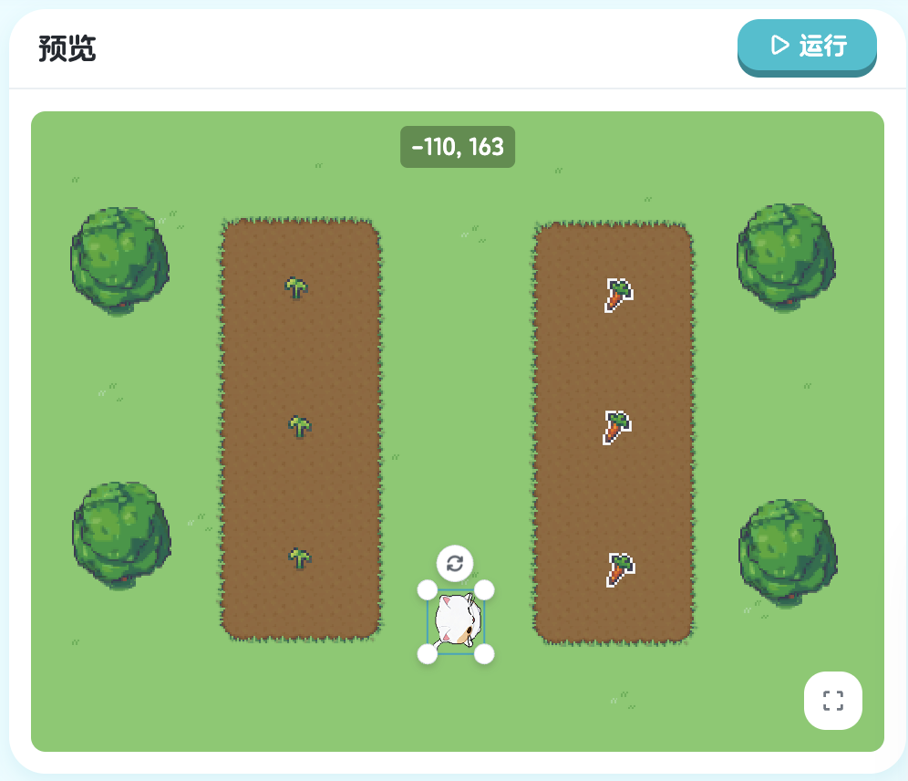
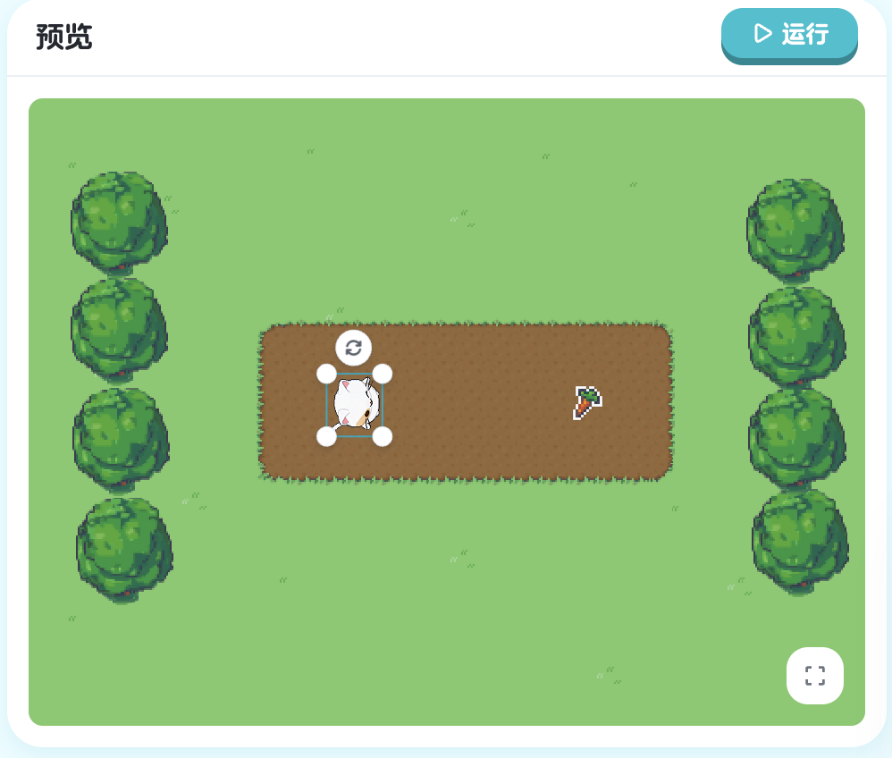
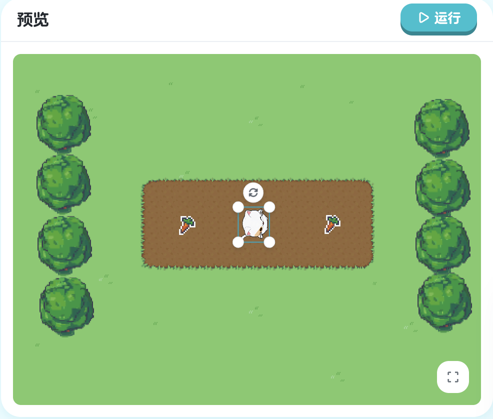
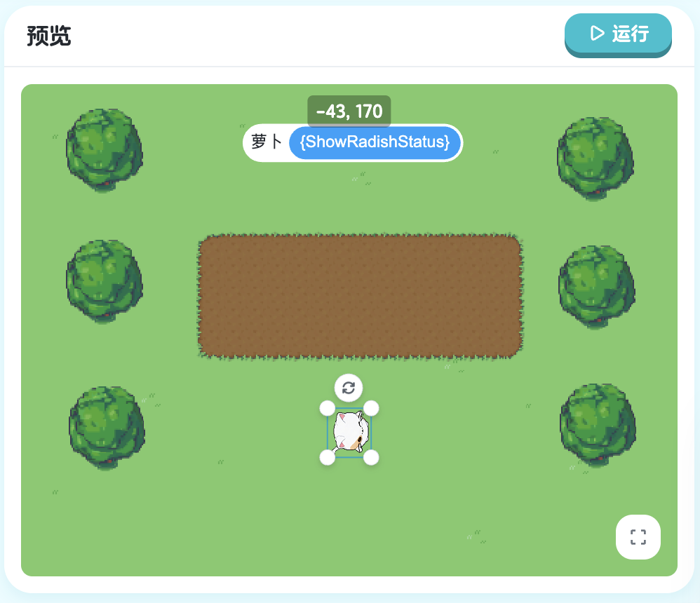

# XBuilder游戏编程教材

## 目录

<!-- TOC -->
- [目录](#目录)
- [前言](#前言)
- [第一章：初步 - 基础动作](#第一章初步---基础动作)
  - [1.1 第一个程序](#11-第一个程序)
  - [1.2 修改步数](#12-修改步数)
  - [1.3 转向与步进](#13-转向与步进)
  - [1.4 使用转向绕过障碍](#14-使用转向绕过障碍)
  - [1.5 使用数字作为参数转向](#15-使用数字作为参数转向)
  - [1.6 更复杂的路径](#16-更复杂的路径)
- [第二章：对象 - 与游戏对象交互](#第二章对象---与游戏对象交互)
  - [2.1 转向对象](#21-转向对象)
  - [2.2 朝对象步进](#22-朝对象步进)
  - [2.3 更复杂的路径](#23-更复杂的路径)
  - [2.4 基于对象的转向与步进](#24-基于对象的转向与步进)
- [第三章：循环 - 重复执行代码](#第三章循环---重复执行代码)
  - [3.1 基础循环](#31-基础循环)
  - [3.2 带停止条件的循环](#32-带停止条件的循环)
  - [3.3 无循环体的条件等待](#33-无循环体的条件等待)
- [第四章：变量 - 存储和使用数据](#第四章变量---存储和使用数据)
  - [4.1 定义和使用变量](#41-定义和使用变量)
  - [4.2 定义循环次数变量](#42-定义循环次数变量)
  - [4.3 定义循环体变量](#43-定义循环体变量)
  - [4.4 在循环中修改变量](#44-在循环中修改变量)
- [综合1：往期章节综合练习](#综合1往期章节综合练习)
  - [综合1：综合练习1](#综合1综合练习1)
  - [综合1：综合练习2](#综合1综合练习2)
- [第五章：函数调用 - 使用内置功能](#第五章函数调用---使用内置功能)
  - [5.1 距离计算](#51-距离计算)
  - [5.2 随机数生成](#52-随机数生成)
- [第六章：数组 - 管理多个对象](#第六章数组---管理多个对象)
  - [6.1 通过索引访问元素](#61-通过索引访问元素)
  - [6.2 遍历数组](#62-遍历数组)
- [第七章：条件 - 根据情况做决定](#第七章条件---根据情况做决定)
  - [7.1 简单条件](#71-简单条件)
  - [7.2 条件与循环结合](#72-条件与循环结合)
  - [7.3 复杂条件处理](#73-复杂条件处理)
- [综合2：往期章节综合练习](#综合2往期章节综合练习)
  - [综合2：综合练习1](#综合2综合练习1)
  - [综合2：综合练习2](#综合2综合练习2)
  - [综合2：综合练习3](#综合2综合练习3)
  - [综合2：综合练习4](#综合2综合练习4)
- [第八章：事件 - 响应用户操作](#第八章事件---响应用户操作)
  - [8.1 键盘事件](#81-键盘事件)
  - [8.2 方向控制](#82-方向控制)
  - [8.3 完整的方向控制](#83-完整的方向控制)
  - [8.4 方向控制和点击事件](#84-方向控制和点击事件)
- [第九章：跨文件编程 - 多个精灵协同工作](#第九章跨文件编程---多个精灵协同工作)
  - [9.1 精灵文件结构](#91-精灵文件结构)
  - [9.2 跨文件通信：broadcast \& onMsg](#92-跨文件通信broadcast--onmsg)
- [第十章：函数定义与调用 - 组织代码](#第十章函数定义与调用---组织代码)
  - [10.1 定义函数与调用](#101-定义函数与调用)
  - [10.2 多角色公用函数](#102-多角色公用函数)
- [综合3：最终大型游戏](#综合3最终大型游戏)
  - [综合3：最终大型游戏1](#综合3最终大型游戏1)

---

## 前言

#### 欢迎来到编程的奇妙世界！

亲爱的同学们：

你好！欢迎来到 XBuilder 的编程世界。

你是否想过，那些好玩的游戏是怎么做出来的？那些会动的角色、有趣的关卡、炫酷的特效，其实都是通过编程创造出来的。现在，你也可以成为游戏的创造者！

#### 这本教材会教你什么？

在这本教材中，你将通过十个章节循序渐进地学习编程：

**第一章：基础动作** - 让角色动起来，学会控制角色的移动和转向

**第二章：对象交互** - 让角色与游戏中的其他对象互动

**第三章：循环** - 让代码自动重复执行，避免重复编写相同的代码

**第四章：变量** - 学会存储和使用数据，让游戏记住重要信息

**第五章：函数调用** - 使用系统提供的强大功能，如计算距离、生成随机数

**第六章：数组** - 同时管理多个对象，让游戏更丰富

**第七章：条件判断** - 让程序根据不同情况做出不同决定

**第八章：事件响应** - 让游戏响应键盘、鼠标等用户操作

**第九章：多精灵协同** - 让多个游戏角色相互配合工作

**第十章：函数定义** - 学会组织代码，创建自己的功能模块

每个章节都配有实践练习，还有三次综合练习帮你巩固所学知识。

更重要的是，你将学会**像程序员一样思考** - 把复杂的问题分解成简单的步骤，用逻辑的方式解决问题。这种思维方式不仅在编程中有用，在学习和生活中也会帮助你。

#### 这本教材有什么特别？

**从游戏开始学习** - 我们不会让你背诵枯燥的语法规则。每一课都从一个有趣的游戏场景开始，在解决实际问题的过程中自然地学会编程。

**循序渐进** - 从最简单的"让角色移动"开始，逐步学习更复杂的功能。每一步都建立在前面学过的知识之上，就像搭积木一样。

**边做边学** - 每一课都有实践项目和课后练习，你可以立即动手尝试。我们相信，做出来的知识才是真正属于你的。

**发挥创造力** - 教材会给你基础知识和示例，但我们鼓励你在此基础上添加自己的想法，创造独一无二的游戏。

#### 开始之前你需要知道的

**零基础也没关系** - 这本教材是为完全没有编程经验的同学设计的。如果这是你第一次接触编程，恭喜你选对了起点！

**不要害怕出错** - 编程过程中出现错误是完全正常的，甚至专业程序员每天都会遇到错误。重要的是学会找到问题、解决问题。每一个错误都是学习的机会。

**保持好奇心** - 当你学会一个新功能时，试着想想"我还能用它做什么？"多尝试、多探索，你会发现编程的乐趣远超你的想象。

**完成练习很重要** - 每个章节都有课后练习，这些练习能帮助你巩固所学知识。不要跳过它们，动手做完练习，你会发现自己进步飞快。

**寻求帮助** - 遇到困难时，可以向老师、同学请教，也可以查看教材中的提示和示例。学会寻求帮助也是一项重要的能力。

#### 给家长和老师的话

XBuilder 基于 spx 游戏引擎和 XGo 编程语言开发，采用类 Scratch 的可视化界面，降低了编程入门的门槛。同时，它使用真实的编程语言语法，帮助孩子建立扎实的编程基础，为未来学习更高级的编程语言做好准备。

本教材强调"做中学"的理念，每个概念都通过实际的游戏项目来教授。课程共分十个章节，从基础的角色控制到复杂的多精灵协同，知识点螺旋式上升。每个章节都配有课后练习，并设置了三次综合练习帮助学生整合所学知识。

我们建议：
- 给孩子充足的时间动手实践
- 鼓励孩子完成每一个课后练习
- 关注孩子的思维过程而不仅是结果
- 让学习保持轻松愉快的氛围

#### 准备好了吗？

现在，打开 XBuilder，让我们开始这段激动人心的编程之旅吧！

记住：每一个伟大的程序员都是从第一行代码开始的。你的第一行代码，就在下一页。

让我们开始创造吧！

## 第一章：初步 - 基础动作

在这一章中，我们将学习最基本的精灵动作：转向和步进。就像你学习走路一样，我们的游戏角色也需要学会如何移动。掌握了这些基础动作，你就能让角色在游戏世界中自由行动了！

### 1.1 第一个程序

**让角色动起来！**

让我们从最简单的开始。想象一下，你站在操场上，有人对你说"向前走160步"，你会怎么做？对，就是一直往前走！现在，我们要让游戏中的角色 Kiko 做同样的事情。

点击"运行"按钮，看看会发生什么：


> 课程地址：https://x.qiniu.com/editor/curator/Coding-Course-1/sprites/Kiko/code

```xgo
onStart => {
    step 160
}
```

**命令解释：**

#### 代码详解

**onStart 是什么？**

`onStart` 是一个特殊的**事件处理器**（Event Handler）。你可以把它想象成游戏的"发令枪"：
- 当你点击"运行"按钮时，游戏就开始了
- `onStart` 后面大括号 `{}` 里的代码会**立即执行**
- 这就像老师说"开始！"之后，你才开始答题一样

**step 命令详解**

`step 160` 是我们的第一个动作命令：
- `step` 的意思是"步进"或"前进"
- `160` 是前进的距离（步数）
- 这行代码的完整意思是：**让 Kiko 向前走 160 步**

#### 运行效果

当你点击运行后，你会看到：
1. Kiko 从起始位置开始移动
2. 它会一直向左前进
3. 移动 160 步后停下来

就这么简单！你已经写出了第一个程序，让角色动起来了！

#### ✨ 小贴士

- 在编程中，我们用 `//` 来写**注释**（Comment），注释是给人看的说明，程序运行时会忽略它
- 每个命令后面都要有正确的参数，比如 `step` 后面要跟一个数字
- 大括号 `{}` 必须成对出现，就像括号一样

#### 📝 本节重点

| 概念 | 说明 | 示例 |
|------|------|------|
| `onStart` | 游戏开始时执行 | `onStart => { ... }` |
| `step` | 让角色前进指定步数 | `step 160` |
| 参数 | 命令后面的数字，控制命令的行为 | `160` 就是 step 的参数 |

恭喜你！你已经迈出了编程的第一步。在下一节中，我们将学习如何修改这些参数，让角色做出更多有趣的动作。

---

**下一节预告**：我们将学习如何通过修改步数，让 Kiko 走到不同的位置。准备好了吗？让我们继续前进！

### 1.2 修改步数

#### 学习目标

在上一节中，我们让 Kiko 走了 160 步。但是，如果我们想让它走到不同的位置怎么办？这就需要修改步数参数了！在这一节，你将学会如何通过改变数字来精确控制角色的移动距离。

#### 挑战任务

看看下面的游戏画面，Kiko 需要走到萝卜的位置。160 步好像不太够，我们需要让它走得更远一些！


> 课程地址：https://x.qiniu.com/editor/curator/Coding-Course-2/sprites/Kiko/code

**原来的代码：**
```xgo
onStart => {
    step 160
}
```

**修改后的代码：**
```xgo
onStart => {
    step 200
}
```

#### 📖 代码详解

**什么是参数？**

在 `step 200` 中，`200` 就是一个**参数**（Parameter）。你可以把参数想象成：
- 游戏手柄上的数值调节器
- 音量控制的旋钮
- 一把可以调节长度的尺子

通过改变参数，同一个命令可以产生不同的效果！

**step 命令的参数规则**

`step` 命令后面的数字表示移动的距离：
- 数字**越大**，角色走得**越远**
- 数字**越小**，角色走得**越近**
- 数字可以是任意正整数，比如 1、50、100、500 等

#### 🎯 运行效果对比

让我们来看看不同参数的效果：

| 代码 | 效果 | 说明 |
|------|------|------|
| `step 160` | Kiko 走 160 步 | 原来的距离，可能到不了萝卜 |
| `step 200` | Kiko 走 200 步 | 走得更远，正好能到达萝卜！ |

当你把参数从 160 改成 200 后：
1. Kiko 会从起点出发
2. 向右前进 200 步（比之前多走 40 步）
3. 正好到达萝卜的位置！

#### 动手实践

现在该你来试试了！尝试下面这些实验：

**实验 1：走得更远**
```xgo
onStart => {
    step 250  // 试试走 250 步
}
```
**问题**：Kiko 会走到哪里？会不会走过头？

**实验 2：走得更近**
```xgo
onStart => {
    step 100  // 试试走 100 步
}
```
**问题**：这次 Kiko 能到达萝卜吗？

**实验 3：找到精确距离**
```xgo
onStart => {
    step 180  // 试试不同的数字
}
```
**挑战**：试着找出让 Kiko 刚好停在萝卜上的精确步数！

#### 观察与思考

通过这些实验，你应该发现了：
- 改变参数很简单，只需要修改数字
- 不同的参数会产生不同的结果
- 找到合适的参数需要多次尝试

这就是编程中的**调试**（Debugging）过程：尝试 → 观察 → 调整 → 再尝试。

#### 编程小知识

**为什么要学会修改参数？**

在真实的游戏开发中，程序员经常需要调整参数来达到最佳效果：
- 调整角色的移动速度
- 调整音乐的音量大小
- 调整敌人的攻击力
- 调整关卡的时间限制

学会修改参数，你就能精确控制游戏中的各种元素！

#### 本节重点

| 概念 | 说明 | 示例 |
|------|------|------|
| 参数 | 命令后面的数值，用来控制命令的行为 | `step 200` 中的 `200` |
| 调试 | 通过修改参数来达到期望效果的过程 | 尝试 160、180、200... |
| 整数 | 没有小数部分的数字 | 1, 50, 160, 200 |

#### 小技巧

- 💡 不确定用多少步数？可以先试一个大概的数字，然后慢慢调整
- 💡 每次只改变一个参数，这样更容易看出变化
- 💡 可以在代码旁边用注释记录不同参数的效果：

```xgo
onStart => {
	step 200  // 这个距离刚好能到达萝卜
}
```

#### 小测验

在进入下一节之前，测试一下你是否掌握了本节内容：

1. 如果想让 Kiko 走得更远，应该把参数改大还是改小？
2. `step 150` 和 `step 250` 哪个会让 Kiko 走得更远？
3. 如果 Kiko 需要走 300 步才能到达目标，你会怎么写代码？

#### 恭喜你！

你已经学会了如何修改参数来控制角色的移动距离。这是编程中非常重要的技能！现在你知道了：
- ✅ 参数是什么
- ✅ 如何修改参数
- ✅ 不同参数会产生不同效果

---

**下一节预告**：只会直线前进还不够，我们需要学会让 Kiko 转向！下一节将学习如何使用 `turn` 命令让角色改变方向。准备好了吗？

### 1.3 转向与步进

#### 学习目标

到目前为止，Kiko 只会直线前进。但在真实的游戏中，目标物品不总是在正前方！这一节，我们将学习一个超级重要的新命令：`turn`（转向）。掌握了转向和步进的组合，Kiko 就能到达任何地方了！

#### 新的挑战

看看这次的场景，萝卜不在 Kiko 的正前方，而是在右边！如果 Kiko 直接往前走，它会错过萝卜。我们需要先让它转向，然后再前进。


> 课程地址：https://x.qiniu.com/editor/curator/Coding-Course-3/sprites/Kiko/code

**初始代码：**
```xgo
onStart => {
    turn Right
    step 120
}
```

**修改后的代码：**
```xgo
onStart => {
    turn Right
    step 160
}
```

#### 代码详解

**认识 turn 命令**

`turn` 是"转向"的意思，就像你在路口需要转弯一样：
- `turn Right` 表示**向右转**
- 每次转向会转 **90 度**（直角）
- 转向后，角色会面向新的方向

**Right 是什么？**

`Right` 是一个**方向常量**（Direction Constant）：
- `Right` = 向右（顺时针转 90°）
- 它是 XGo 语言预定义的特殊值
- 注意首字母要**大写**：`Right` ✅，`right` ❌

**代码执行顺序**

程序会**从上到下**依次执行每一行代码：

```xgo
onStart => {
    turn Right   // 第1步：先转向右边
    step 160     // 第2步：再向前走160步
}
```

就像给 Kiko 下达两个连续的指令：
1. "先向右转！"
2. "然后向前走 160 步！"

#### 运行效果

当你运行这段代码时，会看到：

**第 1 步：转向**
- Kiko 原本面朝右方
- 执行 `turn Right` 后，Kiko 向右转 90 度
- 现在 Kiko 面朝下方

**第 2 步：前进**
- Kiko 保持新的朝向
- 执行 `step 160`，向下走 160 步
- 最终到达萝卜的位置！

#### 动手实践

**实验 1：只转向不前进**
```xgo
onStart => {
    turn Right
    // step 160  // 把这行注释掉
}
```
**观察**：Kiko 只会转向，不会移动。

**实验 2：只前进不转向**
```xgo
onStart => {
    // turn Right  // 把这行注释掉
    step 160
}
```
**观察**：Kiko 会直接向前走，到不了萝卜那里。

**实验 3：调整步数**
```xgo
onStart => {
    turn Right
    step 120  // 试试原来的 120 步
}
```
**观察**：步数不够，Kiko 到不了萝卜那里。

**实验 4：先走后转（错误示范）**
```xgo
onStart => {
    step 160     // 先前进
    turn Right   // 后转向
}
```
**观察**：顺序错了！Kiko 会先向前走，然后才转向，结果到不了萝卜那里。

#### 重要发现

通过实验，你应该发现了：

1. **顺序很重要**
   - 先转向，再前进 ✅
   - 先前进，再转向 ❌（结果完全不同）

2. **两个命令缺一不可**
   - 只转向：Kiko 不会移动
   - 只前进：Kiko 走错方向

3. **参数需要精确**
   - 120 步：到不了萝卜
   - 160 步：刚刚好！

#### 编程小知识

**什么是"顺序执行"？**

计算机程序像读书一样，从上往下一行一行执行：

```xgo
onStart => {
    turn Right   // 第1行：先执行这个
    step 160     // 第2行：再执行这个
}
```

想象你在玩"听指令做动作"的游戏：
- 老师说："第一，向右转！"（你转向）
- 老师说："第二，向前走 160 步！"（你前进）

如果顺序反了，结果就完全不同！

#### 方向系统详解

在 XGo 中，有四个基本方向：

```
        Up (上)
         ↑
         |
Left ←---+---→ Right
(左)     |     (右)
         ↓
       Down (下)
```

- `Up`：向上（0 度）
- `Right`：向右（90 度）
- `Down`：向下（180 度）
- `Left`：向左（270 度）

每次 `turn Right` 会顺时针转 90 度：
- 从 Up → Right
- 从 Right → Down
- 从 Down → Left
- 从 Left → Up

#### 常见错误

**错误 1：方向名称写错**
```xgo
onStart => {
    turn right  // ❌ 小写的 right 是错误的
    step 160
}
```
**正确写法**：
```xgo
onStart => {
    turn Right  // ✅ 首字母必须大写
    step 160
}
```

**错误 2：忘记写步数**
```xgo
onStart => {
    turn Right
    step  // ❌ step 后面必须有数字
}
```
**正确写法**：
```xgo
onStart => {
    turn Right
    step 160  // ✅ 必须指定步数
}
```

**错误 3：顺序颠倒**
```xgo
onStart => {
    step 160     // ❌ 先走后转，方向错了
    turn Right
}
```
**正确写法**：
```xgo
onStart => {
    turn Right   // ✅ 先转后走
    step 160
}
```

#### 命令对比表

| 命令 | 作用 | 参数 | 示例 |
|------|------|------|------|
| `step` | 前进指定步数 | 数字（步数） | `step 160` |
| `turn` | 转向指定方向 | 方向（Right/Left/Up/Down） | `turn Right` |

#### 本节重点

| 概念 | 说明 | 示例 |
|------|------|------|
| `turn` | 转向命令，改变角色朝向 | `turn Right` |
| 方向常量 | 预定义的方向值，首字母大写 | `Right`, `Left`, `Up`, `Down` |
| 顺序执行 | 代码从上到下依次执行 | 先转向，再前进 |
| 组合命令 | 多个命令配合使用达成目标 | `turn` + `step` |

#### 编程思维

这一节我们学到了一个重要的编程思维：**分解任务**

复杂的任务可以分解成简单的步骤：
- 目标：到达萝卜
- 分解：
  1. 转向萝卜的方向
  2. 前进到萝卜位置
- 实现：

```xgo
turn Right
step 160
```

#### 恭喜你！

你现在掌握了两个重要技能：
- ✅ 使用 `turn` 改变方向
- ✅ 组合 `turn` 和 `step` 到达目标
- ✅ 理解代码的执行顺序

有了这些技能，Kiko 可以到达更多地方了！

---

**下一节预告**：在真实的游戏中，经常会遇到障碍物。下一节我们将学习如何使用多次转向来绕过障碍物，完成更复杂的路径！准备好迎接新挑战了吗？

---

### 1.4 使用转向绕过障碍

#### 学习目标

在真实的游戏世界中，路上总会有各种障碍物。这一节，我们将学习如何通过**多次转向**来绕过障碍物，就像在迷宫中找到正确的路径一样！

#### 新的挑战：绕过障碍物

看看这次的场景，Kiko 和萝卜之间有一块树林！如果直接往前走，Kiko 会撞到树上。我们需要让它：
1. 先向右走
2. 再向左走
3. 最终绕过障碍物到达萝卜


> 课程地址：https://x.qiniu.com/editor/curator/Coding-Course-4/sprites/Kiko/code

**初始代码：**
```xgo
onStart => {
    turn Right
    step 190
}
```

**完整代码：**
```xgo
onStart => {
    turn Right
    step 190
    turn Left
    step 160
}
```

#### 代码详解

**认识 turn Left 命令**

我们已经学过了 `turn Right`（向右转），现在来认识它的好朋友：
- `turn Left` 表示**向左转**
- 同样是转 **90 度**（直角）
- `Left` 也要首字母**大写**

**四行代码的执行流程**

让我们一步一步分析这段代码：

```xgo
onStart => {
    turn Right   // 第1步：向右转90度
    step 190     // 第2步：向前走190步
    turn Left    // 第3步：向左转90度
    step 160     // 第4步：向前走160步
}
```

就像给 Kiko 下达一系列连续指令：
1. "向右转！"
2. "向前走 190 步！"
3. "向左转！"
4. "再向前走 160 步！"

#### 动手实践

**实验 1：缺少第二次转向**
```xgo
onStart => {
    turn Right
    step 190
    // turn Left   // 注释掉这行
    step 160
}
```
**观察**：Kiko 会一直向下走，到不了萝卜那里。

**实验 2：缺少第二次前进**
```xgo
onStart => {
    turn Right
    step 190
    turn Left
    // step 160   // 注释掉这行
}
```
**观察**：Kiko 只会转向，不会向右走到萝卜。

**实验 3：调整第一段距离**
```xgo
onStart => {
    turn Right
    step 150     // 改成 150 步
    turn Left
    step 160
}
```
**观察**：距离不够，可能还在障碍物范围内。

**实验 4：调整第二段距离**
```xgo
onStart => {
    turn Right
    step 190
    turn Left
    step 100     // 改成 100 步
}
```
**观察**：距离不够，到不了萝卜那里。

#### 重要发现

通过这些实验，你会发现：

1. **四个步骤缺一不可**
   - 少了任何一步，Kiko 都到不了目的地
   - 每一步都有它的作用

2. **转向的方向要正确**
   - 第一次：`turn Right`（向下走）
   - 第二次：`turn Left`（向右走）
   - 两次转向让 Kiko 形成了一个"L"形路径

3. **步数要精确**
   - 190 步：刚好绕过障碍物
   - 160 步：刚好到达萝卜

#### 编程小知识

**什么是"路径规划"？**

我们刚才做的事情叫做**路径规划**（Path Planning）：
- 分析起点和终点的位置
- 找出障碍物的位置
- 设计一条绕过障碍物的路径
- 把路径分解成一系列转向和前进的指令

这是游戏开发中非常重要的技能！

**Left 和 Right 的关系**

有趣的是，`turn Left` 和 `turn Right` 可以互相抵消：

```xgo
turn Right   // 向右转 90 度
turn Left    // 向左转 90 度
// 结果：回到原来的方向！
```

但在我们的代码中，两次转向之间有 `step 190`，所以不会抵消：

```xgo
turn Right   // 向右转 → 朝向改变了
step 190     // 在新方向上前进
turn Left    // 向左转 → 又改变朝向
step 160     // 在又一个新方向上前进
```

#### 常见错误

**错误 1：转向方向搞反**
```xgo
onStart => {
    turn Left     // ❌ 应该先向右转
    step 190
    turn Right    // ❌ 应该向左转
    step 160
}
```
**结果**：路径完全错误，到不了萝卜。

**错误 2：步数顺序错误**
```xgo
onStart => {
    turn Right
    step 160      // ❌ 这两个步数反了
    turn Left
    step 190      // ❌
}
```
**结果**：距离不对，到不了萝卜。

**错误 3：忘记第二次转向**
```xgo
onStart => {
    turn Right
    step 190
    // ❌ 忘记了 turn Left
    step 160
}
```
**结果**：会一直向下走，方向错误。

#### 命令组合模式

这是我们第一次使用**重复的命令模式**：

```
转向 → 前进 → 转向 → 前进
```

这个模式在游戏编程中非常常见，用于创建复杂的移动路径。

#### 本节重点

| 概念 | 说明 | 示例 |
|------|------|------|
| `turn Left` | 向左转 90 度 | `turn Left` |
| 路径规划 | 设计绕过障碍物的路径 | 右→下→左→右 |
| 命令序列 | 多个命令按顺序执行完成复杂任务 | 转向→前进→转向→前进 |
| L 形路径 | 两次转向形成的直角路径 | 常用于绕过障碍 |

#### 编程思维：任务分解

这一节展示了更复杂的**任务分解**：

- **目标**：从起点到达萝卜（有障碍物）
- **分析**：
  - 直线路径被障碍物挡住
  - 需要绕路
  - 可以从右侧绕过
- **分解**：
  1. 向右转，面向障碍物右侧
  2. 向下走，绕过障碍物
  3. 向左转，面向萝卜
  4. 向右走，到达萝卜
- **实现**：
  ```xgo
  turn Right
  step 190
  turn Left
  step 160
  ```

#### 恭喜你！

你现在已经掌握了：
- ✅ 使用 `turn Left` 向左转
- ✅ 组合多个转向和前进命令
- ✅ 设计绕过障碍物的路径
- ✅ 理解命令序列的执行

这些技能让你能够处理更复杂的移动场景了！

---

**下一节预告**：我们一直在使用 `turn Right` 和 `turn Left`，但这些只能转 90 度的直角。如果需要转 45 度、30 度或其他角度怎么办？下一节将学习使用**数字作为参数**来精确控制转向角度，让 Kiko 的移动更加灵活！

#### 1.4.1 练习：绕过障碍物

练习绕过障碍物的技巧：

> 课程地址：https://x.qiniu.com/editor/curator/Coding-Course-5/sprites/Kiko/code

**练习内容：**
通过组合 `turn` 和 `step` 命令，让精灵成功绕过障碍物到达目标。

### 1.5 使用数字作为参数转向

#### 学习目标

到目前为止，我们只学会了用 `Right` 和 `Left` 来转向，每次都是转 90 度的直角。但是在真实的游戏中，有时候需要转更小的角度，比如 45 度、30 度，甚至 15 度。这一节，我们将学习一个超级强大的技巧：**用数字来精确控制转向角度**！

#### 新的挑战：斜着走

看看这次的场景，萝卜既不在正右方，也不在正下方，而是在**斜下方**！如果用 `turn Right` 转 90 度，角度太大了；如果不转，又走不到萝卜那里。我们需要一个**刚刚好的角度**。


> 课程地址：https://x.qiniu.com/editor/curator/Coding-Course-6/sprites/Kiko/code

**初始代码：**
```xgo
onStart => {
    turn -30
    step 300
}
```

**修改后的代码：**
```xgo
onStart => {
    turn -45
    step 300
}
```

#### 代码详解

**用数字表示角度**

`turn` 命令不仅可以接受 `Right`、`Left` 这样的方向常量，还可以接受**数字**作为参数：

```xgo
turn -45  // 向左转 45 度
```

这里的 `-45` 就是**角度值**：
- 数字表示转动的**角度**（单位：度）
- **正数**表示**顺时针**转（向右转）
- **负数**表示**逆时针**转（向左转）

**角度的正负规则**

记住这个简单的规则：

| 数字 | 方向 | 说明 | 示例 |
|------|------|------|------|
| **正数** | 顺时针（右转） | 像时钟指针转动的方向 | `turn 45`、`turn 90` |
| **负数** | 逆时针（左转） | 与时钟指针相反的方向 | `turn -45`、`turn -90` |

**为什么是 -45 而不是 -30？**

在这个场景中：
- `-30` 度：转的角度太小，走不到萝卜
- `-45` 度：刚刚好，正好是斜下方 45 度角
- `-60` 度：转的角度太大，会偏离目标

#### 运行效果

**使用 -30 度（初始代码）**
```xgo
turn -30   // 向左转 30 度（角度不够）
step 300   // 向前走 300 步
```
- Kiko 向左转 30 度
- 沿着新方向前进 300 步
- 到不了萝卜，因为角度偏小

**使用 -45 度（修改后）**
```xgo
turn -45   // 向左转 45 度（角度刚好）
step 300   // 向前走 300 步
```
- Kiko 向左转 45 度
- 沿着新方向前进 300 步
- 刚好到达萝卜位置！

#### 动手实践

**实验 1：不同的角度**

试试这些不同的角度，看看 Kiko 会走到哪里：

```xgo
onStart => {
    turn -20   // 转得更少
    step 300
}
```

```xgo
onStart => {
    turn -60   // 转得更多
    step 300
}
```

```xgo
onStart => {
    turn -90   // 转 90 度（相当于 turn Left）
    step 300
}
```

**实验 2：正数角度**

试试用正数（向右转）：

```xgo
onStart => {
    turn 45    // 向右转 45 度
    step 300
}
```
**观察**：Kiko 会转向右下方，走向完全不同的方向。

**实验 3：零度**

```xgo
onStart => {
    turn 0     // 不转向
    step 300
}
```
**观察**：Kiko 不转向，直接向前走。

**实验 4：大角度**

```xgo
onStart => {
    turn -180  // 转 180 度
    step 300
}
```
**观察**：Kiko 会转向相反方向（掉头）。

#### 角度系统详解

**角度的含义**

在编程中，我们用**度**（degree）来表示角度：
- 一个完整的圆是 **360 度**
- 直角是 **90 度**
- 半圆是 **180 度**

**常用角度对照表**

| 角度 | 转向效果 | 视觉效果 |
|------|----------|----------|
| `0` | 不转向 | 保持原方向 |
| `45` | 向右转 45 度 | 斜向右 |
| `90` | 向右转 90 度 | 相当于 `turn Right` |
| `180` | 转 180 度 | 掉头 |
| `-45` | 向左转 45 度 | 斜向左 |
| `-90` | 向左转 90 度 | 相当于 `turn Left` |

**数字 vs 方向常量**

现在你知道了，`Right` 和 `Left` 其实就是特殊的角度：

```xgo
turn Right   // 等同于 turn 90
turn Left    // 等同于 turn -90
```

但是使用数字更灵活，可以转任意角度！

#### 编程小知识

**什么时候用方向常量，什么时候用数字？**

**使用方向常量**（`Right`、`Left`、`Up`、`Down`）：
- 转 90 度直角时
- 代码更容易理解
- 适合初学者

**使用数字**：
- 需要精确控制角度时
- 需要转非 90 度的角度时
- 需要根据计算结果转向时

**示例对比**

```xgo
// 方式 1：使用方向常量（简单直观）
turn Right
step 100

// 方式 2：使用数字（灵活精确）
turn 90
step 100

// 方式 2 的优势：可以转任意角度
turn 45    // 这个用方向常量做不到！
step 100
```

#### 深入理解负数

**为什么负数表示向左转？**

这是数学中的约定：
- **正方向**：顺时针（就像时钟指针）
- **负方向**：逆时针（与时钟相反）

想象一下：
- 你面向北方
- `turn 90`：向右转 90 度，现在面向东方
- `turn -90`：向左转 90 度，现在面向西方

**负数的实际应用**

```xgo
// 向右上方走（右转 45 度）
turn 45
step 200

// 向左上方走（左转 45 度）
turn -45
step 200
```

#### 常见错误

**错误 1：忘记负号**
```xgo
onStart => {
    turn 45    // 错误：应该是 -45（向左转）
    step 300
}
```
**结果**：会向右转而不是向左转，方向完全相反。

**错误 2：角度太大或太小**
```xgo
onStart => {
    turn -10   // 错误：角度太小
    step 300
}
```
**结果**：转向不够，到不了目标。

**错误 3：混淆角度和步数**
```xgo
onStart => {
    turn -300  // 错误：角度写成了步数
    step 45    // 错误：步数写成了角度
}
```
**结果**：完全错误的移动。

**错误 4：使用小数但不精确**
```xgo
onStart => {
    turn -45.5  // 可以用，但通常整数角度更常见
    step 300
}
```
**建议**：除非需要极高精度，否则使用整数角度。

#### 转向方式对比

| 方式 | 语法 | 优点 | 缺点 | 适用场景 |
|------|------|------|------|----------|
| 方向常量 | `turn Right` | 简单易懂 | 只能转 90 度 | 直角转向 |
| 正数角度 | `turn 45` | 精确灵活 | 需要理解角度 | 任意顺时针转向 |
| 负数角度 | `turn -45` | 精确灵活 | 需要理解负数 | 任意逆时针转向 |

#### 本节重点

| 概念 | 说明 | 示例 |
|------|------|------|
| 角度参数 | 用数字表示转向的角度 | `turn -45` |
| 正数角度 | 顺时针转向（向右） | `turn 45` |
| 负数角度 | 逆时针转向（向左） | `turn -45` |
| 精确控制 | 可以转任意角度，不限于 90 度 | `turn 30`、`turn -60` |

#### 实用技巧

**技巧 1：如何确定需要的角度？**

1. 观察起点和终点的位置关系
2. 估算大概需要转多少度
3. 先试一个接近的值
4. 运行观察效果
5. 根据结果调整角度

**技巧 2：常用角度记忆**

记住这些常用角度会很有帮助：
- `±30°`：小幅度转向
- `±45°`：斜向（对角线）
- `±60°`：较大幅度转向
- `±90°`：直角转向
- `±180°`：掉头

**技巧 3：正负号的快速判断**

- 想向**右**转，用**正数**
- 想向**左**转，用**负数**
- 记住：**右正左负**

#### 小测验

测试一下你的理解：

1. `turn 90` 和 `turn Right` 的效果一样吗？
2. 如果想让 Kiko 向左转 60 度，应该写什么代码？
3. `turn -180` 会让 Kiko 转向哪里？
4. 下面哪个角度会让 Kiko 转得最多？
   - A. `turn 30`
   - B. `turn -45`
   - C. `turn 90`
   - D. `turn -120`

<details>
<summary>点击查看答案</summary>

1. 是的，效果完全一样，都是向右转 90 度
2. `turn -60`
3. 转向相反方向（掉头）
4. D. `turn -120`（120 度是最大的角度）
</details>

#### 恭喜你！

你现在已经掌握了：
- 使用数字表示转向角度
- 理解正数和负数的含义
- 精确控制任意角度的转向
- 根据需要选择合适的角度

有了这个技能，Kiko 可以沿着任意方向移动了！

---

**下一节预告**：现在你已经学会了转向和前进的所有基本技巧。下一节，我们将把这些技巧组合起来，创建更加复杂和有趣的移动路径。准备好迎接更大的挑战了吗？

你完全正确！我又搞错了。让我重新修正：

从左(←)开始：
- turn Right → 上(↑)
- 从上(↑) turn Left → 左(←)

让我重新修正整个内容：

### 1.6 更复杂的路径

#### 学习目标

恭喜你走到了第一章的最后一节！在前面的学习中，我们掌握了转向和前进的各种技巧。现在，是时候把这些技巧组合起来，创建真正复杂的移动路径了。这一节将是对你所学知识的综合考验！

#### 终极挑战：U 形路径

看看这次的场景，Kiko 需要走一条 **U 形路径** 才能到达萝卜！这条路径需要：
1. 先向上走
2. 再向左走
3. 最后向下走

这是我们迄今为止遇到的最复杂的路径，需要用到**三次转向**和**三次前进**。


> 课程地址：https://x.qiniu.com/editor/curator/Coding-Course-7/sprites/Kiko/code

**完整代码：**
```xgo
onStart => {
    turn Right
    step 180
    turn Left
    step 200
    turn Left
    step 180
}
```

#### 代码详解

**六个步骤的执行流程**

让我们逐步分析这段代码，看看 Kiko 是如何完成这条 U 形路径的：

```xgo
onStart => {
    turn Right   // 第1步：向右转90度
    step 180     // 第2步：向上走180步
    turn Left    // 第3步：向左转90度
    step 200     // 第4步：向左走200步
    turn Left    // 第5步：再向左转90度
    step 180     // 第6步：向下走180步
}
```

**为什么是这个顺序？**

每一步都有它的目的：

| 步骤 | 代码 | 目的 | Kiko 的位置 |
|------|------|------|-------------|
| 1 | `turn Right` | 调整方向，准备向上走 | 起点，面朝上 |
| 2 | `step 180` | 向上移动 | 上方 |
| 3 | `turn Left` | 调整方向，准备向左走 | 上方，面朝左 |
| 4 | `step 200` | 向左移动 | 左上方 |
| 5 | `turn Left` | 调整方向，准备向下走 | 左上方，面朝下 |
| 6 | `step 180` | 向下移动到终点 | 终点（萝卜位置） |

#### 运行效果详解

**阶段 1：上升段**
```xgo
turn Right   // Kiko 从面朝左 → 转为面朝上
step 180     // Kiko 向上走 180 步
```
- Kiko 向右转 90 度，现在面朝上方
- 向上走 180 步

**阶段 2：横向段**
```xgo
turn Left    // Kiko 从面朝上 → 转为面朝左
step 200     // Kiko 向左走 200 步
```
- Kiko 向左转 90 度，现在面朝左方
- 向左走 200 步

**阶段 3：下降段**
```xgo
turn Left    // Kiko 从面朝左 → 转为面朝下
step 180     // Kiko 向下走 180 步
```
- Kiko 再次向左转 90 度，现在面朝下方
- 向下走 180 步，到达萝卜位置！

这就是一个 **n 形路径**（或者说反向的 U 形）！

#### 动手实践

**实验 1：改变第一段距离**
```xgo
onStart => {
    turn Right
    step 100     // 改成 100 步
    turn Left
    step 200
    turn Left
    step 180
}
```
**观察**：第一段变短，整体高度会降低。

**实验 2：改变横向距离**
```xgo
onStart => {
    turn Right
    step 180
    turn Left
    step 150     // 改成 150 步
    turn Left
    step 180
}
```
**观察**：横向距离变短，路径会变窄。

**实验 3：改变第三段距离**
```xgo
onStart => {
    turn Right
    step 180
    turn Left
    step 200
    turn Left
    step 100     // 改成 100 步
}
```
**观察**：最后一段不够长，到不了萝卜。

**实验 4：缺少中间的转向**
```xgo
onStart => {
    turn Right
    step 180
    // turn Left   // 注释掉这行
    step 200
    turn Left
    step 180
}
```
**观察**：路径会完全错误，因为缺少了关键的转向。

**实验 5：改变转向方向**
```xgo
onStart => {
    turn Right
    step 180
    turn Right   // 改成 Right
    step 200
    turn Left
    step 180
}
```
**观察**：路径会变成相反的形状。

#### 重要发现

通过这些实验，你应该发现了：

1. **每个参数都很重要**
   - 三个距离参数（180、200、180）必须精确
   - 任何一个不对，都到不了终点

2. **转向的顺序不能错**
   - 右 → 左 → 左 形成了 n 形路径
   - 改变任何一个转向，路径就变了

3. **对称性**
   - 第一段和第三段距离相同（都是 180）
   - 第一段向上，第三段向下，形成对称

4. **命令的数量**
   - 6 个命令（3 次转向 + 3 次前进）
   - 这是我们目前写过最长的代码！

#### 编程小知识

**什么是"复杂路径"？**

复杂路径是指需要多次转向和前进才能完成的移动路径。特点：
- 包含多个转折点
- 需要精确规划每一步
- 任何一步出错都会影响最终结果

**常见的路径形状**

在游戏编程中，有一些常见的路径形状：

| 形状 | 转向次数 | 示例用途 |
|------|----------|----------|
| L 形 | 1 次 | 绕过单个障碍物 |
| Z 形 | 2 次 | 绕过多个障碍物 |
| U 形 | 2 次 | 绕过凹陷区域 |
| 矩形 | 3 次 | 巡逻路径 |

我们这一节学的就是类似 **n 形的路径**！

**代码的可读性**

当代码变长时，添加注释会让代码更容易理解：

```xgo
onStart => {
    // 第一段：向上走
    turn Right
    step 180
    
    // 第二段：向左走
    turn Left
    step 200
    
    // 第三段：向下走
    turn Left
    step 180
}
```

#### 方向变化追踪

让我们详细追踪 Kiko 在整个过程中的方向变化：

| 步骤 | 执行前朝向 | 命令 | 执行后朝向 | 说明 |
|------|-----------|------|-----------|------|
| 初始 | 左 (←) | - | 左 (←) | 游戏开始 |
| 1 | 左 (←) | `turn Right` | 上 (↑) | 第一次转向 |
| 2 | 上 (↑) | `step 180` | 上 (↑) | 保持方向前进 |
| 3 | 上 (↑) | `turn Left` | 左 (←) | 第二次转向 |
| 4 | 左 (←) | `step 200` | 左 (←) | 保持方向前进 |
| 5 | 左 (←) | `turn Left` | 下 (↓) | 第三次转向 |
| 6 | 下 (↓) | `step 180` | 下 (↓) | 保持方向前进 |

**有趣的发现**：
- Kiko 经历了 4 个不同的朝向：左 → 上 → 左 → 下
- 初始朝向和第二次转向后的朝向相同（都是左）

#### 常见错误

**错误 1：转向次数不够**
```xgo
onStart => {
    turn Right
    step 180
    turn Left
    step 200
    // 错误：缺少第三次转向
    step 180
}
```
**结果**：Kiko 会继续向左走，而不是向下走。

**错误 2：转向方向错误**
```xgo
onStart => {
    turn Left    // 错误：应该是 Right
    step 180
    turn Left
    step 200
    turn Left
    step 180
}
```
**结果**：整个路径会镜像翻转，变成向下开始。

**错误 3：步数顺序混乱**
```xgo
onStart => {
    turn Right
    step 200     // 错误：步数顺序错了
    turn Left
    step 180     // 错误
    turn Left
    step 180
}
```
**结果**：路径的尺寸不对，到不了终点。

**错误 4：忘记某个 step**
```xgo
onStart => {
    turn Right
    step 180
    turn Left
    // 错误：忘记了 step 200
    turn Left
    step 180
}
```
**结果**：Kiko 会在原地转向，不会横向移动。

#### 本节重点

| 概念 | 说明 | 示例 |
|------|------|------|
| 复杂路径 | 需要多次转向和前进的移动路径 | n 形、Z 形、矩形 |
| 命令序列 | 多个命令按特定顺序执行 | 6 个命令完成 n 形 |
| 对称性 | 路径的某些部分距离相同 | 上升和下降都是 180 步 |
| 路径规划 | 设计和实现复杂移动的过程 | 观察→分解→编码→测试 |

#### 编程思维总结

这一节体现了重要的编程思维：

**分解思维**
- 复杂任务 = 多个简单任务的组合
- n 形路径 = 3 段直线移动

**顺序思维**
- 命令的执行顺序很重要
- 改变顺序会得到完全不同的结果

**精确思维**
- 每个参数都要精确
- 差一点就可能到不了终点

**调试思维**
- 通过实验找出正确的参数
- 出错时逐步检查每一步

#### 实用技巧

**技巧 1：用注释分段**
```xgo
onStart => {
    // 第一段：向上走
    turn Right
    step 180
    
    // 第二段：向左走
    turn Left
    step 200
    
    // 第三段：向下走
    turn Left
    step 180
}
```

**技巧 2：检查对称性**

如果路径有对称性，相应的参数应该相同：
- 第一段和第三段：都是 180 步
- 第一段向上，第三段向下，距离对称

**技巧 3：逐步测试**

写复杂代码时，可以先写一部分，测试通过后再继续：

```xgo
// 第一次测试：只写前两步
onStart => {
    turn Right
    step 180
}

// 第二次测试：加上中间部分
onStart => {
    turn Right
    step 180
    turn Left
    step 200
}

// 第三次测试：完整代码
onStart => {
    turn Right
    step 180
    turn Left
    step 200
    turn Left
    step 180
}
```

#### 恭喜你！

你已经完成了第一章的所有内容！现在你掌握了：
- 使用 `step` 让角色前进
- 使用 `turn` 改变方向（方向常量和数字角度）
- 组合多个命令创建复杂路径
- 设计和实现 L 形、n 形等复杂移动

这些是游戏编程的基础技能，为后面的学习打下了坚实的基础！

---

## 第二章：对象 - 与游戏对象交互

在第一章中，我们学会了如何让 Kiko 移动。但是在真实的游戏中，角色不仅要移动，还要与其他游戏对象互动。第二章将教你如何让 Kiko 与游戏世界中的其他对象进行交互！

### 2.1 转向对象

使用 `turnTo` 可以让精灵面向指定的对象：


> 课程地址：https://x.qiniu.com/editor/curator/Coding-Course-8/sprites/Kiko/code

```xgo
onStart => {
	turnTo 萝卜
	step 200
}
```

**命令解释：**
- `turnTo 萝卜`: 让精灵转向名为"萝卜"的对象
- `step 200`: 让精灵朝当前方向前进200步

#### 2.1.1 练习：转向对象

练习使用 `turnTo` 命令：

> 课程地址：https://x.qiniu.com/editor/curator/Coding-Course-9/sprites/Kiko/code

**练习内容：**
掌握如何让精灵准确转向指定对象。

### 2.2 朝对象步进

`turnTo` 让精灵转向目标对象，`stepTo` 让精灵走向目标对象。这比手动计算角度和距离要简单得多。以下例子，需要在 stepTo 前，增加 turnTo 转向 


> 课程地址：https://x.qiniu.com/editor/curator/Coding-Course-10/sprites/Kiko/code

```xgo
onStart => {
	stepTo 萝卜
}
```

修改为：

```xgo
onStart => {
    turnTo 萝卜
	stepTo 萝卜
}
```

**命令解释：**
- `turnTo 萝卜`: 让精灵转向名为"萝卜"的对象
- `stepTo 萝卜`: 让精灵移动到名为"萝卜"的对象位置

### 2.3 更复杂的路径

通过组合多个 `turnTo`，`stepTo` 让精灵走向多个目标对象。


> 课程地址：https://x.qiniu.com/editor/curator/Coding-Course-11/sprites/Kiko/code

```
onStart => {
	turnTo 萝卜1
	stepTo 萝卜1
}
```

修改为：

```
onStart => {
	turnTo 萝卜1
	stepTo 萝卜1

    turnTo 萝卜2
	stepTo 萝卜2

    turnTo 萝卜3
	stepTo 萝卜3
}
```

**命令解释：**
- `turnTo 萝卜1`: 让精灵转向名为"萝卜1"的对象
- `stepTo 萝卜1`: 让精灵移动到名为"萝卜1"的对象位置
- `turnTo 萝卜2`: 让精灵转向名为"萝卜2"的对象
- `stepTo 萝卜2`: 让精灵移动到名为"萝卜2"的对象位置
- `turnTo 萝卜3`: 让精灵转向名为"萝卜3"的对象
- `stepTo 萝卜3`: 让精灵移动到名为"萝卜3"的对象位置

### 2.4 基于对象的转向与步进

学习更高级的对象交互技巧：


> 课程地址：https://x.qiniu.com/editor/curator/Coding-Course-12/sprites/Kiko/code

**命令解释：**
结合使用 `turnTo` 和 `stepTo` 实现复杂的移动路径。

#### 2.4.1 练习：基于对象的转向与步进

综合练习对象交互：

> 课程地址：https://x.qiniu.com/editor/curator/Coding-Course-13/sprites/Kiko/code

**练习内容：**
掌握如何灵活使用对象交互命令实现复杂的移动模式。

## 第三章：循环 - 重复执行代码

循环让我们可以重复执行相同的代码，避免写重复的语句。

### 3.1 基础循环

使用 `repeat` 可以重复执行代码块：


> 课程地址：https://x.qiniu.com/editor/curator/Coding-Course-15/sprites/Kiko/code

```xgo
onStart => {
	repeat 5, => {
		turn -60
		step 100
	}
}
```

**命令解释：**
- `repeat 5, => {}`: 重复执行花括号内的代码5次
- `turn -60`: 让精灵向左转60度
- `step 100`: 让精灵朝当前方向前进100步

#### 3.1.1 练习：基础循环 1

基础循环练习：

> 课程地址：https://x.qiniu.com/editor/curator/Coding-Course-14/sprites/Kiko/code

**练习内容：**
通过 `repeat` 创建简单的重复模式。

#### 3.1.2 练习：基础循环 2

进阶循环练习：

> 课程地址：https://x.qiniu.com/editor/curator/Coding-Course-16/sprites/Kiko/code

**练习内容：**
掌握更复杂的循环结构和嵌套。

### 3.2 带停止条件的循环

我们可以在循环中使用条件判断，xpos 代表精灵的 x 轴坐标：


> 课程地址：https://x.qiniu.com/editor/curator/Coding-Course-28/sprites/Kiko/code

```xgo
onStart => {
	repeatUntil xpos > 80, => {
		step 10
	}
}
```

**命令解释：**
- `repeatUntil xpos > 80, => {}`: 重复执行花括号内的代码，直到条件"xpos > 80"为真时停止
- `xpos`: 精灵当前的X坐标位置
- `step 10`: 让精灵朝当前方向前进10步

### 3.3 无循环体的条件等待

学习使用 `waitUntil` 进行条件等待：


> 课程地址：https://x.qiniu.com/editor/curator/Coding-Course-29/sprites/Kiko/code

```xgo
onStart => {
	waitUntil 萝卜.mature
	turnTo 萝卜
	stepTo 萝卜
}
```

**命令解释：**
- `waitUntil 萝卜.mature`: 等待直到萝卜对象的mature属性为真（成熟）
- `萝卜.mature`: 访问萝卜对象的mature属性，表示萝卜是否成熟
- `turnTo 萝卜`: 等待结束后，让精灵转向萝卜对象
- `stepTo 萝卜`: 让精灵移动到萝卜对象位置

## 第四章：变量 - 存储和使用数据

变量就像是一个盒子，可以存储数据供我们使用。

### 4.1 定义和使用变量


> 课程地址：https://x.qiniu.com/editor/curator/Coding-Course-19/sprites/Kiko/code

```xgo
onStart => {
	var x float64 = 100
	step x
}
```

需求改为：

```xgo
onStart => {
	var x float64 = 160
	step x
}
```

**命令解释：**
- `var x float64 = 160`: 定义一个名为x的浮点数变量，并赋值为160
- `step x`: 让精灵朝当前方向前进x步（即160步）

### 4.2 定义循环次数变量

学习定义控制循环次数的变量：


> 课程地址：https://x.qiniu.com/editor/curator/Coding-Course-20/sprites/Kiko/code

```xgo
onStart => {
	var n int = 3
	repeat n, => {
		turn -60
		step 100
	}
}
```

**命令解释：**
- `var n int = 3`: 定义一个名为n的整数变量，并赋值为3
- `repeat n, => {}`: 使用变量n作为循环次数，重复执行花括号内的代码n次（3次）
- `turn -60`: 让精灵向左转60度
- `step 100`: 让精灵朝当前方向前进100步

### 4.3 定义循环体变量

学习在循环体中使用变量：


> 课程地址：https://x.qiniu.com/editor/curator/Coding-Course-21/sprites/Kiko/code

```xgo
onStart => {
	var stepN float64 = 100
	repeat 3, => {
		turn Left
		step stepN
	}
}
```

**命令解释：**
- `var stepN float64 = 100`: 定义一个名为stepN的浮点数变量，并赋值为100
- `repeat 3, => {}`: 重复执行花括号内的代码3次
- `turn Left`: 让精灵向左转90度
- `step stepN`: 使用变量stepN作为步进距离，让精灵前进100步

#### 4.3.1 练习：定义循环体变量1

进一步练习在循环体中使用变量：

> 课程地址：https://x.qiniu.com/editor/curator/Coding-Course-22/sprites/Kiko/code

**练习内容：**
掌握在循环体中灵活使用变量控制精灵行为。

### 4.4 在循环中修改变量

学习在循环过程中动态修改变量的值：


> 课程地址：https://x.qiniu.com/editor/curator/Coding-Course-25/sprites/Kiko/code

```xgo
onStart => {
    var x float64 = 145

    repeat 3, => {
        turn Right
        step x
        step -x
        turn Left
        step 161
        x = x + 10
    }
}
```

需求改为：

```xgo
onStart => {
    var x float64 = 145

    repeat 3, => {
        turn Right
        step x
        step -x
        turn Left
        step 161
        x = x + 70
    }
}
```

每次循环，`x` 的值都会增加70，使得步数逐渐增大。

**命令解释：**
- `var x float64 = 145`: 定义一个名为x的浮点数变量，并赋值为145
- `repeat 3, => {}`: 重复执行花括号内的代码3次
- `turn Right`: 让精灵向右转90度
- `step x`: 让精灵朝当前方向前进x步（第一次是145步）
- `step -x`: 让精灵向后退x步（负数表示后退）
- `turn Left`: 让精灵向左转90度
- `step 161`: 让精灵朝当前方向前进161步
- `x = x + 70`: 将变量x的值增加70，每次循环后x都会变大（145→215→285）

#### 4.4.1 练习：变量章节课后练习1

综合练习变量的使用：

> 课程地址：https://x.qiniu.com/editor/curator/Coding-Course-23/sprites/Kiko/code

**练习内容：**
运用变量知识完成更复杂的编程任务。

#### 4.4.2 练习：变量章节课后练习2

进阶变量练习：

> 课程地址：https://x.qiniu.com/editor/curator/Coding-Course-24/sprites/Kiko/code

**练习内容：**
掌握变量在不同场景下的应用技巧。

## 综合1：往期章节综合练习

通过综合练习巩固前面章节学到的知识：

### 综合1：综合练习1

> 课程地址：https://x.qiniu.com/editor/curator/Coding-Course-26/sprites/Kiko/code

综合运用基础动作、对象交互、循环和变量知识完成复杂任务。

### 综合1：综合练习2

> 课程地址：https://x.qiniu.com/editor/curator/Coding-Course-27/sprites/Kiko/code

进一步练习多种编程概念的组合使用。

## 第五章：函数调用 - 使用内置功能

XBuilder提供了许多内置函数来帮助我们编写游戏。命令与函数区别：
- 命令：参数可以使用括号括起来，也可以不需要，默认不需要
- 函数：参数必须使用括号括起来。

### 5.1 距离计算

使用 `distanceTo` 函数可以计算到目标对象的距离：


> 课程地址：https://x.qiniu.com/project/curator/Coding-Course-30-1

```xgo
onStart => {
    var n = distanceTo(萝卜)
    step n
}
```

**命令解释：**
- `var n = distanceTo(萝卜)`: 定义变量n，并将精灵到"萝卜"对象的距离赋值给n
- `distanceTo(萝卜)`: 函数，计算精灵到指定对象"萝卜"的距离
- `step n`: 让精灵朝当前方向前进n步

#### 5.1.1 练习：距离计算

练习使用距离计算函数：

> 课程地址：https://x.qiniu.com/editor/curator/Coding-Course-30-4/sprites/Kiko/code

**练习内容：**
掌握如何使用 `distanceTo` 函数计算精灵到目标对象的距离。

### 5.2 随机数生成

使用 `rand` 函数可以生成随机数：


> 课程地址：https://x.qiniu.com/project/curator/Coding-Course-30-2

```xgo
onStart => {
    var x = rand(10, 20)
    step x
    var n = distanceTo(萝卜1)
    step n
}
```

**命令解释：**
- `var x = rand(10, 20)`: 定义变量x，并将10到20之间的随机数赋值给x
- `rand(10, 20)`: 函数，生成10到20之间的随机数
- `step x`: 让精灵朝当前方向前进x步
- `var n = distanceTo(萝卜1)`: 定义变量n，并将精灵到"萝卜1"对象的距离赋值给n
- `distanceTo(萝卜1)`: 函数，计算精灵到指定对象"萝卜1"的距离
- `step n`: 让精灵朝当前方向前进n步

#### 5.2.1 练习：随机数生成

练习使用随机数生成函数：

> 课程地址：https://x.qiniu.com/editor/curator/Coding-Course-30-5/sprites/Kiko/code

**练习内容：**
掌握如何使用 `rand` 函数生成随机数并应用到游戏中。

## 第六章：数组 - 管理多个对象

数组让我们可以存储和管理多个相似的对象。

### 6.1 通过索引访问元素

有三个萝卜，但萝卜2没有成熟，不能采摘，所以需要通过索引访问萝卜1和萝卜3.


> 课程地址：https://x.qiniu.com/editor/curator/Coding-Course-30-3/sprites/Kiko/code

```xgo
onStart => {
    var radishs = ["萝卜", "萝卜2", "萝卜3"] // 萝卜2 没成熟不能采摘
    turnTo radishs[0]
    stepTo radishs[0]

    turnTo radishs[2]
    stepTo radishs[2]
}
```

数组的索引从0开始，`radishs[0]` 表示第一个元素，`radishs[2]` 表示第三个元素。

**命令解释：**
- `var radishs = ["萝卜", "萝卜2", "萝卜3"]`: 定义一个名为radishs的数组，包含三个字符串元素
- `radishs[0]`: 访问数组中索引为0的元素（即"萝卜"）
- `turnTo radishs[0]`: 让精灵转向数组第一个元素指定的对象
- `stepTo radishs[0]`: 让精灵移动到数组第一个元素指定的对象位置
- `radishs[2]`: 访问数组中索引为2的元素（即"萝卜3"）
- `turnTo radishs[2]`: 让精灵转向数组第三个元素指定的对象
- `stepTo radishs[2]`: 让精灵移动到数组第三个元素指定的对象位置

### 6.2 遍历数组

使用 `for...in` 可以遍历数组：


> 课程地址：https://x.qiniu.com/editor/curator/Coding-Course-18/sprites/Kiko/code

```xgo
onStart => {
    for v in ["萝卜1", "萝卜2", "萝卜3"] {
        turnTo v
        stepTo v
    }
}
```

**命令解释：**
- `for v in ["萝卜1", "萝卜2", "萝卜3"]`: 遍历数组中的每个元素，每次将元素赋值给变量v
- `turnTo v`: 让精灵转向当前遍历到的对象
- `stepTo v`: 让精灵移动到当前遍历到的对象位置

#### 6.2.1 练习：遍历数组1

练习遍历数组的使用：

> 课程地址：https://x.qiniu.com/editor/curator/Coding-Course-17/sprites/Kiko/code

**练习内容：**
掌握如何使用 `for...in` 循环遍历数组中的所有元素。

#### 6.2.2 练习：遍历数组2

进阶遍历数组练习：

> 课程地址：https://x.qiniu.com/editor/curator/Coding-Course-30/sprites/Kiko/code

**练习内容：**
在更复杂的场景中运用数组遍历技巧。

## 第七章：条件 - 根据情况做决定

条件语句让程序可以根据不同情况执行不同的代码。

### 7.1 简单条件


> 课程地址：https://x.qiniu.com/editor/curator/Coding-Course-31/sprites/Kiko/code

```xgo
onStart => {
    if 萝卜1.IsMature() {
        turnTo 萝卜1
        stepTo 萝卜1
    }
}
```

**命令解释：**
- `if 萝卜1.IsMature()`: 条件语句，如果"萝卜1"对象已经成熟则执行花括号内的代码
- `萝卜1.IsMature()`: 函数调用，检查"萝卜1"对象是否成熟，返回布尔值
- `turnTo 萝卜1`: 让精灵转向"萝卜1"对象
- `stepTo 萝卜1`: 让精灵移动到"萝卜1"对象位置
 
### 7.2 条件与循环结合


> 课程地址：https://x.qiniu.com/editor/curator/Coding-Course-32/sprites/Kiko/code

```xgo
onStart => {
    var radishs []Radish = [萝卜1, 萝卜2, 萝卜3]
    for v in radishs {
        if v.IsMature() {
            turnTo v
            stepTo v
        }
    }
}
```

**命令解释：**
- `var radishs []Radish = [萝卜1, 萝卜2, 萝卜3]`: 定义一个Radish类型的数组，包含三个萝卜对象
- `for v in radishs`: 遍历数组中的每个萝卜对象，每次将对象赋值给变量v
- `if v.IsMature()`: 条件语句，如果当前萝卜对象已经成熟则执行花括号内的代码
- `v.IsMature()`: 函数调用，检查当前萝卜对象是否成熟
- `turnTo v`: 让精灵转向当前萝卜对象
- `stepTo v`: 让精灵移动到当前萝卜对象位置

#### 7.2.1 练习：条件与循环结合1

练习条件语句与循环的组合使用：

> 课程地址：https://x.qiniu.com/editor/curator/Coding-Course-33/sprites/Kiko/code

**练习内容：**
掌握在循环中使用条件判断控制程序流程。

#### 7.2.2 练习：条件与循环结合2

进阶条件与循环结合练习：

> 课程地址：https://x.qiniu.com/editor/curator/Coding-Course-34/sprites/Kiko/code

**练习内容：**
在更复杂的场景中运用条件与循环结合的技巧。

### 7.3 复杂条件处理


> 课程地址：https://x.qiniu.com/editor/curator/Coding-Course-35/sprites/Kiko/code

```xgo
onStart => {
    var radishs []Radish = [萝卜1, 萝卜2, 萝卜3]
    for v in radishs {
        if v.IsMature() {
            turnTo v
            stepTo v
        } else {
            turnTo v
            step distanceTo(v)-20
            v.Water()
            animateAndWait "浇花"
        }
    }

    for v in radishs {
        waitUntil v.IsMature()
        turnTo v
        stepTo v
    }
}
```

**命令解释：**
- `var radishs []Radish = [萝卜1, 萝卜2, 萝卜3]`: 定义一个Radish类型的数组
- `for v in radishs`: 遍历数组中的每个萝卜对象
- `if v.IsMature()`: 如果萝卜成熟了
- `else`: 否则（如果萝卜没有成熟）
- `turnTo v`: 让精灵转向萝卜对象
- `step distanceTo(v)-20`: 让精灵前进到距离萝卜20步的位置
- `distanceTo(v)`: 函数，计算精灵到萝卜对象的距离
- `v.Water()`: 调用萝卜对象的浇水方法
- `animateAndWait "浇花"`: 播放"浇花"动画并等待动画完成
- `waitUntil v.IsMature()`: 等待直到萝卜对象成熟
- `stepTo v`: 让精灵移动到萝卜对象位置

#### 7.3.1 练习：复杂条件处理

练习复杂条件处理的综合应用：

> 课程地址：https://x.qiniu.com/editor/curator/Coding-Course-36/sprites/Kiko/code

**练习内容：**
掌握复杂条件判断和多层嵌套逻辑的处理技巧。

## 综合2：往期章节综合练习

通过更复杂的综合练习进一步巩固编程技能：

### 综合2：综合练习1

> 课程地址：https://x.qiniu.com/editor/curator/Coding-Course-37/sprites/Kiko/code

结合变量、循环、条件和函数调用完成复杂编程任务。

### 综合2：综合练习2

> 课程地址：https://x.qiniu.com/editor/curator/Coding-Course-38/sprites/Kiko/code

### 综合2：综合练习3

> 课程地址：https://x.qiniu.com/editor/curator/Coding-Course-39/sprites/Kiko/code

### 综合2：综合练习4

> 课程地址：https://x.qiniu.com/editor/curator/Coding-Course-40/sprites/Kiko/code

## 第八章：事件 - 响应用户操作

事件让我们的游戏可以响应用户的操作。

### 8.1 键盘事件


> 课程地址：https://x.qiniu.com/editor/curator/Coding-Course-41/sprites/Kiko/code

```xgo
onKey KeyRight, => {
    step 10
}
```

**命令解释：**
- `onKey KeyRight, => {}`: 键盘事件处理器，当用户按下右箭头键时执行花括号内的代码
- `KeyRight`: 右箭头键的键码常量
- `step 10`: 让精灵朝当前方向前进10步

### 8.2 方向控制


> 课程地址：https://x.qiniu.com/editor/curator/Coding-Course-42/sprites/Kiko/code

```xgo
onKey KeyRight, => {
    setHeading Right
    step 20
}

onKey KeyLeft, => {
    setHeading Left
    step 20
}
```

**命令解释：**
- `onKey KeyRight, => {}`: 当用户按下右箭头键时的事件处理器
- `setHeading Right`: 设置精灵的朝向为向右
- `step 20`: 让精灵朝当前方向前进20步
- `onKey KeyLeft, => {}`: 当用户按下左箭头键时的事件处理器
- `setHeading Left`: 设置精灵的朝向为向左

### 8.3 完整的方向控制


> 课程地址：https://x.qiniu.com/editor/curator/Coding-Course-43/sprites/Kiko/code

```xgo
onKey KeyRight, => {
    if heading != Right {
        setHeading Right
    }
    step 20
}

onKey KeyLeft, => {
    if heading != Left {
        setHeading Left
    }
    step 20
}

onKey KeyUp, => {
    if heading != Up {
        setHeading Up
    }
    step 20
}

onKey KeyDown, => {
    if heading != Down {
        setHeading Down
    }
    step 20
}
```

**命令解释：**
- `onKey KeyRight, => {}`: 当用户按下右箭头键时的事件处理器
- `if heading != Right`: 如果精灵的当前朝向不是向右
- `heading`: 精灵当前的朝向属性
- `setHeading Right`: 设置精灵的朝向为向右
- `Right`: 向右方向的常量
- `onKey KeyUp, => {}`: 当用户按下上箭头键时的事件处理器
- `Up`: 向上方向的常量
- `onKey KeyDown, => {}`: 当用户按下下箭头键时的事件处理器
- `Down`: 向下方向的常量

### 8.4 方向控制和点击事件

通过上下左右箭头键控制方向，按Q键种植萝卜，按W键浇水：


> 课程地址：https://x.qiniu.com/editor/curator/Coding-Course-44/sprites/Kiko/code

```xgo
var (
	radishs []Radish
)

onKey KeyRight, => {
	if heading != Right {
		setHeading Right
	}
	step 20
}

onKey KeyLeft, => {
	if heading != Left {
		setHeading Left
	}
	step 20
}

onKey KeyUp, => {
	if heading != Up {
		setHeading Up
	}
	step 20
}

onKey KeyDown, => {
	if heading != Down {
		setHeading Down
	}
	step 20
}

onKey KeyQ, => {
	// 找一个 离Kiko 最近的可以种萝卜的地方
	rad, ok := farm.findPlot(xpos, ypos)
	if ok {
		turnTo rad
		step distanceTo(rad)-20
		rad.show
		radishs = append(radishs, rad)
	}
}

onKey KeyW, => {
	// 找一个离 Kiko 最近的萝卜
	rad, ok := farm.findPlant(xpos, ypos)
	if ok && !rad.IsMature() {
		turnTo rad
		step distanceTo(rad)-20
		rad.Water()
		animateAndWait "浇水"
		animate "默认", true
	}
}
```

**命令解释：**
- `var (radishs []Radish)`: 定义一个全局的Radish类型数组变量，用于存储种植的萝卜
- `onKey KeyRight, => {}`: 当用户按下右箭头键时的事件处理器
- `onKey KeyLeft, => {}`: 当用户按下左箭头键时的事件处理器
- `onKey KeyUp, => {}`: 当用户按下上箭头键时的事件处理器
- `onKey KeyDown, => {}`: 当用户按下下箭头键时的事件处理器
- `if heading != Right`: 如果精灵的当前朝向不是向右
- `setHeading Right`: 设置精灵的朝向为向右
- `step 20`: 让精灵朝当前方向前进20步
- `onKey KeyQ, => {}`: 当用户按下Q键时的事件处理器（种植功能）
- `rad, ok := farm.findPlot(xpos, ypos)`: 调用farm对象的findPlot方法，根据Kiko的当前坐标查找最近的可种植地块
- `xpos, ypos`: 精灵当前的X和Y坐标位置
- `if ok`: 如果找到了可种植的地块
- `turnTo rad`: 让精灵转向找到的种植位置
- `step distanceTo(rad)-20`: 让精灵前进到距离种植位置20步的地方
- `distanceTo(rad)`: 函数，计算精灵到种植位置的距离
- `rad.show`: 显示萝卜对象（让种植的萝卜可见）
- `radishs = append(radishs, rad)`: 将新种植的萝卜对象添加到数组中
- `append(radishs, rad)`: 函数，向数组中添加新元素
- `onKey KeyW, => {}`: 当用户按下W键时的事件处理器（浇水功能）
- `rad, ok := farm.findPlant(xpos, ypos)`: 调用farm对象的findPlant方法，查找最近的已种植萝卜
- `ok && !rad.IsMature()`: 如果找到萝卜且萝卜没有成熟（!表示逻辑非）
- `rad.Water()`: 调用萝卜对象的浇水方法
- `animateAndWait "浇水"`: 播放"浇水"动画并等待动画完成
- `animate "默认", true`: 播放"默认"动画并循环播放

#### 8.4.1 练习：事件章节练习1

练习事件处理的基础应用：

> 课程地址：https://x.qiniu.com/editor/curator/Coding-Course-45/sprites/Kiko/code

**练习内容：**
综合运用键盘事件和方向控制完成交互式游戏任务。

#### 8.4.2 练习：事件章节练习2

进阶事件处理练习：

> 课程地址：https://x.qiniu.com/editor/curator/Coding-Course-46/sprites/Kiko/code

**练习内容：**
掌握复杂事件组合和多种交互方式的实现技巧。

## 第九章：跨文件编程 - 多个精灵协同工作

在复杂的游戏中，我们需要多个精灵协同工作。

### 9.1 精灵文件结构


> 课程地址：https://x.qiniu.com/editor/curator/Coding-Course-47/sprites/Kiko/code

- Kiko精灵：
```xgo
onKey KeyD, => {
	if followRole == name {
		if heading != Right {
			setHeading Right
		}
		step 20
	}
}

onKey KeyA, => {
	if followRole == name {
		if heading != Left {
			setHeading Left
		}
		step 20
	}
}

onKey KeyW, => {
	if followRole == name {
		if heading != Up {
			setHeading Up
		}
		step 20
	}
}

onKey KeyS, => {
	if followRole == name {
		if heading != Down {
			setHeading Down
		}
		step 20
	}
}

onClick => {
	followRole = name
}
```

点击 Jenny精灵, 代码编辑器切换到 Jenny 精灵的代码，所有事件都将被绑定到 Jenny 下
- Jenny精灵：
```xgo
onKey KeyD, => {
	if followRole == name {
		if heading != Right {
			setHeading Right
		}
		step 20
	}
}

onKey KeyA, => {
	if followRole == name {
		if heading != Left {
			setHeading Left
		}
		step 20
	}
}

onKey KeyW, => {
	if followRole == name {
		if heading != Up {
			setHeading Up
		}
		step 20
	}
}

onKey KeyS, => {
	if followRole == name {
		if heading != Down {
			setHeading Down
		}
		step 20
	}
}

onClick => {
	followRole = name
}

```

公用的，全局性质的，比如全局变量，需要定义到舞台中，点击舞台，可以切换到舞台代码

**舞台** - 主程序：
```xgo
var (
	followRole string
)
```

**命令解释：**
- `var (followRole string)`: 在舞台中定义全局字符串变量followRole
- `if followRole == name`: 如果全局变量followRole等于当前精灵的名字
- `name`: 精灵的名字属性
- `onClick => {}`: 当精灵被点击时的事件处理器
- `followRole = name`: 将当前精灵的名字赋值给全局变量followRole

#### 9.1.1 练习：精灵文件结构

练习多精灵文件结构的使用：

> 课程地址：https://x.qiniu.com/editor/curator/Coding-Course-48/sprites/Kiko/code

**练习内容：**
掌握如何组织和管理多个精灵文件的代码结构。

### 9.2 跨文件通信：broadcast & onMsg

学习不同精灵之间如何传递信息：


> 课程地址：https://x.qiniu.com/editor/curator/Coding-Course-49/sprites/Kiko/code

**舞台代码：**
```xgo
var (
	followRole string
)
```

**Kiko精灵代码：**
```xgo
onStart => {
	say "你好 Jenny"
	broadcast "hello"
}
```

**Jenny精灵代码：**
```xgo
onMsg "hello", => {
	wait 1
	say "你好 Kiko"
}
```

**命令解释：**
- `var (followRole string)`: 在舞台中定义全局字符串变量followRole
- `say "你好 Jenny"`: 让Kiko精灵显示文字"你好 Jenny"
- `broadcast "hello"`: 广播名为"hello"的消息给游戏中的所有对象
- `onMsg "hello", => {}`: 监听名为"hello"的消息的事件处理器
- `wait 1`: 等待1秒
- `say "你好 Kiko"`: 让Jenny精灵显示文字"你好 Kiko"

#### 9.2.1 练习：跨文件通信练习题

练习精灵间通信的实现：

> 课程地址：https://x.qiniu.com/editor/curator/Coding-Course-50/sprites/Kiko/code

**练习内容：**
掌握使用 `broadcast` 和 `onMsg` 实现精灵之间的消息传递。

#### 9.2.2 练习：章节练习

综合练习跨文件编程技巧：

> 课程地址：https://x.qiniu.com/editor/curator/Coding-Course-51/sprites/Kiko/code

**练习内容：**
运用跨文件编程技术完成复杂的多精灵协作任务。

## 第十章：函数定义与调用 - 组织代码

函数让我们可以将代码组织成可重用的模块，提高代码的可读性和维护性。

### 10.1 定义函数与调用

> 课程地址：https://x.qiniu.com/editor/curator/Coding-Course-52/sprites/Kiko/code

**函数定义**
```xgo
func plant() {
	// 是否站在农田上
	if f, ok := findFarm(xpos, ypos); ok {
		// 找一个离Kiko最近的可以种萝卜的地方
		rad, ok := f.findPlot(xpos, ypos)
		if ok {
			turnTo rad
			step distanceTo(rad)-20
			rad.show
		}
	}
}

func water() {
	if f, ok := findFarm(xpos, ypos); ok {
		// 找一个离Kiko最近的萝卜
		rad, ok := f.findPlant(xpos, ypos)
		if ok && !rad.IsMature() {
			turnTo rad
			step distanceTo(rad)-20
			rad.Water()
			animateAndWait "浇水"
			animate "默认", true
		}
	}
}

func harvest() {
	if f, ok := findFarm(xpos, ypos); ok {
		// 找一个离Kiko最近的萝卜
		rad, ok := f.findPlant(xpos, ypos)
		if ok && rad.IsMature() {
			turnTo rad
			stepTo rad
		}
	}
}
```

**函数调用**
```xgo
onKey KeyQ, => {
	plant()
}

onKey KeyW, => {
	water()
}

onKey KeyE, => {
	harvest()
}
```

**命令解释：**
- `func plant()`: 定义一个名为plant的函数，用于种植萝卜
- `if f, ok := findFarm(xpos, ypos); ok`: 查找当前位置是否有农田，如果找到则执行后续操作
- `findFarm(xpos, ypos)`: 函数调用，根据坐标查找农田对象
- `xpos`, `ypos`: 精灵当前的X和Y坐标
- `rad, ok := f.findPlot(xpos, ypos)`: 在农田中查找可种植的地块
- `turnTo rad`: 让精灵转向萝卜种植位置
- `step distanceTo(rad)-20`: 让精灵移动到距离种植位置20步的地方
- `rad.show`: 显示萝卜对象（让萝卜可见）
- `func water()`: 定义一个名为water的函数，用于给萝卜浇水
- `f.findPlant(xpos, ypos)`: 在农田中查找已种植的萝卜
- `!rad.IsMature()`: 检查萝卜是否未成熟
- `rad.Water()`: 调用萝卜对象的浇水方法
- `animateAndWait "浇水"`: 播放浇水动画并等待完成
- `func harvest()`: 定义一个名为harvest的函数，用于收获萝卜
- `rad.IsMature()`: 检查萝卜是否已经成熟
- `stepTo rad`: 让精灵移动到萝卜位置进行收获
- `onKey KeyQ, => {}`: 当用户按下Q键时的事件处理器
- `plant()`: 调用plant函数执行种植操作
- `onKey KeyW, => {}`: 当用户按下W键时的事件处理器
- `water()`: 调用water函数执行浇水操作
- `onKey KeyE, => {}`: 当用户按下E键时的事件处理器
- `harvest()`: 调用harvest函数执行收获操作

### 10.2 多角色公用函数

```xgo
// 舞台代码
func moveDir(s Sprite, dir Direction, n float64) {
	if s.name != followRole {
		return
	}
	if s.heading != dir {
		s.setHeading dir
	}
	s.step n
}

func plant(s Sprite) {
	if s.name != followRole {
		return
	}
	if f, ok := findFarm(s.xpos, s.ypos); ok {
		rad, ok := f.findPlot(s.xpos, s.ypos)
		if ok {
			s.turnTo rad
			s.step s.distanceTo(rad)-20
			rad.show
		}
	}
}
```

**命令解释：**
- `func moveDir(s Sprite, dir Direction, n float64)`: 定义一个通用的移动函数，接受精灵对象、方向和距离作为参数
- `s Sprite`: 参数，表示要移动的精灵对象
- `dir Direction`: 参数，表示移动方向
- `n float64`: 参数，表示移动距离
- `if s.name != followRole`: 如果精灵的名字不等于当前跟随的角色名
- `return`: 直接返回，不执行后续操作
- `s.setHeading dir`: 设置精灵s的朝向为指定方向
- `s.step n`: 让精灵s前进n步
- `func plant(s Sprite)`: 定义一个通用的种植函数，接受精灵对象作为参数
- `s.xpos, s.ypos`: 获取精灵s的坐标位置
- `s.turnTo rad`: 让精灵s转向萝卜位置
- `s.distanceTo(rad)`: 计算精灵s到萝卜的距离

**精灵代码中的调用：**
```xgo
onKey KeyRight, => {
	moveDir this, Right, 20
}

onKey KeyQ, => {
	plant this
}
```

**命令解释：**
- `moveDir this, Right, 20`: 调用moveDir函数，传入当前精灵对象(this)、向右方向(Right)和距离20
- `this`: 代表当前精灵对象本身
- `plant this`: 调用plant函数，传入当前精灵对象(this)作为参数

通过将函数定义在舞台中，多个精灵可以共享相同的功能代码，避免重复编写相同的逻辑。每个精灵只需要调用这些公用函数并传入自己的对象引用(`this`)即可。

这种设计模式的优势：
1. **代码复用**：避免在每个精灵中重复编写相同的功能
2. **统一管理**：所有公用逻辑集中在舞台中，便于维护和修改
3. **参数化**：通过传入不同的精灵对象，同一个函数可以作用于不同的精灵
4. **权限控制**：通过`followRole`变量控制哪个精灵可以执行操作

这样的函数组织方式让代码更加模块化和可维护，是编程中的良好实践。

#### 10.2.1 练习：函数定义与调用练习

练习函数定义和调用的综合应用：

> 课程地址：https://x.qiniu.com/editor/curator/Coding-Course-54/sprites/Kiko/code

## 综合3：最终大型游戏

### 综合3：最终大型游戏1

**练习：最终大型游戏项目**

**练习内容：**
运用所有学到的编程知识创建一个大型综合游戏项目。

---

恭喜你完成了 Kiko 编程教程！现在你已经具备了使用 XBuilder 创建精彩游戏和应用的能力。继续练习和探索，创造出属于你自己的作品吧！
