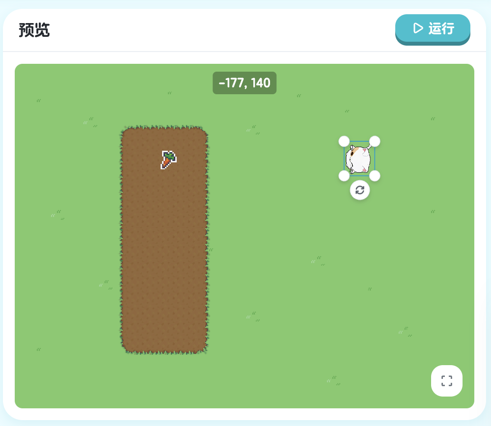
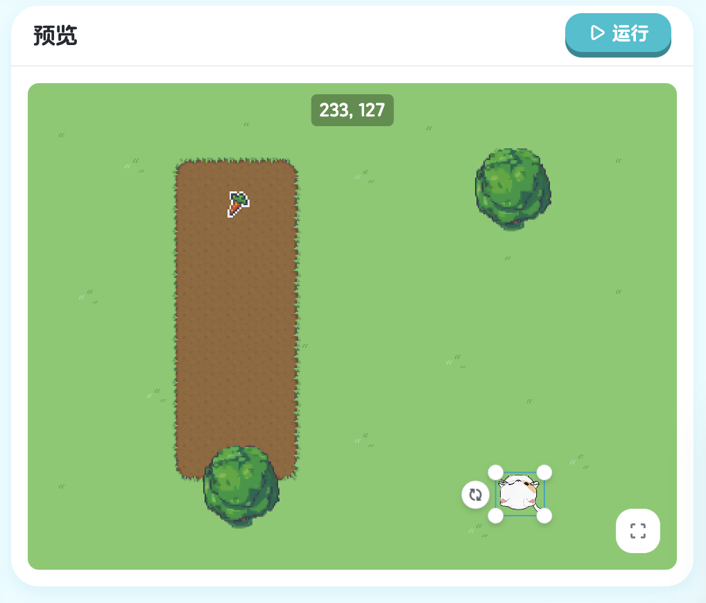
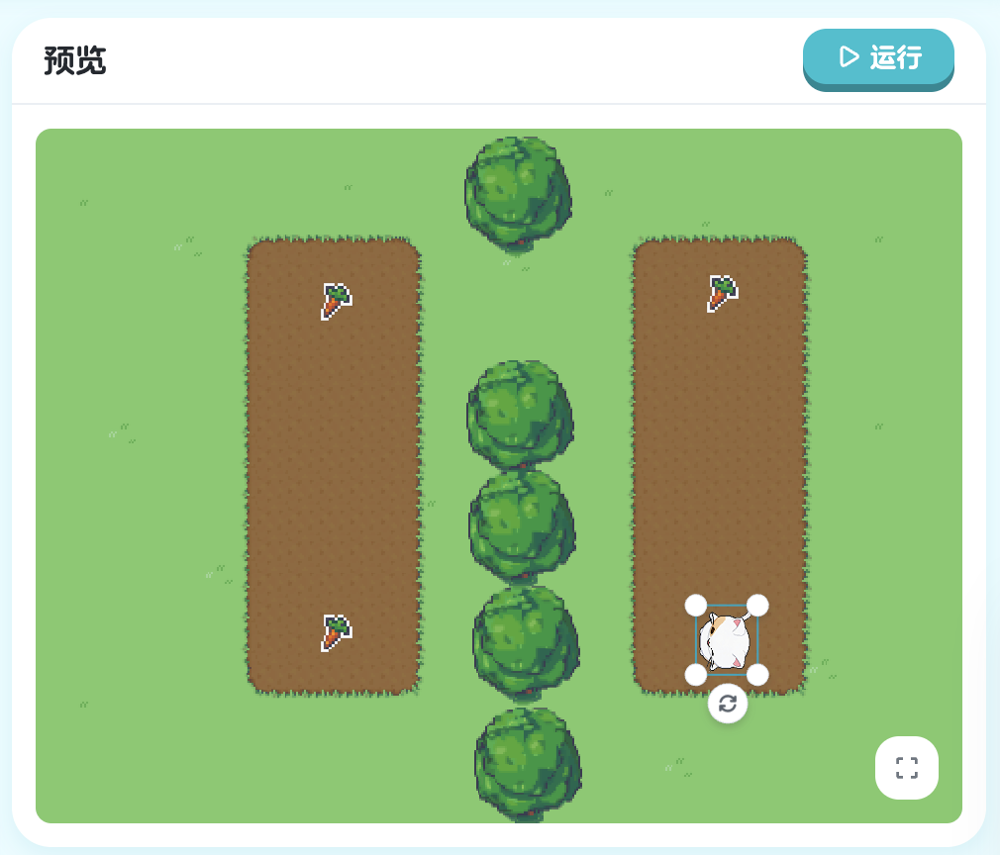

## 第一章：初步 - 基础动作

在这一章中，我们将学习最基本的精灵动作：转向和步进。就像你学习走路一样，我们的游戏角色也需要学会如何移动。掌握了这些基础动作，你就能让角色在游戏世界中自由行动了！

### 1.1 第一个程序

**让角色动起来！**

让我们从最简单的开始。想象一下，你站在操场上，有人对你说"向前走160步"，你会怎么做？对，就是一直往前走！现在，我们要让游戏中的角色 Kiko 做同样的事情。

点击"运行"按钮，看看会发生什么：


> 课程地址：https://x.qiniu.com/editor/curator/Coding-Course-1/sprites/Kiko/code

```go
onStart => {
    step 160
}
```

**命令解释：**

#### 代码详解

**onStart 是什么？**

`onStart` 是一个特殊的**事件处理器**（Event Handler）。你可以把它想象成游戏的"发令枪"：
- 当你点击"运行"按钮时，游戏就开始了
- `onStart` 后面大括号 `{}` 里的代码会**立即执行**
- 这就像老师说"开始！"之后，你才开始答题一样

**step 命令详解**

`step 160` 是我们的第一个动作命令：
- `step` 的意思是"步进"或"前进"
- `160` 是前进的距离（步数）
- 这行代码的完整意思是：**让 Kiko 向前走 160 步**

#### 小贴士

- 在编程中，我们用 `//` 来写**注释**（Comment），注释是给人看的说明，程序运行时会忽略它
- 每个命令后面都要有正确的参数，比如 `step` 后面要跟一个数字
- 大括号 `{}` 必须成对出现，就像括号一样

#### 本节重点

| 概念 | 说明 | 示例 |
|------|------|------|
| `onStart` | 游戏开始时执行 | `onStart => { ... }` |
| `step` | 让角色前进指定步数 | `step 160` |
| 参数 | 命令后面的数字，控制命令的行为 | `160` 就是 step 的参数 |

恭喜你！你已经迈出了编程的第一步。在下一节中，我们将学习如何修改这些参数，让角色做出更多有趣的动作。

---

**下一节预告**：我们将学习如何通过修改步数，让 Kiko 走到不同的位置。准备好了吗？让我们继续前进！

### 1.2 修改步数

#### 学习目标

在上一节中，我们让 Kiko 走了 160 步。但是，如果我们想让它走到不同的位置怎么办？这就需要修改步数参数了！在这一节，你将学会如何通过改变数字来精确控制角色的移动距离。

#### 挑战任务

看看下面的游戏画面，Kiko 需要走到萝卜的位置。160 步好像不太够，我们需要让它走得更远一些！


> 课程地址：https://x.qiniu.com/editor/curator/Coding-Course-2/sprites/Kiko/code

**原来的代码：**
```go
onStart => {
    step 160
}
```

**修改后的代码：**
```go
onStart => {
    step 200
}
```

#### 代码详解

**什么是参数？**

在 `step 200` 中，`200` 就是一个**参数**（Parameter）。你可以把参数想象成：
- 游戏手柄上的数值调节器
- 音量控制的旋钮
- 一把可以调节长度的尺子

通过改变参数，同一个命令可以产生不同的效果！

**step 命令的参数规则**

`step` 命令后面的数字表示移动的距离：
- 数字**越大**，角色走得**越远**
- 数字**越小**，角色走得**越近**
- 数字可以是任意正整数，比如 1、50、100、500 等

#### 运行效果对比

让我们来看看不同参数的效果：

| 代码 | 效果 | 说明 |
|------|------|------|
| `step 160` | Kiko 走 160 步 | 原来的距离，可能到不了萝卜 |
| `step 200` | Kiko 走 200 步 | 走得更远，正好能到达萝卜！ |

当你把参数从 160 改成 200 后：
1. Kiko 会从起点出发
2. 向右前进 200 步（比之前多走 40 步）
3. 正好到达萝卜的位置！

#### 编程小知识

**为什么要学会修改参数？**

在真实的游戏开发中，程序员经常需要调整参数来达到最佳效果：
- 调整角色的移动速度
- 调整音乐的音量大小
- 调整敌人的攻击力
- 调整关卡的时间限制

学会修改参数，你就能精确控制游戏中的各种元素！

#### 本节重点

| 概念 | 说明 | 示例 |
|------|------|------|
| 参数 | 命令后面的数值，用来控制命令的行为 | `step 200` 中的 `200` |
| 调试 | 通过修改参数来达到期望效果的过程 | 尝试 160、180、200... |
| 整数 | 没有小数部分的数字 | 1, 50, 160, 200 |

#### 小技巧

- 💡 不确定用多少步数？可以先试一个大概的数字，然后慢慢调整
- 💡 每次只改变一个参数，这样更容易看出变化
- 💡 可以在代码旁边用注释记录不同参数的效果：

```go
onStart => {
    step 200  // 这个距离刚好能到达萝卜
}
```

#### 恭喜你！

你已经学会了如何修改参数来控制角色的移动距离。这是编程中非常重要的技能！现在你知道了：
- 参数是什么
- 如何修改参数
- 不同参数会产生不同效果

---

**下一节预告**：只会直线前进还不够，我们需要学会让 Kiko 转向！下一节将学习如何使用 `turn` 命令让角色改变方向。准备好了吗？

### 1.3 转向与步进

#### 学习目标

到目前为止，Kiko 只会直线前进。但在真实的游戏中，目标物品不总是在正前方！这一节，我们将学习一个超级重要的新命令：`turn`（转向）。掌握了转向和步进的组合，Kiko 就能到达任何地方了！

#### 新的挑战

看看这次的场景，萝卜不在 Kiko 的正前方，而是在右边！如果 Kiko 直接往前走，它会错过萝卜。我们需要先让它转向，然后再前进。


> 课程地址：https://x.qiniu.com/editor/curator/Coding-Course-3/sprites/Kiko/code

**初始代码：**
```go
onStart => {
    turn Right
    step 120
}
```

**修改后的代码：**
```go
onStart => {
    turn Right
    step 160
}
```

#### 代码详解

**认识 turn 命令**

`turn` 是"转向"的意思，就像你在路口需要转弯一样：
- `turn Right` 表示**向右转**
- 每次转向会转 **90 度**（直角）
- 转向后，角色会面向新的方向

**Right 是什么？**

`Right` 是一个**方向常量**（Direction Constant）：
- `Right` = 向右（顺时针转 90°）
- 它是 XGo 语言预定义的特殊值
- 注意首字母要**大写**：`Right` ✅，`right` ❌

**代码执行顺序**

程序会**从上到下**依次执行每一行代码：

```go
onStart => {
    turn Right   // 第1步：先转向右边
    step 160     // 第2步：再向前走160步
}
```

就像给 Kiko 下达两个连续的指令：
1. "先向右转！"
2. "然后向前走 160 步！"

#### 编程小知识

**什么是"顺序执行"？**

计算机程序像读书一样，从上往下一行一行执行：

```go
onStart => {
    turn Right   // 第1行：先执行这个
    step 160     // 第2行：再执行这个
}
```

想象你在玩"听指令做动作"的游戏：
- 老师说："第一，向右转！"（你转向）
- 老师说："第二，向前走 160 步！"（你前进）

如果顺序反了，结果就完全不同！

#### 方向系统详解

在 XGo 中，有四个基本方向：

```
        Up (上)
         ↑
         |
Left ←---+---→ Right
(左)     |     (右)
         ↓
       Down (下)
```

- `Up`：向上（0 度）
- `Right`：向右（90 度）
- `Down`：向下（180 度）
- `Left`：向左（270 度）

每次 `turn Right` 会顺时针转 90 度：
- 从 Up → Right
- 从 Right → Down
- 从 Down → Left
- 从 Left → Up

#### 命令对比表

| 命令 | 作用 | 参数 | 示例 |
|------|------|------|------|
| `step` | 前进指定步数 | 数字（步数） | `step 160` |
| `turn` | 转向指定方向 | 方向（Right/Left/Up/Down） | `turn Right` |

#### 本节重点

| 概念 | 说明 | 示例 |
|------|------|------|
| `turn` | 转向命令，改变角色朝向 | `turn Right` |
| 方向常量 | 预定义的方向值，首字母大写 | `Right`, `Left`, `Up`, `Down` |
| 顺序执行 | 代码从上到下依次执行 | 先转向，再前进 |
| 组合命令 | 多个命令配合使用达成目标 | `turn` + `step` |

#### 编程思维

这一节我们学到了一个重要的编程思维：**分解任务**

复杂的任务可以分解成简单的步骤：
- 目标：到达萝卜
- 分解：
  1. 转向萝卜的方向
  2. 前进到萝卜位置
- 实现：

```go
turn Right
step 160
```

#### 恭喜你！

你现在掌握了两个重要技能：
- 使用 `turn` 改变方向
- 组合 `turn` 和 `step` 到达目标
- 理解代码的执行顺序

有了这些技能，Kiko 可以到达更多地方了！

---

**下一节预告**：在真实的游戏中，经常会遇到障碍物。下一节我们将学习如何使用多次转向来绕过障碍物，完成更复杂的路径！准备好迎接新挑战了吗？

---

### 1.4 使用转向绕过障碍

#### 学习目标

在真实的游戏世界中，路上总会有各种障碍物。这一节，我们将学习如何通过**多次转向**来绕过障碍物，就像在迷宫中找到正确的路径一样！

#### 新的挑战：绕过障碍物

看看这次的场景，Kiko 和萝卜之间有一块树林！如果直接往前走，Kiko 会撞到树上。我们需要让它：
1. 先向右走
2. 再向左走
3. 最终绕过障碍物到达萝卜


> 课程地址：https://x.qiniu.com/editor/curator/Coding-Course-4/sprites/Kiko/code

**初始代码：**
```go
onStart => {
    turn Right
    step 190
}
```

**完整代码：**
```go
onStart => {
    turn Right
    step 190
    turn Left
    step 160
}
```

#### 代码详解

**认识 turn Left 命令**

我们已经学过了 `turn Right`（向右转），现在来认识它的好朋友：
- `turn Left` 表示**向左转**
- 同样是转 **90 度**（直角）
- `Left` 也要首字母**大写**

**四行代码的执行流程**

让我们一步一步分析这段代码：

```go
onStart => {
    turn Right   // 第1步：向右转90度
    step 190     // 第2步：向前走190步
    turn Left    // 第3步：向左转90度
    step 160     // 第4步：向前走160步
}
```

就像给 Kiko 下达一系列连续指令：
1. "向右转！"
2. "向前走 190 步！"
3. "向左转！"
4. "再向前走 160 步！"

#### 编程小知识

**什么是"路径规划"？**

我们刚才做的事情叫做**路径规划**（Path Planning）：
- 分析起点和终点的位置
- 找出障碍物的位置
- 设计一条绕过障碍物的路径
- 把路径分解成一系列转向和前进的指令

这是游戏开发中非常重要的技能！

**Left 和 Right 的关系**

有趣的是，`turn Left` 和 `turn Right` 可以互相抵消：

```go
turn Right   // 向右转 90 度
turn Left    // 向左转 90 度
// 结果：回到原来的方向！
```

但在我们的代码中，两次转向之间有 `step 190`，所以不会抵消：

```go
turn Right   // 向右转 → 朝向改变了
step 190     // 在新方向上前进
turn Left    // 向左转 → 又改变朝向
step 160     // 在又一个新方向上前进
```

#### 命令组合模式

这是我们第一次使用**重复的命令模式**：

```
转向 → 前进 → 转向 → 前进
```

这个模式在游戏编程中非常常见，用于创建复杂的移动路径。

#### 本节重点

| 概念 | 说明 | 示例 |
|------|------|------|
| `turn Left` | 向左转 90 度 | `turn Left` |
| 路径规划 | 设计绕过障碍物的路径 | 右→下→左→右 |
| 命令序列 | 多个命令按顺序执行完成复杂任务 | 转向→前进→转向→前进 |
| L 形路径 | 两次转向形成的直角路径 | 常用于绕过障碍 |

#### 编程思维：任务分解

这一节展示了更复杂的**任务分解**：

- **目标**：从起点到达萝卜（有障碍物）
- **分析**：
  - 直线路径被障碍物挡住
  - 需要绕路
  - 可以从右侧绕过
- **分解**：
  1. 向右转，面向障碍物右侧
  2. 向下走，绕过障碍物
  3. 向左转，面向萝卜
  4. 向右走，到达萝卜
- **实现**：
  ```go
  turn Right
  step 190
  turn Left
  step 160
  ```

#### 恭喜你！

你现在已经掌握了：
- 使用 `turn Left` 向左转
- 组合多个转向和前进命令
- 设计绕过障碍物的路径
- 理解命令序列的执行

这些技能让你能够处理更复杂的移动场景了！

---

**下一节预告**：我们一直在使用 `turn Right` 和 `turn Left`，但这些只能转 90 度的直角。如果需要转 45 度、30 度或其他角度怎么办？下一节将学习使用**数字作为参数**来精确控制转向角度，让 Kiko 的移动更加灵活！

#### 1.4.1 练习：绕过障碍物

练习绕过障碍物的技巧：

> 课程地址：https://x.qiniu.com/editor/curator/Coding-Course-5/sprites/Kiko/code

**练习内容：**
通过组合 `turn` 和 `step` 命令，让精灵成功绕过障碍物到达目标。

### 1.5 使用数字作为参数转向

#### 学习目标

到目前为止，我们只学会了用 `Right` 和 `Left` 来转向，每次都是转 90 度的直角。但是在真实的游戏中，有时候需要转更小的角度，比如 45 度、30 度，甚至 15 度。这一节，我们将学习一个超级强大的技巧：**用数字来精确控制转向角度**！

#### 新的挑战：斜着走

看看这次的场景，萝卜既不在正右方，也不在正下方，而是在**斜下方**！如果用 `turn Right` 转 90 度，角度太大了；如果不转，又走不到萝卜那里。我们需要一个**刚刚好的角度**。


> 课程地址：https://x.qiniu.com/editor/curator/Coding-Course-6/sprites/Kiko/code

**初始代码：**
```go
onStart => {
    turn -30
    step 300
}
```

**修改后的代码：**
```go
onStart => {
    turn -45
    step 300
}
```

#### 代码详解

**用数字表示角度**

`turn` 命令不仅可以接受 `Right`、`Left` 这样的方向常量，还可以接受**数字**作为参数：

```go
turn -45  // 向左转 45 度
```

这里的 `-45` 就是**角度值**：
- 数字表示转动的**角度**（单位：度）
- **正数**表示**顺时针**转（向右转）
- **负数**表示**逆时针**转（向左转）

**角度的正负规则**

记住这个简单的规则：

| 数字 | 方向 | 说明 | 示例 |
|------|------|------|------|
| **正数** | 顺时针（右转） | 像时钟指针转动的方向 | `turn 45`、`turn 90` |
| **负数** | 逆时针（左转） | 与时钟指针相反的方向 | `turn -45`、`turn -90` |

**为什么是 -45 而不是 -30？**

在这个场景中：
- `-30` 度：转的角度太小，走不到萝卜
- `-45` 度：刚刚好，正好是斜下方 45 度角
- `-60` 度：转的角度太大，会偏离目标

#### 角度系统详解

**角度的含义**

在编程中，我们用**度**（degree）来表示角度：
- 一个完整的圆是 **360 度**
- 直角是 **90 度**
- 半圆是 **180 度**

**常用角度对照表**

| 角度 | 转向效果 | 视觉效果 |
|------|----------|----------|
| `0` | 不转向 | 保持原方向 |
| `45` | 向右转 45 度 | 斜向右 |
| `90` | 向右转 90 度 | 相当于 `turn Right` |
| `180` | 转 180 度 | 掉头 |
| `-45` | 向左转 45 度 | 斜向左 |
| `-90` | 向左转 90 度 | 相当于 `turn Left` |

**数字 vs 方向常量**

现在你知道了，`Right` 和 `Left` 其实就是特殊的角度：

```go
turn Right   // 等同于 turn 90
turn Left    // 等同于 turn -90
```

但是使用数字更灵活，可以转任意角度！

#### 编程小知识

**什么时候用方向常量，什么时候用数字？**

**使用方向常量**（`Right`、`Left`、`Up`、`Down`）：
- 转 90 度直角时
- 代码更容易理解
- 适合初学者

**使用数字**：
- 需要精确控制角度时
- 需要转非 90 度的角度时
- 需要根据计算结果转向时

**示例对比**

```go
// 方式 1：使用方向常量（简单直观）
turn Right
step 100

// 方式 2：使用数字（灵活精确）
turn 90
step 100

// 方式 2 的优势：可以转任意角度
turn 45    // 这个用方向常量做不到！
step 100
```

#### 深入理解负数

**为什么负数表示向左转？**

这是数学中的约定：
- **正方向**：顺时针（就像时钟指针）
- **负方向**：逆时针（与时钟相反）

想象一下：
- 你面向北方
- `turn 90`：向右转 90 度，现在面向东方
- `turn -90`：向左转 90 度，现在面向西方

**负数的实际应用**

```go
// 向右上方走（右转 45 度）
turn 45
step 200

// 向左上方走（左转 45 度）
turn -45
step 200
```

#### 转向方式对比

| 方式 | 语法 | 优点 | 缺点 | 适用场景 |
|------|------|------|------|----------|
| 方向常量 | `turn Right` | 简单易懂 | 只能转 90 度 | 直角转向 |
| 正数角度 | `turn 45` | 精确灵活 | 需要理解角度 | 任意顺时针转向 |
| 负数角度 | `turn -45` | 精确灵活 | 需要理解负数 | 任意逆时针转向 |

#### 本节重点

| 概念 | 说明 | 示例 |
|------|------|------|
| 角度参数 | 用数字表示转向的角度 | `turn -45` |
| 正数角度 | 顺时针转向（向右） | `turn 45` |
| 负数角度 | 逆时针转向（向左） | `turn -45` |
| 精确控制 | 可以转任意角度，不限于 90 度 | `turn 30`、`turn -60` |

#### 实用技巧

**技巧 1：如何确定需要的角度？**

1. 观察起点和终点的位置关系
2. 估算大概需要转多少度
3. 先试一个接近的值
4. 运行观察效果
5. 根据结果调整角度

**技巧 2：常用角度记忆**

记住这些常用角度会很有帮助：
- `±30°`：小幅度转向
- `±45°`：斜向（对角线）
- `±60°`：较大幅度转向
- `±90°`：直角转向
- `±180°`：掉头

**技巧 3：正负号的快速判断**

- 想向**右**转，用**正数**
- 想向**左**转，用**负数**
- 记住：**右正左负**

#### 恭喜你！

你现在已经掌握了：
- 使用数字表示转向角度
- 理解正数和负数的含义
- 精确控制任意角度的转向
- 根据需要选择合适的角度

有了这个技能，Kiko 可以沿着任意方向移动了！

---

**下一节预告**：现在你已经学会了转向和前进的所有基本技巧。下一节，我们将把这些技巧组合起来，创建更加复杂和有趣的移动路径。准备好迎接更大的挑战了吗？

### 1.6 更复杂的路径

#### 学习目标

恭喜你走到了第一章的最后一节！在前面的学习中，我们掌握了转向和前进的各种技巧。现在，是时候把这些技巧组合起来，创建真正复杂的移动路径了。这一节将是对你所学知识的综合考验！

#### 终极挑战：n 形路径

看看这次的场景，Kiko 需要走一条 **n 形路径** 才能到达萝卜！这条路径需要：
1. 先向上走
2. 再向左走
3. 最后向下走

这是我们迄今为止遇到的最复杂的路径，需要用到**三次转向**和**三次前进**。


> 课程地址：https://x.qiniu.com/editor/curator/Coding-Course-7/sprites/Kiko/code

**完整代码：**
```go
onStart => {
    turn Right
    step 180
    turn Left
    step 200
    turn Left
    step 180
}
```

#### 代码详解

**六个步骤的执行流程**

让我们逐步分析这段代码，看看 Kiko 是如何完成这条 n 形路径的：

```go
onStart => {
    turn Right   // 第1步：向右转90度
    step 180     // 第2步：向上走180步
    turn Left    // 第3步：向左转90度
    step 200     // 第4步：向左走200步
    turn Left    // 第5步：再向左转90度
    step 180     // 第6步：向下走180步
}
```

**为什么是这个顺序？**

每一步都有它的目的：

| 步骤 | 代码 | 目的 | Kiko 的位置 |
|------|------|------|-------------|
| 1 | `turn Right` | 调整方向，准备向上走 | 起点，面朝上 |
| 2 | `step 180` | 向上移动 | 上方 |
| 3 | `turn Left` | 调整方向，准备向左走 | 上方，面朝左 |
| 4 | `step 200` | 向左移动 | 左上方 |
| 5 | `turn Left` | 调整方向，准备向下走 | 左上方，面朝下 |
| 6 | `step 180` | 向下移动到终点 | 终点（萝卜位置） |

#### 编程小知识

**什么是"复杂路径"？**

复杂路径是指需要多次转向和前进才能完成的移动路径。特点：
- 包含多个转折点
- 需要精确规划每一步
- 任何一步出错都会影响最终结果

**代码的可读性**

当代码变长时，添加注释会让代码更容易理解：

```go
onStart => {
    // 第一段：向上走
    turn Right
    step 180
    
    // 第二段：向左走
    turn Left
    step 200
    
    // 第三段：向下走
    turn Left
    step 180
}
```

#### 方向变化追踪

让我们详细追踪 Kiko 在整个过程中的方向变化：

| 步骤 | 执行前朝向 | 命令 | 执行后朝向 | 说明 |
|------|-----------|------|-----------|------|
| 初始 | 左 (←) | - | 左 (←) | 游戏开始 |
| 1 | 左 (←) | `turn Right` | 上 (↑) | 第一次转向 |
| 2 | 上 (↑) | `step 180` | 上 (↑) | 保持方向前进 |
| 3 | 上 (↑) | `turn Left` | 左 (←) | 第二次转向 |
| 4 | 左 (←) | `step 200` | 左 (←) | 保持方向前进 |
| 5 | 左 (←) | `turn Left` | 下 (↓) | 第三次转向 |
| 6 | 下 (↓) | `step 180` | 下 (↓) | 保持方向前进 |

#### 本节重点

| 概念 | 说明 | 示例 |
|------|------|------|
| 复杂路径 | 需要多次转向和前进的移动路径 | n 形、Z 形、矩形 |
| 命令序列 | 多个命令按特定顺序执行 | 6 个命令完成 n 形 |
| 对称性 | 路径的某些部分距离相同 | 上升和下降都是 180 步 |
| 路径规划 | 设计和实现复杂移动的过程 | 观察→分解→编码→测试 |

#### 编程思维总结

这一节体现了重要的编程思维：

**分解思维**
- 复杂任务 = 多个简单任务的组合
- n 形路径 = 3 段直线移动

**顺序思维**
- 命令的执行顺序很重要
- 改变顺序会得到完全不同的结果

**精确思维**
- 每个参数都要精确
- 差一点就可能到不了终点

**调试思维**
- 通过实验找出正确的参数
- 出错时逐步检查每一步

#### 恭喜你！

你已经完成了第一章的所有内容！现在你掌握了：
- 使用 `step` 让角色前进
- 使用 `turn` 改变方向（方向常量和数字角度）
- 组合多个命令创建复杂路径
- 设计和实现 L 形、n 形等复杂移动

这些是游戏编程的基础技能，为后面的学习打下了坚实的基础！
