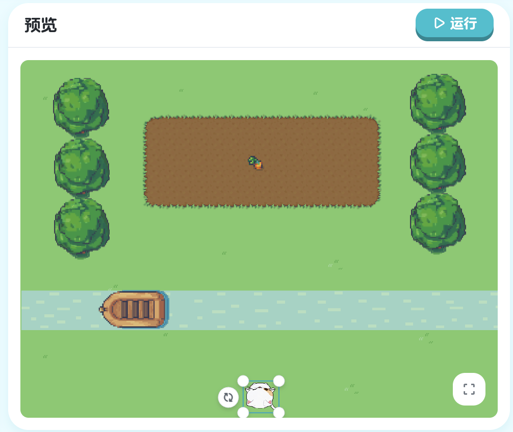

## 第二章：对象 - 与游戏对象交互

在第一章中，我们学会了如何让 Kiko 移动。但是在真实的游戏中，角色不仅要移动，还要与其他游戏对象互动。第二章将教你如何让 Kiko 与游戏世界中的其他对象进行交互！

### 2.1 转向对象

#### 学习目标

在第一章中，我们学会了使用 `turn Right`、`turn Left` 或者数字角度来转向。但是有一个问题：**我们需要自己计算角度**。如果目标对象在斜上方 37 度的位置，你能快速算出需要转多少度吗？

好消息是，XGo 提供了一个超级方便的命令：`turnTo`（转向对象）。有了它，你不需要计算任何角度，只要告诉 Kiko 要面向哪个对象，它就会自动转向那个对象！

#### 新的挑战：自动转向目标

看看这次的场景，萝卜的位置可能在任何地方。如果用 `turn` 命令，我们需要：
1. 观察萝卜在哪里
2. 计算需要转多少度
3. 写出 `turn` 命令

太麻烦了！现在我们用 `turnTo` 命令，一步搞定！


> 课程地址：https://x.qiniu.com/editor/curator/Coding-Course-8/sprites/Kiko/code

**完整代码：**
```xgo
onStart => {
    turnTo 萝卜
    step 200
}
```

#### 代码详解

**认识 turnTo 命令**

`turnTo` 是"转向某个对象"的意思：
- `turnTo 萝卜`：让 Kiko 转向名为"萝卜"的对象
- 不需要指定角度，系统会自动计算
- 无论萝卜在哪里，Kiko 都能准确转向它

**对象名称**

在 XGo 中，游戏里的每个精灵都是一个对象都有自己的名称：
- `萝卜`：这是游戏中一个精灵的名称
- 精灵名称**区分大小写**
- 精灵名称要与游戏中实际的名称完全一致

**代码执行流程**

```xgo
onStart => {
    turnTo 萝卜   // 第1步：自动转向萝卜
    step 200      // 第2步：向前走200步
}
```

就像给 Kiko 下达指令：
1. "看向萝卜！"（Kiko 自动计算角度并转向）
2. "向前走 200 步！"（沿着面向萝卜的方向前进）

#### turnTo 的优势

**对比：传统方式 vs turnTo**

**传统方式（麻烦）：**
```xgo
onStart => {
    turn -37      // 需要自己计算角度
    step 200
}
```
问题：
- 需要手动计算角度
- 如果萝卜位置改变，角度也要改
- 容易出错

**使用 turnTo（简单）：**
```xgo
onStart => {
    turnTo 萝卜   // 自动转向，无需计算
    step 200
}
```
优势：
- 不需要计算角度
- 萝卜位置改变了，代码不用改
- 代码更容易理解

#### 编程小知识

每个对象都有：
- **名称**：用来识别对象
- **位置**：对象在游戏世界中的坐标
- **属性**：如大小、颜色等

**turnTo 的工作原理**

当你写 `turnTo 萝卜` 时，系统会：
1. 找到名为"萝卜"的对象
2. 获取萝卜的位置坐标
3. 计算 Kiko 和萝卜之间的角度
4. 让 Kiko 转向那个角度

这一切都是自动完成的，你不需要关心具体的计算过程！

#### turnTo vs turn 对比

| 特性 | `turn` | `turnTo` |
|------|--------|----------|
| 参数 | 方向常量或角度数字 | 对象名称 |
| 使用场景 | 知道具体角度时 | 要转向某个对象时 |
| 灵活性 | 固定角度 | 自动计算角度 |
| 代码可读性 | 需要理解角度 | 更直观易懂 |
| 示例 | `turn 45` | `turnTo 萝卜` |

**什么时候用 turn？**
- 需要转向固定方向（上下左右）
- 需要转动特定角度
- 不涉及其他对象

**什么时候用 turnTo？**
- 需要面向某个对象
- 对象位置可能变化
- 想让代码更简洁直观

#### 本节重点

| 概念 | 说明 | 示例 |
|------|------|------|
| `turnTo` | 自动转向指定对象 | `turnTo 萝卜` |
| 对象名称 | 游戏中物体的标识符 | `萝卜`、`宝石`、`Apple` |
| 自动计算 | 系统自动计算转向角度 | 无需手动指定度数 |
| 顺序执行 | 先转向后前进 | `turnTo` → `step` |

#### 恭喜你！

你现在已经掌握了：
- 使用 `turnTo` 自动转向对象
- 理解对象名称的概念
- 知道何时用 `turn`，何时用 `turnTo`
- 能够让角色智能地面向目标

这是游戏编程中非常重要的技能，让你的代码更智能、更灵活！

---

**下一节预告**：只是转向目标还不够，我们还需要让 Kiko 直接走向目标。下一节将学习 `stepTo` 命令，让移动变得更简单！

#### 2.1.1 练习：转向对象

练习使用 `turnTo` 命令：

> 课程地址：https://x.qiniu.com/editor/curator/Coding-Course-9/sprites/Kiko/code

**练习内容：**
掌握如何让精灵准确转向指定对象。

### 2.2 朝对象步进

#### 学习目标

在上一节中，我们学会了使用 `turnTo` 自动转向对象。但还有一个问题：我们仍然需要用 `step` 命令手动指定前进的距离。如果目标很远，需要走 500 步；如果目标很近，只需要 50 步。每次都要计算距离，太麻烦了！

这一节，我们将学习一个更强大的命令：`stepTo`（走向对象）。有了它，你不仅不需要计算角度，连距离也不用计算了！

#### 新的挑战：自动走向目标

看看这次的场景，我们要让 Kiko 走到萝卜那里。如果用之前学的方法：

```xgo
onStart => {
    turnTo 萝卜    // 转向萝卜
    step 200       // 走 200 步...够吗？不够？太多？
}
```

问题是：我们不知道萝卜离 Kiko 有多远！如果萝卜的位置改变了，`step` 的参数也要跟着改。

现在用 `stepTo`，一切都变简单了！


> 课程地址：https://x.qiniu.com/editor/curator/Coding-Course-10/sprites/Kiko/code

**初始代码：**
```xgo
onStart => {
    stepTo 萝卜
}
```

**修改后的代码：**
```xgo
onStart => {
    turnTo 萝卜
    stepTo 萝卜
}
```

#### 代码详解

**认识 stepTo 命令**

`stepTo` 是"走向某个对象"的意思：
- `stepTo 萝卜`：让 Kiko 走向名为"萝卜"的对象
- 自动计算需要走的距离
- 自动沿着当前朝向前进

**为什么需要先 turnTo？**

这是一个重要的细节！让我们理解 `stepTo` 的工作方式：

```xgo
stepTo 萝卜   // 只会沿着当前朝向前进，直到到达萝卜的距离
```

`stepTo` 做的事情：
1. 计算 Kiko 到萝卜的**直线距离**
2. 沿着 Kiko **当前的朝向** 前进这个距离
3. **不会自动转向**！

所以，如果 Kiko 没有面向萝卜，`stepTo` 会让它走错方向！

**正确的组合**

```xgo
onStart => {
    turnTo 萝卜   // 第1步：先转向萝卜
    stepTo 萝卜   // 第2步：再走向萝卜
}
```

这样的组合：
1. `turnTo` 让 Kiko 面向萝卜
2. `stepTo` 让 Kiko 沿着正确的方向前进到萝卜

#### 编程小知识

**三种移动方式的进化**

让我们回顾一下我们学过的三种移动方式：

**第一代：完全手动**
```xgo
turn 45       // 手动计算角度
step 200      // 手动计算距离
```
- 需要计算角度
- 需要计算距离
- 最麻烦，但最灵活

**第二代：自动转向**
```xgo
turnTo 萝卜   // 自动计算角度
step 200      // 手动计算距离
```
- 自动计算角度
- 仍需计算距离
- 比较方便

**第三代：全自动**
```xgo
turnTo 萝卜   // 自动计算角度
stepTo 萝卜   // 自动计算距离
```
- 自动计算角度
- 自动计算距离
- 最方便！

**stepTo 的工作原理**

当你写 `stepTo 萝卜` 时，系统会：
1. 找到名为"萝卜"的对象
2. 获取萝卜的位置坐标 (x2, y2)
3. 获取 Kiko 的位置坐标 (x1, y1)
4. 计算直线距离：√[(x2-x1)² + (y2-y1)²]
5. 让 Kiko 沿当前朝向前进这个距离

这些复杂的数学计算都是自动完成的！

#### 命令对比表

| 命令 | 作用 | 参数 | 是否自动计算 | 示例 |
|------|------|------|-------------|------|
| `turn` | 转向指定角度 | 角度或方向 | 否 | `turn 45` |
| `step` | 前进指定距离 | 距离 | 否 | `step 200` |
| `turnTo` | 转向指定对象 | 对象名称 | 自动计算角度 | `turnTo 萝卜` |
| `stepTo` | 走向指定对象 | 对象名称 | 自动计算距离 | `stepTo 萝卜` |

#### 使用场景

**什么时候用 step？**
- 需要精确控制移动距离
- 不需要到达特定对象
- 例如：巡逻、固定距离移动

**什么时候用 stepTo？**
- 需要到达某个对象
- 对象位置可能变化
- 想让代码更简洁
- 例如：收集物品、追逐目标

#### 本节重点

| 概念 | 说明 | 示例 |
|------|------|------|
| `stepTo` | 自动走向指定对象 | `stepTo 萝卜` |
| 黄金组合 | `turnTo` + `stepTo` 配合使用 | 先转向后前进 |
| 自动计算距离 | 系统自动计算到目标的距离 | 无需手动指定 |
| 执行顺序 | 必须先转向后前进 | `turnTo` → `stepTo` |

#### 恭喜你！

你现在已经掌握了：
- 使用 `stepTo` 自动走向对象
- 理解 `turnTo + stepTo` 的黄金组合
- 知道何时用 `step`，何时用 `stepTo`
- 能够让角色智能地到达任何目标

这让你的代码更加简洁和智能！

---

**下一节预告**：现在我们已经学会了到达单个目标，但如果需要访问多个目标，路径会变得更复杂。下一节将学习如何规划更复杂的多目标路径！

### 2.3 更复杂的路径

#### 学习目标

在前两节中，我们学会了使用 `turnTo + stepTo` 组合到达单个目标。但在真实的游戏中，经常需要访问多个目标。比如：
- 收集散落在各处的宝石
- 依次触碰多个检查点
- 按顺序拜访不同的角色

这一节，我们将学习如何通过**重复使用** `turnTo + stepTo` 组合，让 Kiko 依次访问多个目标对象。

#### 新的挑战：收集三个萝卜

看看这次的场景，游戏中有三个萝卜：萝卜1、萝卜2、萝卜3。它们散落在不同的位置。我们需要让 Kiko 依次收集它们。

如果只收集第一个萝卜：

```xgo
onStart => {
    turnTo 萝卜1
    stepTo 萝卜1
}
```

但这样只能到达萝卜1，其他两个萝卜怎么办？

答案很简单：**重复这个模式**！


> 课程地址：https://x.qiniu.com/editor/curator/Coding-Course-11/sprites/Kiko/code

**初始代码：**
```xgo
onStart => {
    turnTo 萝卜1
    stepTo 萝卜1
}
```

**修改后的代码：**
```xgo
onStart => {
    turnTo 萝卜1
    stepTo 萝卜1

    turnTo 萝卜2
    stepTo 萝卜2

    turnTo 萝卜3
    stepTo 萝卜3
}
```

#### 代码详解

**重复的模式**

仔细观察代码，你会发现一个重复的模式：

```xgo
turnTo 目标
stepTo 目标
```

这个模式重复了三次，只是目标对象不同：
- 第一次：目标是萝卜1
- 第二次：目标是萝卜2
- 第三次：目标是萝卜3

**执行流程**

让我们逐步分析代码的执行过程：

```xgo
onStart => {
    // 阶段1：收集萝卜1
    turnTo 萝卜1   // 转向萝卜1
    stepTo 萝卜1   // 走到萝卜1

    // 阶段2：收集萝卜2
    turnTo 萝卜2   // 转向萝卜2
    stepTo 萝卜2   // 走到萝卜2

    // 阶段3：收集萝卜3
    turnTo 萝卜3   // 转向萝卜3
    stepTo 萝卜3   // 走到萝卜3
}
```

**为什么每次都要 turnTo？**

你可能会想：Kiko 已经在萝卜1那里了，为什么还要 `turnTo 萝卜2`？不能直接 `stepTo 萝卜2` 吗？

答案是：**必须先转向**！

- 到达萝卜1后，Kiko 的朝向是面向萝卜1的方向
- 萝卜2可能在完全不同的方向
- 如果不先 `turnTo 萝卜2`，`stepTo 萝卜2` 会让Kiko 沿着错误的方向走

所以，每次移动到新目标前，都要先转向那个目标。

#### 本节重点

| 概念 | 说明 | 示例 |
|------|------|------|
| 模式重复 | 重复使用相同的代码模式 | `turnTo + stepTo` 重复3次 |
| 顺序执行 | 按代码顺序依次访问目标 | 萝卜1 → 萝卜2 → 萝卜3 |
| 代码扩展 | 添加新目标只需重复模式 | 复制粘贴并修改对象名 |
| 路径规划 | 访问顺序影响移动路径 | 优化顺序可缩短路径 |

#### 恭喜你！

你现在已经掌握了：
- 重复使用 `turnTo + stepTo` 模式
- 让角色依次访问多个目标
- 规划和优化访问路径
- 组织和扩展代码

这让你能够创建更复杂的游戏行为！

---

**下一节预告**：我们一直在使用 `turnTo` 和 `stepTo` 两个命令来移动。但其实有一个更强大的命令可以同时完成转向和移动！下一节将揭晓这个秘密，让代码变得更简洁。

### 2.4 基于对象的转向与步进

#### 学习目标

在前面的学习中，我们学会了控制 Kiko 自己移动。但在真实的游戏中，我们经常需要**控制其他对象**。比如：
- 让一艘船移动
- 让一扇门打开
- 让一个平台升降

这一节，我们将学习一个新技能：**操作其他对象**。你将学会用代码控制游戏中的任何对象，而不仅仅是 Kiko！

#### 新的挑战：过河捡萝卜

看看这次的场景，Kiko 需要去河对岸捡萝卜。但是有一个问题：河中间有一艘船（Boat），它现在的位置和方向都不对！

我们需要：
1. 让船掉头（船现在朝向错误）
2. 让船开到 Kiko 面前
3. Kiko 踩着船到对岸
4. Kiko 去捡萝卜

这次的特别之处：我们要在 **Kiko 的代码里控制船**！


> 课程地址：https://x.qiniu.com/editor/curator/Coding-Course-12/sprites/Kiko/code

**初始代码：**
```xgo
onStart => {
    Boat.step 80
    stepTo Radish
}
```

**期望的完整代码：**
```xgo
onStart => {
    Boat.turn Right
    Boat.turn Right
    Boat.step 120
    stepTo Radish
}
```

#### 代码详解

**认识"对象.方法"语法**

这是一个全新的语法！让我们仔细理解：

```xgo
Boat.turn Right
```

这行代码的结构：
- `Boat`：对象的名称（船）
- `.`：连接符，表示"的"
- `turn Right`：要执行的命令

完整意思：**让 Boat（船）执行 turn Right（向右转）命令**

**对象方法 vs 自身方法**

对比这两种写法：

```xgo
// 控制 Kiko 自己
turn Right      // Kiko 向右转
step 100        // Kiko 前进 100 步

// 控制其他对象
Boat.turn Right // 让船向右转
Boat.step 100   // 让船前进 100 步
```

区别：
- 没有对象名：控制 Kiko 自己
- 有对象名（`对象.`）：控制指定的对象

**为什么船要转两次？**

让我们分析船的转向：

```xgo
Boat.turn Right   // 第一次右转：船转 90 度
Boat.turn Right   // 第二次右转：船再转 90 度
```

- 船初始朝向：假设朝左
- 第一次右转：朝上
- 第二次右转：朝右（掉头完成！）

两次右转 = 转 180 度 = 掉头

#### 初始代码的问题

让我们分析初始代码为什么不能完成任务：

```xgo
onStart => {
    Boat.step 80      // 问题1：船没有先转向
    stepTo Radish     // 问题2：距离不够，Kiko 到不了
}
```

**问题 1：缺少转向**
- 船的初始朝向是错误的
- 直接 `step` 会让船朝错误方向移动
- 必须先让船掉头

**问题 2：距离不够**
- `step 80` 只走 80 步
- 但船需要走 120 步才能到 Kiko
- 距离不够，Kiko 踩不上船

**问题 3：顺序不对**
- 应该先让船准备好（转向+移动）
- 然后 Kiko 才能行动
- 初始代码没有完整准备船

#### 本节重点

| 概念 | 说明 | 示例 |
|------|------|------|
| 对象方法调用 | 用 `对象.命令` 控制其他对象 | `Boat.turn Right` |
| 分步调试 | 逐步完成和测试代码 | 先转向→再移动→最后行动 |
| 参数精确性 | 转向次数和距离要准确 | 转2次，走120步 |
| 执行顺序 | 先准备环境，再执行主要任务 | 先准备船，再让 Kiko 行动 |

#### 恭喜你！

你已经完成了第二章的所有内容！现在你掌握了：
- 使用 `turnTo` 和 `stepTo` 控制自己
- 使用 `对象.命令` 控制其他对象
- 让多个对象协同工作
- 分步调试复杂任务

这些技能让你能够创建更丰富、更有趣的游戏场景！

---

#### 2.4.1 练习：基于对象的转向与步进

综合练习对象交互：

> 课程地址：https://x.qiniu.com/editor/curator/Coding-Course-13/sprites/Kiko/code

**练习内容：**
掌握如何灵活使用对象交互命令实现复杂的移动模式。
