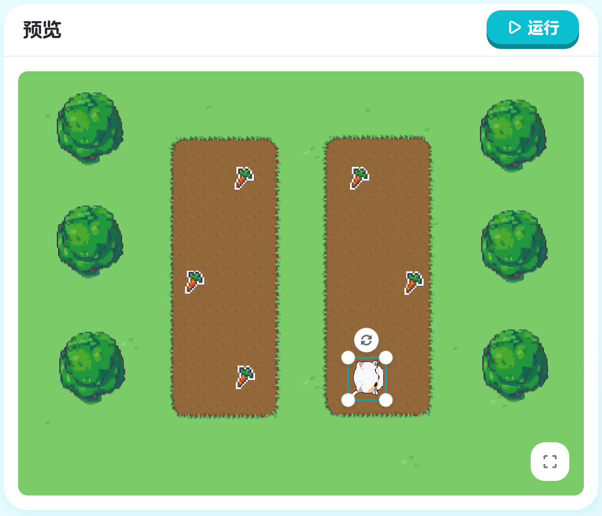
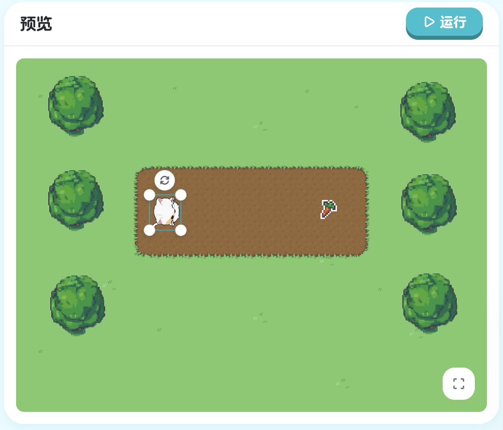
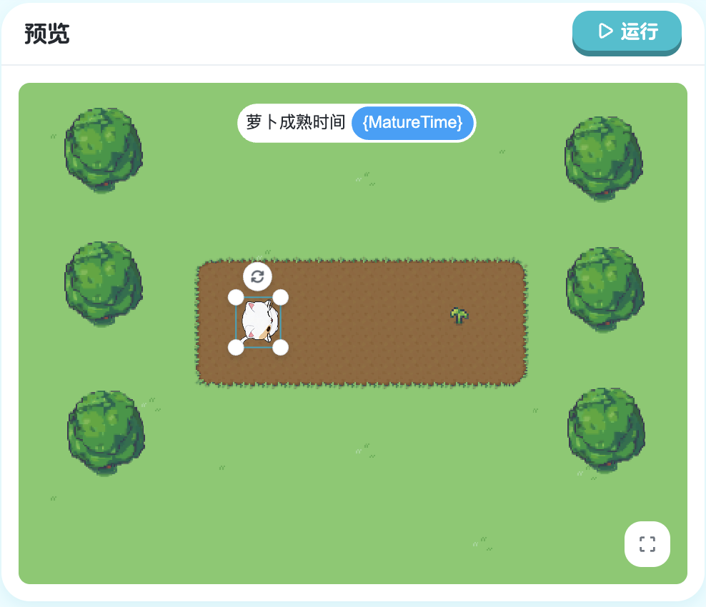

### 3.1 基础循环

#### 学习目标

想象一下，如果你要让 Kiko 画一个五边形，你需要写多少代码？

```xgo
turn -60
step 100
turn -60
step 100
turn -60
step 100
turn -60
step 100
turn -60
step 100
```

10 行代码！如果是画一个 100 边形呢？那就是 200 行代码！这太疯狂了。

幸运的是，编程中有一个超级强大的工具：**循环**（Loop）。循环可以让计算机自动重复执行代码，无论重复多少次。这一节，我们将学习最基础的循环：`repeat`。

#### 新的挑战：画五边形

看看这次的场景，我们要让 Kiko 画一个五边形。五边形有 5 条边，每条边需要：
1. 转向 -60 度
2. 前进 100 步

如果不用循环，我们需要重复写 5 次相同的代码。但用循环，只需要 3 行代码！


> 课程地址：https://x.qiniu.com/editor/curator/Coding-Course-15/sprites/Kiko/code

**使用循环的代码：**
```xgo
onStart => {
    repeat 5, => {
        turn -60
        step 100
    }
}
```

#### 代码详解

**认识 repeat 命令**

`repeat` 是"重复"的意思，它的完整语法是：

```xgo
repeat 次数, => {
    要重复的代码
}
```

让我们拆解这个语法：

- `repeat`：循环命令的关键词
- `5`：重复的次数（这里是 5 次）
- `,`：逗号，分隔次数和代码块
- `=> {}`：Lambda 表达式，包含要重复的代码
- 大括号 `{}` 内：要重复执行的代码

**Lambda 表达式**

`=> {}` 这个符号在 XGo 中叫做 Lambda 表达式：
- `=>`：箭头符号，读作"goes to"
- `{}`：大括号，包含代码块
- 完整意思：定义一段要执行的代码

我们在 `onStart` 中已经见过它：
```xgo
onStart => {  // 这也是 Lambda 表达式
    // 代码
}
```

**循环体**

大括号内的代码叫做**循环体**（Loop Body）：

```xgo
repeat 5, => {
    turn -60    // 循环体的第1行
    step 100    // 循环体的第2行
}
```

循环体内的所有代码会被重复执行 5 次。

**执行过程**

让我们看看这段代码是如何执行的：

```xgo
repeat 5, => {
    turn -60
    step 100
}
```

**第 1 次循环**：
1. 执行 `turn -60`（Kiko 转向）
2. 执行 `step 100`（Kiko 前进）

**第 2 次循环**：
1. 执行 `turn -60`（Kiko 再次转向）
2. 执行 `step 100`（Kiko 再次前进）

**第 3 次循环**：
1. 执行 `turn -60`
2. 执行 `step 100`

**第 4 次循环**：
1. 执行 `turn -60`
2. 执行 `step 100`

**第 5 次循环**：
1. 执行 `turn -60`
2. 执行 `step 100`

**循环结束**，总共执行了：
- `turn -60`：5 次
- `step 100`：5 次
- 画出了一个五边形！

#### 循环的优势

**对比：不用循环 vs 用循环**

**不用循环：**
```xgo
onStart => {
    turn -60
    step 100
    turn -60
    step 100
    turn -60
    step 100
    turn -60
    step 100
    turn -60
    step 100
}
```
- 10 行代码
- 重复写相同内容
- 容易出错
- 难以修改

**使用循环：**
```xgo
onStart => {
    repeat 5, => {
        turn -60
        step 100
    }
}
```
- 5 行代码
- 简洁清晰
- 不易出错
- 容易修改

**如果要画 100 边形？**

**不用循环**：
- 需要 200 行代码！
- 几乎不可能手写

**使用循环**：
```xgo
repeat 100, => {
    turn -3.6  // 360÷100 = 3.6
    step 50
}
```
- 还是 5 行代码！
- 只需改变次数和角度

这就是循环的威力！

#### 编程小知识

**什么是"循环"？**

**循环**（Loop）是编程中的基本概念之一，它让计算机能够：
- 重复执行相同的任务
- 自动计数次数
- 提高代码效率

生活中的循环例子：
- 刷牙：重复上下刷动 20 次
- 跑步：绕操场跑 5 圈
- 做作业：做 10 道数学题

**为什么叫"循环体"？**

循环体就像一个模板：
```xgo
repeat 5, => {
    turn -60    // 模板第1步
    step 100    // 模板第2步
}
```

计算机会拿着这个模板，重复执行 5 次。就像用一个饼干模具，可以做出很多相同的饼干！

**循环的计数**

虽然我们看不见，但计算机在循环时会自动计数：

```
第1次：执行循环体
第2次：执行循环体
第3次：执行循环体
第4次：执行循环体
第5次：执行循环体
完成！
```

当计数到达指定次数（5次），循环就会停止。

#### 循环体的内容

**循环体可以包含任何代码**

```xgo
// 简单：只有一个命令
repeat 5, => {
    step 50
}

// 中等：两个命令
repeat 5, => {
    turn -60
    step 100
}

// 复杂：多个命令
repeat 3, => {
    turn Right
    step 50
    turn Left
    step 30
    turn -45
    step 20
}

// 更复杂：包含对象控制
repeat 2, => {
    Boat.turn Right
    Boat.step 100
    step 50
}
```

**循环体的缩进**

为了代码清晰，循环体内的代码要**缩进**（向右移动）：

```xgo
// 好的缩进
repeat 5, => {
    turn -60
    step 100
}

// 不好的缩进（虽然能运行，但不清晰）
repeat 5, => {
turn -60
step 100
}
```

缩进让我们一眼就能看出哪些代码在循环体内。

#### 本节重点

| 概念 | 说明 | 示例 |
|------|------|------|
| `repeat` | 重复执行代码指定次数 | `repeat 5, => {}` |
| 循环体 | 大括号内要重复的代码 | `{ turn -60; step 100 }` |
| Lambda 表达式 | `=> {}` 定义代码块 | `=> { 代码 }` |
| 循环次数 | 重复执行的次数 | `5` 表示重复 5 次 |

**DRY 原则**

编程中有一个重要原则：**DRY**（Don't Repeat Yourself - 不要重复自己）

- 不要写重复的代码
- 用循环代替重复
- 让代码更简洁

#### 恭喜你！

你现在已经掌握了：
- 使用 `repeat` 创建循环
- 理解循环体的概念
- 知道如何确定循环次数
- 能用循环简化重复代码

循环是编程中最强大的工具之一，你已经迈出了重要的一步！

---

**下一节预告**：`repeat` 循环会重复固定次数。但有时候，我们不知道要重复多少次，而是想"一直重复，直到某个条件满足"。下一节将学习**带停止条件的循环**，让循环变得更智能！

#### 3.1.1 练习：基础循环 1

基础循环练习：

> 课程地址：https://x.qiniu.com/editor/curator/Coding-Course-14/sprites/Kiko/code

**练习内容：**
通过 `repeat` 创建简单的重复模式。

#### 3.1.2 练习：基础循环 2

进阶循环练习：

> 课程地址：https://x.qiniu.com/editor/curator/Coding-Course-16/sprites/Kiko/code

**练习内容：**
掌握更复杂的循环结构和嵌套。

### 3.2 带停止条件的循环

#### 学习目标

在上一节中，我们学会了 `repeat` 循环，它会重复固定的次数。但有时候，我们不知道要重复多少次，而是想：

- "一直走，直到到达某个位置"
- "一直转，直到面向某个方向"
- "一直移动，直到碰到障碍物"

这种"重复直到某个条件满足"的循环，就是**带停止条件的循环**。这一节，我们将学习 `repeatUntil` 命令。

#### 新的挑战：走到指定位置

看看这次的场景，我们要让 Kiko 一直向右走，直到它的 X 坐标超过 80。问题是：我们不知道需要走多少步！

如果用 `repeat`：
```xgo
repeat 10, => {  // 10次够吗？不够？太多？
    step 10
}
```

我们无法确定循环次数。但用 `repeatUntil`，就很简单：

```xgo
repeatUntil xpos > 80, => {  // 一直走，直到 x 坐标 > 80
    step 10
}
```


> 课程地址：https://x.qiniu.com/editor/curator/Coding-Course-28/sprites/Kiko/code

**完整代码：**
```xgo
onStart => {
    repeatUntil xpos > 80, => {
        step 10
    }
}
```

#### 代码详解

**认识 repeatUntil 命令**

`repeatUntil` 是"重复直到"的意思，完整语法是：

```xgo
repeatUntil 条件, => {
    要重复的代码
}
```

让我们拆解这个语法：

- `repeatUntil`：带条件的循环命令
- `xpos > 80`：停止条件（当这个条件为真时停止）
- `,`：逗号，分隔条件和代码块
- `=> {}`：Lambda 表达式，包含要重复的代码
- 大括号 `{}` 内：要重复执行的代码

**什么是 xpos？**

`xpos` 是 Kiko 的 **X 坐标**（X Position）：

- 游戏世界是一个坐标系
- X 坐标表示水平位置（左右方向）
- 数值越大，位置越靠右
- 数值越小，位置越靠左

```
  Y 轴（上下）
  ↑
  |
  |    Kiko (xpos = 50)
  |      ●
  |
  +------------------→ X 轴（左右）
  0    50   80   100
```

**什么是条件？**

条件是一个**判断语句**，结果是"真"或"假"：

```xgo
xpos > 80   // 判断：x 坐标是否大于 80
```

- 如果 Kiko 的 x 坐标是 90：条件为**真**（90 > 80）
- 如果 Kiko 的 x 坐标是 70：条件为**假**（70 不大于 80）

**repeatUntil 的工作原理**

```xgo
repeatUntil xpos > 80, => {
    step 10
}
```

执行流程：

1. **检查条件**：xpos > 80 吗？
   - 如果是（条件为真）：停止循环
   - 如果否（条件为假）：继续执行循环体

2. **执行循环体**：`step 10`

3. **回到第 1 步**：再次检查条件

4. **重复**：直到条件为真

#### repeat vs repeatUntil

**对比两种循环**

**repeat（固定次数）：**
```xgo
repeat 5, => {
    step 10
}
```
- 重复固定次数（5 次）
- 不管结果如何，总是执行 5 次
- 适合：知道要重复多少次

**repeatUntil（条件控制）：**
```xgo
repeatUntil xpos > 80, => {
    step 10
}
```
- 重复直到条件满足
- 不知道会执行多少次
- 适合：知道要达到什么状态

**什么时候用哪个？**

| 场景 | 使用 | 示例 |
|------|------|------|
| 画一个五边形 | `repeat` | `repeat 5, => {}` |
| 走到某个位置 | `repeatUntil` | `repeatUntil xpos > 80, => {}` |
| 重复动作 10 次 | `repeat` | `repeat 10, => {}` |
| 走到碰到边缘 | `repeatUntil` | `repeatUntil touching(Edge), => {}` |

#### 编程小知识

**什么是"条件"？**

条件是一个**布尔表达式**（Boolean Expression），结果只有两种：
- **真**（True）：条件成立
- **假**（False）：条件不成立

**常见的条件表达式**

**比较运算符**：

| 运算符 | 意思 | 示例 | 说明 |
|--------|------|------|------|
| `>` | 大于 | `xpos > 80` | x 坐标大于 80 |
| `<` | 小于 | `xpos < 20` | x 坐标小于 20 |
| `>=` | 大于等于 | `xpos >= 80` | x 坐标大于或等于 80 |
| `<=` | 小于等于 | `xpos <= 20` | x 坐标小于或等于 20 |
| `==` | 等于 | `xpos == 50` | x 坐标等于 50 |
| `!=` | 不等于 | `xpos != 0` | x 坐标不等于 0 |

**注意**：判断相等用 `==`（两个等号），不是 `=`（一个等号）！

**示例**：
```xgo
// 走到 x 坐标大于 100
repeatUntil xpos > 100, => {
    step 10
}

// 走到 x 坐标小于 -50
repeatUntil xpos < -50, => {
    step -10  // 负数表示向后退
}

// 走到 y 坐标大于等于 80
repeatUntil ypos >= 80, => {
    step 10
}
```

**什么是坐标系？**

游戏世界使用**笛卡尔坐标系**：

```
      Y 轴（ypos）
      ↑
      |
  100 +
      |
   50 +     ● (50, 50)
      |
    0 +----+----+----+----→ X 轴（xpos）
      0   50  100  150
      |
  -50 +
```

- **X 轴**（xpos）：水平方向，向右为正
- **Y 轴**（ypos）：垂直方向，向上为正
- **原点**（0, 0）：坐标系的中心

**Kiko 的坐标属性**

```xgo
xpos  // Kiko 的 x 坐标
ypos  // Kiko 的 y 坐标
```

这些属性会随着 Kiko 的移动而变化：
- `step 10`：xpos 增加（如果朝右）
- `turn` 然后 `step`：xpos 和 ypos 都可能变化

#### 循环的安全性

**无限循环的风险**

如果条件永远不满足，循环会永远执行下去！

```xgo
// 危险：可能无限循环
repeatUntil xpos > 80, => {
    step -10  // 向后退！永远到不了 80
}
```

这段代码的问题：
- 条件是 `xpos > 80`（要向右）
- 但 `step -10` 是向后退
- xpos 会越来越小，永远不会大于 80
- 循环永远不会停止！

**如何避免无限循环**

1. **确保循环体会改变条件**
   ```xgo
   // 好：step 10 会增加 xpos
   repeatUntil xpos > 80, => {
       step 10
   }
   ```

2. **检查方向是否正确**
   ```xgo
   // 好：向右走，xpos 增加
   repeatUntil xpos > 80, => {
       step 10
   }
   
   // 危险：向左走，xpos 减少
   repeatUntil xpos > 80, => {
       step -10
   }
   ```

3. **确保条件可以达到**
   ```xgo
   // 好：xpos 可以达到 80
   repeatUntil xpos > 80, => {
       step 10
   }
   
   // 危险：如果初始 xpos 已经 > 80，但 step 10 会让它更大
   // 这个例子其实是安全的，因为条件已经满足，循环不会执行
   ```

#### 本节重点

| 概念 | 说明 | 示例 |
|------|------|------|
| `repeatUntil` | 重复执行直到条件满足 | `repeatUntil xpos > 80, => {}` |
| 条件表达式 | 返回真或假的判断 | `xpos > 80` |
| `xpos` | 精灵的 X 坐标（水平位置） | 数值越大越靠右 |
| `ypos` | 精灵的 Y 坐标（垂直位置） | 数值越大越靠上 |
| 比较运算符 | `>`, `<`, `>=`, `<=`, `==`, `!=` | 用于比较数值 |

#### 恭喜你！

你现在已经掌握了：
- 使用 `repeatUntil` 创建条件循环
- 理解条件表达式的概念
- 知道如何使用坐标（xpos, ypos）
- 能根据目标选择合适的循环类型

条件循环让你的程序更加智能和灵活！

---

**下一节预告**：有时候，我们只想"等待某个条件满足"，而不需要在等待时重复执行代码。下一节将学习 `waitUntil`，一个更简洁的等待命令！

### 3.3 无循环体的条件等待

#### 学习目标

在上一节中，我们学习了 `repeatUntil`，它会重复执行代码直到条件满足。但有时候，我们只是想**等待**，而不需要在等待时做任何事情。

比如：
- 等待一扇门打开
- 等待一个物品成熟
- 等待另一个角色到达某个位置

这种"纯等待"的情况，用 `repeatUntil` 就显得有点笨拙：

```xgo
repeatUntil 萝卜.mature, => {
    // 什么都不做，只是等待
}
```

XGo 提供了一个更简洁的命令：`waitUntil`（等待直到）。

#### 新的挑战：等待萝卜成熟

看看这次的场景，地里有一个萝卜，但它还没有成熟。Kiko 需要：
1. 等待萝卜成熟
2. 萝卜成熟后，去收获它

关键是：Kiko 要**耐心等待**，不能去摘还没成熟的萝卜！


> 课程地址：https://x.qiniu.com/editor/curator/Coding-Course-29/sprites/Kiko/code

**完整代码：**
```xgo
onStart => {
    waitUntil 萝卜.mature
    turnTo 萝卜
    stepTo 萝卜
}
```

#### 代码详解

**认识 waitUntil 命令**

`waitUntil` 是"等待直到"的意思，语法非常简洁：

```xgo
waitUntil 条件
```

- `waitUntil`：等待命令
- `条件`：要等待满足的条件
- **没有** `=> {}`：不需要循环体！

**对比 repeatUntil 和 waitUntil**

**repeatUntil（有循环体）：**
```xgo
repeatUntil 条件, => {
    // 在等待期间重复执行这些代码
    做某事
}
```

**waitUntil（无循环体）：**
```xgo
waitUntil 条件
// 什么都不做，只是等待
```

**什么时候用哪个？**

| 场景 | 使用 | 原因 |
|------|------|------|
| 等待时需要做事 | `repeatUntil` | 需要循环体 |
| 等待时什么都不做 | `waitUntil` | 更简洁 |

**示例对比**：

```xgo
// 场景1：走到某个位置（等待时要移动）
repeatUntil xpos > 80, => {
    step 10  // 需要持续移动
}

// 场景2：等待萝卜成熟（等待时不做事）
waitUntil 萝卜.mature  // 只是等待
```

**认识对象属性**

在这个例子中，我们看到了新的语法：

```xgo
萝卜.mature
```

这叫做**访问对象属性**（Object Property Access）：
- `萝卜`：对象的名称
- `.`：访问符号
- `mature`：属性的名称（成熟状态）

**什么是属性？**

属性是对象的**特征**或**状态**。在 XBuilder 中，属性分为两类：

**1. 系统内置属性**

这些是 XBuilder 自动为每个对象提供的属性：

```xgo
// Kiko 的内置属性
Kiko.xpos     // Kiko 的 x 坐标（系统自带）
Kiko.ypos     // Kiko 的 y 坐标（系统自带）
Kiko.heading  // Kiko 的朝向（系统自带）
Kiko.size     // Kiko 的大小（系统自带）
```

这些属性：
- 所有精灵都有
- 由 XBuilder 系统管理
- 会随着精灵的移动、转向等自动更新

**2. 自定义属性**

这些是开发者为特定对象自定义的属性：

```xgo
// 萝卜的自定义属性
萝卜.mature   // 是否成熟（自定义属性）
```

这些属性：
- 不是所有对象都有
- 由开发者在对象代码中定义
- 用于表示对象的特殊状态

**mature 属性详解**

在这个例子中，`mature` 是**萝卜对象的自定义属性**：

```xgo
// 在萝卜对象的代码中（我们看不到，但它存在）
var (
    mature bool  // 自定义属性：是否成熟
)
```

- `mature` 不是 XBuilder 的系统属性
- 它是专门为萝卜对象创建的
- 用来表示萝卜的成熟状态

**属性值的变化**：
- 当萝卜还在生长时：`萝卜.mature` 为 `false`（假）
- 当萝卜成熟时：`萝卜.mature` 变为 `true`（真）

```xgo
waitUntil 萝卜.mature
```

这行代码的意思：
- 持续检查 `萝卜.mature` 的值
- 如果是 `false`：继续等待
- 如果是 `true`：停止等待，继续执行后面的代码

**如何知道对象有哪些属性？**

**系统内置属性**：
- 所有精灵都有相同的内置属性
- 可以查看 XBuilder 文档
- 常用的有：`xpos`, `ypos`, `heading`, `size`, `visible` 等

**自定义属性**：
- 需要查看该对象的代码
- 或者查看游戏文档
- 不同对象可能有完全不同的自定义属性

例如：
```xgo
// 系统属性：所有对象都有
Kiko.xpos      // ✓ 有
萝卜.xpos      // ✓ 有
门.xpos        // ✓ 有

// 自定义属性：只有特定对象有
萝卜.mature    // ✓ 萝卜有这个属性
Kiko.mature    // ✗ Kiko 没有这个属性
门.mature      // ✗ 门没有这个属性

门.open        // ✓ 门可能有这个属性
萝卜.open      // ✗ 萝卜没有这个属性
```

#### 执行流程

让我们详细看看代码是如何执行的：

```xgo
onStart => {
    waitUntil 萝卜.mature  // 第1步：等待
    turnTo 萝卜            // 第2步：转向
    stepTo 萝卜            // 第3步：前进
}
```

**时间线**：

```
游戏开始
  ↓
执行 waitUntil 萝卜.mature
  ↓
检查：萝卜.mature == true？
  ├─ 否 → 继续等待...
  │       ↓
  │     检查：萝卜.mature == true？
  │       ├─ 否 → 继续等待...
  │       └─ 是 → 停止等待
  │
  └─ 是 → 停止等待
  ↓
执行 turnTo 萝卜（Kiko 转向萝卜）
  ↓
执行 stepTo 萝卜（Kiko 走向萝卜）
  ↓
任务完成！
```

**等待期间发生了什么？**

在 `waitUntil` 等待期间：
- Kiko 保持静止
- 不执行任何代码
- 只是不断检查 `萝卜.mature` 的值
- 萝卜在慢慢成熟（由萝卜对象自己的代码控制）

当萝卜成熟的瞬间：
- 萝卜对象的代码将 `mature` 设为 `true`
- `waitUntil` 检测到条件满足
- 停止等待，继续执行后面的代码

#### 编程小知识

**什么是"等待"？**

在编程中，**等待**（Wait）是一种特殊的操作：
- 程序暂停执行
- 但不是完全停止
- 持续检查某个条件
- 条件满足后继续执行

这就像：
- 你在等公交车
- 你站在那里（暂停其他活动）
- 眼睛一直看着路（检查条件）
- 看到公交车来了（条件满足）
- 开始上车（继续执行）

**同步 vs 异步**

`waitUntil` 是**同步等待**：
- 代码会停在这一行
- 等待条件满足
- 然后才执行下一行

```xgo
waitUntil 萝卜.mature  // 停在这里等待
turnTo 萝卜            // 萝卜成熟后才执行这行
stepTo 萝卜            // 然后执行这行
```

这保证了执行顺序，让代码逻辑清晰。

**对象属性的动态性**

对象的属性会**动态变化**：

```xgo
// 游戏开始时
萝卜.mature == false  // 未成熟（由萝卜对象设置）

// 5秒后
萝卜.mature == false  // 还在生长

// 10秒后
萝卜.mature == true   // 成熟了！（萝卜对象更新了这个值）
```

`waitUntil` 会持续监测这种变化。

让我继续完成剩余部分：

```

**模式 3：等待后循环**

```xgo
onStart => {
    // 等待门打开（自定义属性）
    waitUntil 门.open
    
    // 门开了，通过走廊
    repeat 5, => {
        step 20
    }
}
```

**模式 4：循环中等待**

```xgo
onStart => {
    repeat 3, => {
        // 等待萝卜成熟（自定义属性）
        waitUntil 萝卜.mature
        
        // 收获萝卜
        turnTo 萝卜
        stepTo 萝卜
        
        // 萝卜会重新开始生长...
    }
}
```

**模式 5：混合使用系统属性和自定义属性**

```xgo
onStart => {
    // 先等待到达某个位置（系统属性）
    waitUntil xpos > 50
    
    // 再等待门打开（自定义属性）
    waitUntil 门.open
    
    // 最后通过门
    step 100
}
```

#### 三种循环的总结

现在我们学完了三种循环/等待命令，让我们总结一下：

| 命令 | 用途 | 有循环体 | 示例 |
|------|------|---------|------|
| `repeat` | 重复固定次数 | 是 | `repeat 5, => { step 10 }` |
| `repeatUntil` | 重复直到条件满足 | 是 | `repeatUntil xpos > 80, => { step 10 }` |
| `waitUntil` | 等待直到条件满足 | 否 | `waitUntil 萝卜.mature` |

**选择指南**：

```
需要重复做某事？
  ├─ 知道重复次数？
  │   └─ 用 repeat
  │
  └─ 不知道次数，根据条件？
      ├─ 等待时要做事？
      │   └─ 用 repeatUntil
      │
      └─ 等待时不做事？
          └─ 用 waitUntil
```

#### 属性类型总结

| 属性类型 | 说明 | 示例 | 适用对象 |
|---------|------|------|---------|
| 系统内置属性 | XBuilder 自动提供 | `xpos`, `ypos`, `heading` | 所有精灵 |
| 自定义属性 | 开发者为特定对象定义 | `mature`, `open`, `built` | 特定对象 |

**使用建议**：
- 使用系统属性时：可以放心使用，所有对象都有
- 使用自定义属性时：确保该对象确实有这个属性

#### 本节重点

| 概念 | 说明 | 示例 |
|------|------|------|
| `waitUntil` | 等待直到条件满足 | `waitUntil 萝卜.mature` |
| 系统属性 | XBuilder 自带的对象属性 | `xpos`, `ypos`, `heading` |
| 自定义属性 | 开发者定义的对象属性 | `mature`, `open`, `built` |
| 属性访问 | 用 `对象.属性` 访问 | `萝卜.mature` |
| 同步等待 | 代码暂停直到条件满足 | 保证执行顺序 |

#### 恭喜你！

你已经完成了第三章的所有内容！现在你掌握了：
- 使用 `repeat` 重复固定次数
- 使用 `repeatUntil` 重复直到条件满足
- 使用 `waitUntil` 等待条件满足
- 理解系统属性和自定义属性的区别
- 知道如何访问对象的不同类型属性
- 能够根据需求选择合适的循环/等待方式

循环是编程中最强大的工具之一，你已经完全掌握了它！
