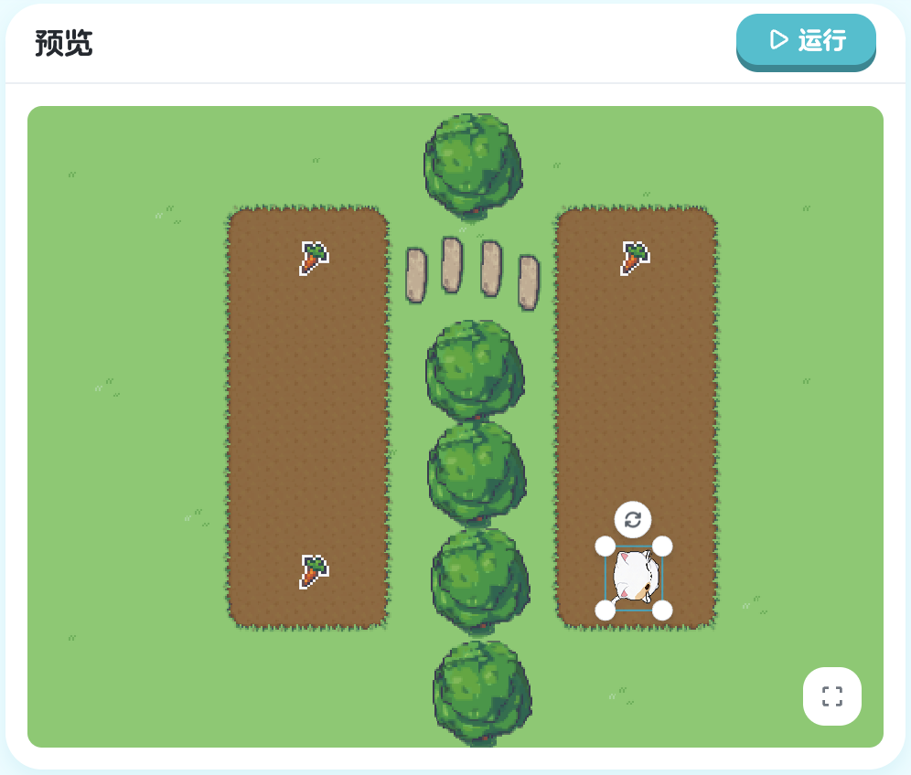
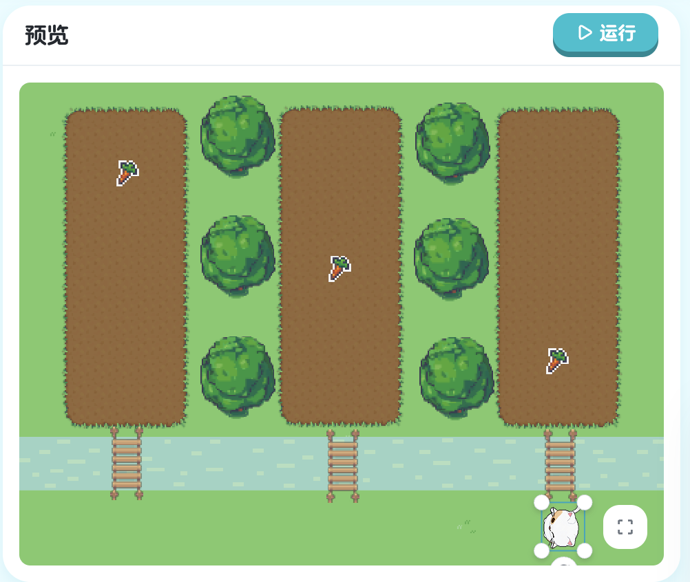

## 第四章：变量 - 存储和使用数据

在前三章中，我们学会了让角色移动、与对象交互、使用循环。但你可能注意到一个问题：我们的程序不能"记住"东西。

想象一下这些场景：
- 玩家得了多少分？
- 收集了几个萝卜？
- 角色还有多少生命值？
- 游戏进行了多长时间？

要实现这些功能，我们需要一个能够**存储数据**的工具。这个工具就是：**变量**（Variable）！

变量就像是一个**有标签的盒子**：
- 盒子可以装东西（存储数据）
- 标签上写着名字（变量名）
- 你可以随时打开盒子看里面装了什么（读取变量）
- 你也可以换掉盒子里的东西（修改变量）

### 4.1 定义和使用变量

#### 学习目标

这一节，我们将学习编程中最基础也最重要的概念之一：**变量**。你将学会：
- 如何创建变量
- 如何给变量赋值
- 如何使用变量
- 变量的类型是什么

掌握变量后，你的程序将拥有"记忆"能力！

#### 新的挑战：灵活的步数

看看这次的场景，我们要让 Kiko 向前走。但这次，我们不直接写 `step 160`，而是：
1. 先定义一个变量 `x`
2. 把步数 `160` 存储在变量 `x` 中
3. 使用变量 `x` 来控制前进

为什么要这样做？因为如果要改变步数，只需要修改变量的值，而不用改变 `step` 命令！


> 课程地址：https://x.qiniu.com/editor/curator/Coding-Course-19/sprites/Kiko/code

**初始代码：**
```xgo
onStart => {
    var x float64 = 100
    step x
}
```

**修改后的代码：**
```xgo
onStart => {
    var x float64 = 160
    step x
}
```

#### 代码详解

**认识变量定义**

让我们仔细分析变量定义的语法：

```xgo
var x float64 = 160
```

这行代码包含了几个重要部分：

| 部分 | 名称 | 作用 | 示例中的值 |
|------|------|------|-----------|
| `var` | 关键字 | 表示"定义变量" | `var` |
| `x` | 变量名 | 变量的名字 | `x` |
| `float64` | 类型 | 变量存储的数据类型 | `float64` |
| `=` | 赋值符号 | 把值赋给变量 | `=` |
| `160` | 值 | 存储在变量中的数据 | `160` |

**完整意思**：定义一个名为 `x` 的 `float64` 类型变量，并把值 `160` 存储进去。

**var 关键字**

`var` 是 "variable"（变量）的缩写：
- 它告诉计算机："我要创建一个变量"
- 每次定义变量都要用 `var` 开头
- 这是 XGo 的固定语法

**变量名**

`x` 是这个变量的名字：
- 你可以给变量起任何合法的名字
- 变量名要有意义，让人一看就知道它是干什么的
- 后面会详细讲变量命名规则

**数据类型**

`float64` 是变量的**数据类型**（Data Type）：
- 表示这个变量可以存储什么样的数据
- `float64` 表示"浮点数"（可以有小数的数字）
- 不同类型的数据要用不同的类型

**赋值**

`= 160` 是给变量**赋值**（Assignment）：
- `=` 不是"等于"，而是"赋值"
- 意思是"把右边的值存储到左边的变量中"
- `160` 是具体的数值

**使用变量**

定义变量后，就可以使用它了：

```xgo
step x
```

这里的 `x` 就是我们刚才定义的变量：
- 计算机会读取 `x` 中存储的值（160）
- 然后执行 `step 160`
- 效果和直接写 `step 160` 一样

**完整执行流程**

```xgo
onStart => {
    var x float64 = 160  // 第1步：创建变量x，存入160
    step x               // 第2步：读取x的值（160），前进160步
}
```

1. 程序执行第一行：创建变量 `x`，存入值 `160`
2. 程序执行第二行：读取 `x` 的值，得到 `160`，执行 `step 160`
3. Kiko 向前走 160 步

#### 为什么要用变量？

你可能会问：为什么不直接写 `step 160`？为什么要多此一举用变量？

**对比：不用变量 vs 用变量**

**不用变量：**
```xgo
onStart => {
    step 160
    turn Right
    step 160
    turn Right
    step 160
}
```

如果要把所有的 `160` 改成 `200`：
- 需要找到每一个 `160`
- 一个一个修改
- 容易漏掉或改错

**使用变量：**
```xgo
onStart => {
    var distance float64 = 160
    step distance
    turn Right
    step distance
    turn Right
    step distance
}
```

如果要改变距离：
- 只需要修改一个地方：`var distance float64 = 200`
- 所有用到 `distance` 的地方都会自动更新
- 简单、安全、不易出错

**变量的优势**：
1. **易于修改**：只需改一处
2. **代码清晰**：`distance` 比 `160` 更有意义
3. **减少错误**：不会漏改或改错
4. **便于维护**：代码更容易理解和修改

你说得对！让我修正这部分内容：

#### 数据类型详解

在 XGo 中，变量可以**显式指定类型**，也可以让编译器**自动推断类型**。

**两种定义方式**

**方式 1：显式指定类型**
```xgo
var x float64 = 160  // 明确告诉编译器 x 是 float64 类型
```

**方式 2：类型自动推断**
```xgo
var x = 160  // 编译器自动推断 x 是 int 类型
var y = 160.5  // 编译器自动推断 y 是 float64 类型
var name = "Kiko"  // 编译器自动推断 name 是 string 类型
```

**类型推断规则**

编译器根据赋值的内容自动判断类型：

| 赋值内容 | 推断类型 | 示例 |
|---------|---------|------|
| 整数 | `int` | `var x = 100` |
| 小数 | `float64` | `var x = 3.14` |
| 文字（用引号） | `string` | `var x = "Hello"` |
| true/false | `bool` | `var x = true` |

**常见的数据类型**

| 类型 | 中文名 | 用途 | 示例值 |
|------|--------|------|--------|
| `int` | 整数 | 存储整数（没有小数） | `10`, `100`, `-5` |
| `float64` | 浮点数 | 存储小数 | `3.14`, `160.5`, `-2.5` |
| `string` | 字符串 | 存储文字 | `"Hello"`, `"Kiko"` |
| `bool` | 布尔值 | 存储真/假 | `true`, `false` |

**为什么示例中用 float64？**

在这个例子中，我们**显式指定** `float64`：

```xgo
var x float64 = 160
```

原因是：
- `step` 命令可以接受小数，比如 `step 160.5`
- 如果写 `var x = 160`，会被推断为 `int` 类型，不能存储小数
- 用 `float64` 更灵活，既可以存整数也可以存小数

**对比两种方式**

```xgo
// 自动推断：x 是 int 类型
var x = 160
step x  // 可以，但 x 只能是整数

// 显式指定：x 是 float64 类型
var x float64 = 160
step x  // 可以，x 可以是整数或小数

// 自动推断为 float64
var x = 160.0  // 注意：有小数点
step x  // 可以，x 可以是整数或小数
```

**什么时候用哪种方式？**

| 情况 | 推荐方式 | 示例 |
|------|---------|------|
| 类型很明显 | 自动推断 | `var count = 5` |
| 需要特定类型 | 显式指定 | `var distance float64 = 160` |
| 想要更清晰 | 显式指定 | `var score int = 100` |
| 追求简洁 | 自动推断 | `var name = "Kiko"` |

**类型示例**

```xgo
// 自动推断类型
var count = 5           // int
var distance = 160.5    // float64
var name = "Kiko"       // string
var isReady = true      // bool

// 显式指定类型
var count int = 5
var distance float64 = 160
var name string = "Kiko"
var isReady bool = true
```

**重要提示**

一旦变量的类型确定（无论是显式指定还是自动推断），就不能改变：

```xgo
var x = 100        // x 是 int 类型
x = 200            // ✓ 可以，都是整数
x = 3.14           // ✗ 错误！不能把 float64 赋给 int

var y float64 = 100  // y 是 float64 类型
y = 200              // ✓ 可以，200 会转为 200.0
y = 3.14             // ✓ 可以，都是 float64
```

这部分修正后，更准确地反映了 XGo 的类型系统特性。

#### 变量命名规则

**合法的变量名**

变量名必须遵循这些规则：

1. **只能包含**：
   - 字母（a-z, A-Z）
   - 数字（0-9）
   - 下划线（_）

2. **不能以数字开头**：
   - `x1` ✓ 合法
   - `1x` ✗ 非法

3. **不能使用关键字**：
   - `var` ✗ 非法（是关键字）
   - `step` ✗ 非法（是命令）
   - `myVar` ✓ 合法

4. **区分大小写**：
   - `x` 和 `X` 是不同的变量
   - `name` 和 `Name` 是不同的变量

**好的变量命名习惯**

| 不好的命名 | 好的命名 | 原因 |
|-----------|---------|------|
| `x` | `distance` | 有意义 |
| `a` | `score` | 清晰明了 |
| `temp` | `playerHealth` | 说明用途 |
| `n` | `gemCount` | 容易理解 |

**命名风格**

XGo 推荐使用**驼峰命名法**（Camel Case）：

```xgo
// 单个单词：小写
var speed float64 = 10

// 多个单词：第一个单词小写，后面的单词首字母大写
var moveSpeed float64 = 10
var playerScore int = 100
var isGameOver bool = false
```

#### 变量的使用

**读取变量的值**

定义变量后，可以在任何地方使用它：

```xgo
onStart => {
    var distance float64 = 160
    
    // 用在 step 命令中
    step distance
    
    // 用在 turn 命令中（假设 distance 是角度）
    // turn distance
}
```

**多次使用同一个变量**

变量可以被多次使用：

```xgo
onStart => {
    var distance float64 = 100
    
    step distance      // 第1次使用：走100步
    turn Right
    step distance      // 第2次使用：再走100步
    turn Right
    step distance      // 第3次使用：再走100步
}
```

每次使用 `distance` 时，计算机都会读取它存储的值（100）。

**变量与常量的对比**

```xgo
// 直接使用数字（常量）
step 100
step 100
step 100

// 使用变量
var distance float64 = 100
step distance
step distance
step distance
```

两种方式效果相同，但变量方式更灵活。

#### 变量的作用域

**局部变量**

在 `onStart` 中定义的变量是**局部变量**：

```xgo
onStart => {
    var x float64 = 160  // 局部变量
    step x
}
// 这里不能使用 x，因为它只在 onStart 内部有效
```

局部变量的特点：
- 只在定义它的代码块内有效
- 代码块结束后就消失
- 不同代码块可以有同名的局部变量

**全局变量**（预告）

后面我们会学习在函数外定义的**全局变量**，它们在整个程序中都有效。

#### 编程小知识

**什么是"变量"？**

变量这个概念来自数学，但在编程中有特殊的含义：

**数学中的变量**：
```
x + 5 = 10
x = 5
```
- x 是未知数
- 通过计算得出 x 的值

**编程中的变量**：
```xgo
var x float64 = 5
x = x + 1  // x 现在是 6
```
- x 是存储数据的容器
- 可以随时改变 x 的值

**变量 = 标签 + 盒子**

你可以这样理解变量：

```
┌─────────────┐
│   标签: x   │
├─────────────┤
│   类型:     │
│   float64   │
├─────────────┤
│   值: 160   │
└─────────────┘
```

- **标签**：变量名（x）
- **类型**：盒子的规格（float64）
- **值**：盒子里的内容（160）

**内存中的变量**

当你定义变量时，计算机会：
1. 在内存中分配一块空间
2. 给这块空间贴上标签（变量名）
3. 把值存储在这块空间中

```
内存示意图：
地址    变量名    值
0x1000   x      160
0x1008   y      3.14
0x1010   name   "Kiko"
```

#### 本节重点

| 概念 | 说明 | 示例 |
|------|------|------|
| 变量 | 存储数据的容器 | `var x float64 = 160` |
| `var` | 定义变量的关键字 | `var` |
| 变量名 | 变量的标识符 | `x`, `distance`, `score` |
| 数据类型 | 变量存储的数据类型 | `int`, `float64`, `string`, `bool` |
| 赋值 | 给变量存入值 | `= 160` |
| 读取 | 使用变量的值 | `step x` |

#### 恭喜你！

你现在已经掌握了：
- 使用 `var` 定义变量
- 理解变量的类型（int, float64, string, bool）
- 给变量赋值和读取变量的值
- 知道如何给变量起好名字
- 理解变量的优势和用途

变量是编程的基础，你已经迈出了重要的一步！

---

**下一节预告**：我们已经学会了在普通代码中使用变量，但如果要在循环中使用变量呢？下一节将学习如何定义循环次数变量，让循环更加灵活！

### 4.2 定义循环次数变量

#### 学习目标

在上一节中，我们学会了定义变量并在简单命令中使用它。但变量的真正威力在于它的**灵活性**。这一节，我们将学习一个更实用的应用：**用变量控制循环次数**。

想象一下这些场景：
- 画一个三角形需要循环 3 次
- 画一个正方形需要循环 4 次
- 画一个五边形需要循环 5 次

如果每次都要修改 `repeat` 后面的数字，很麻烦。但如果用变量，只需要改变量的值就可以了！

#### 新的挑战：用变量控制图形

看看这次的场景，我们要画一个图形，但这次循环次数不是直接写死的，而是**存储在变量中**。这样，如果想改变图形的边数，只需要修改变量的值！


> 课程地址：https://x.qiniu.com/editor/curator/Coding-Course-20/sprites/Kiko/code

**完整代码：**
```xgo
onStart => {
    var n int = 3
    repeat n, => {
        turn -60
        step 100
    }
}
```

#### 代码详解

**变量定义**

```xgo
var n int = 3
```

这次我们定义了一个整数变量：
- `n`：变量名（通常用 n 表示"次数"number）
- `int`：整数类型（循环次数必须是整数）
- `3`：初始值，表示循环 3 次

**为什么用 int 而不是 float64？**

循环次数必须是**整数**：
- 可以循环 3 次、5 次、10 次
- 不能循环 3.5 次、2.7 次

所以这里用 `int` 类型是最合适的。

**在 repeat 中使用变量**

```xgo
repeat n, => {
    turn -60
    step 100
}
```

以前我们这样写：
```xgo
repeat 3, => {  // 直接写数字
    turn -60
    step 100
}
```

现在我们这样写：
```xgo
var n = 3
repeat n, => {  // 使用变量
    turn -60
    step 100
}
```

**执行过程**

让我们看看代码是如何执行的：

```xgo
onStart => {
    var n int = 3        // 第1步：创建变量n，值为3
    repeat n, => {       // 第2步：读取n的值（3），循环3次
        turn -60         // 第3步：每次循环执行这两行
        step 100
    }
}
```

1. **定义变量**：创建变量 `n`，存入值 `3`
2. **读取变量**：`repeat` 读取 `n` 的值，得到 `3`
3. **执行循环**：循环体执行 3 次
4. **绘制图形**：每次循环转 -60 度，走 100 步

**等价代码**

使用变量的代码：
```xgo
var n = 3
repeat n, => {
    turn -60
    step 100
}
```

等价于：
```xgo
repeat 3, => {
    turn -60
    step 100
}
```

但使用变量的好处是更灵活！

#### 变量的灵活性

**改变循环次数**

如果要改变循环次数，只需要修改变量的值：

**画三角形（3次循环）：**
```xgo
var n = 3  // 只改这里
repeat n, => {
    turn -120
    step 100
}
```

**画正方形（4次循环）：**
```xgo
var n = 4  // 只改这里
repeat n, => {
    turn -90
    step 100
}
```

**画五边形（5次循环）：**
```xgo
var n = 5  // 只改这里
repeat n, => {
    turn -72
    step 100
}
```

**画六边形（6次循环）：**
```xgo
var n = 6  // 只改这里
repeat n, => {
    turn -60
    step 100
}
```

看到了吗？只需要改变 `n` 的值，就能画出不同的图形！

#### 本节重点

| 概念 | 说明 | 示例 |
|------|------|------|
| 循环次数变量 | 用变量控制循环次数 | `var n = 5; repeat n, => {}` |
| `int` 类型 | 循环次数必须是整数 | `var n int = 3` |
| 变量灵活性 | 改变量值即可改变循环行为 | 修改 `n` 的值 |
| 避免魔法数字 | 用有意义的变量名代替数字 | `sides` 比 `5` 更清晰 |

#### 实用技巧

**技巧 1：选择有意义的变量名**

```xgo
// 不好
var n = 5
repeat n, => {}

// 好
var sides = 5  // 或 loopCount, repeatTimes
repeat sides, => {}
```

**技巧 2：在变量定义处添加注释**

```xgo
// 定义图形的边数
var sides = 5

repeat sides, => {
    turn -72
    step 100
}
```

**技巧 3：用类型自动推断简化代码**

```xgo
// 显式指定类型
var n int = 5

// 自动推断（更简洁）
var n = 5  // 编译器自动推断为 int
```

**技巧 4：把相关的变量放在一起**

```xgo
onStart => {
    // 图形参数
    var sides = 5
    var sideLength = 100
    var turnAngle = -72
    
    // 绘制图形
    repeat sides, => {
        turn turnAngle
        step sideLength
    }
}
```

#### 编程思维

**从"固定"到"可配置"**

这一节展示了编程思维的重要转变：

**固定循环次数**：
```xgo
repeat 5, => {
    turn -72
    step 100
}
```
- 循环次数写死
- 要改就得改代码
- 不灵活

**可配置循环次数**：
```xgo
var sides = 5
repeat sides, => {
    turn -72
    step 100
}
```
- 循环次数可配置
- 改变量就能改行为
- 灵活可扩展

**参数化思维**

用变量控制循环次数是**参数化**思维的体现：
- 把"可能变化的值"提取为变量
- 让代码更通用
- 提高代码的可重用性

**配置与逻辑分离**

```xgo
// 配置部分（数据）
var sides = 5
var sideLength = 100

// 逻辑部分（行为）
repeat sides, => {
    turn -72
    step sideLength
}
```

把配置和逻辑分开，让代码结构更清晰。

#### 恭喜你！

你现在已经掌握了：
- 定义循环次数变量
- 在 `repeat` 中使用变量
- 理解为什么要用变量控制循环
- 知道如何选择好的变量名
- 理解参数化的编程思维

变量让循环变得更加灵活和强大！

---

**下一节预告**：我们已经学会了用变量控制循环次数，但如果要在**循环体内部**使用变量呢？下一节将学习如何定义循环体内的变量，让循环能够处理更复杂的逻辑！

### 4.3 定义循环体变量

学习在循环体中使用变量：


> 课程地址：https://x.qiniu.com/editor/curator/Coding-Course-21/sprites/Kiko/code

```xgo
onStart => {
    var stepN float64 = 100
    repeat 3, => {
        turn Left
        step stepN
    }
}
```

**命令解释：**
- `var stepN float64 = 100`: 定义一个名为stepN的浮点数变量，并赋值为100
- `repeat 3, => {}`: 重复执行花括号内的代码3次
- `turn Left`: 让精灵向左转90度
- `step stepN`: 使用变量stepN作为步进距离，让精灵前进100步

#### 4.3.1 练习：定义循环体变量1

进一步练习在循环体中使用变量：

> 课程地址：https://x.qiniu.com/editor/curator/Coding-Course-22/sprites/Kiko/code

**练习内容：**
掌握在循环体中灵活使用变量控制精灵行为。

### 4.4 在循环中修改变量

#### 学习目标

到目前为止，我们定义的变量值都是固定的。但变量最强大的特性是：它的值可以**改变**！这就是为什么叫"变量"（Variable）——因为它的值是"可变的"。

这一节，我们将学习编程中最重要的技能之一：**在循环中修改变量**。这个技能将让你创造出动态的、有趣的效果！

想象一下这些场景：
- 每次循环步数增加，形成螺旋图案
- 每次循环角度变化，创造特殊效果
- 记录循环次数，实现计数功能

所有这些都需要修改变量！

#### 新的挑战：创造动态效果

看看这次的场景，我们要让 Kiko 执行一个复杂的移动模式。关键是：每次循环后，移动的距离都会**增加**！这样就能创造出动态变化的效果。


> 课程地址：https://x.qiniu.com/editor/curator/Coding-Course-25/sprites/Kiko/code

**初始代码：**
```xgo
onStart => {
    var x float64 = 145

    repeat 3, => {
        turn Right
        step x
        step -x
        turn Left
        step 161
        x = x + 10
    }
}
```

**修改后的代码：**
```xgo
onStart => {
    var x float64 = 145

    repeat 3, => {
        turn Right
        step x
        step -x
        turn Left
        step 161
        x = x + 70
    }
}
```

#### 代码详解

**变量的初始值**

```xgo
var x float64 = 145
```

- 定义变量 `x`，初始值为 `145`
- 这是 `x` 的**起始值**
- 后面会在循环中改变它

**循环体中的操作**

让我们逐行分析循环体：

```xgo
repeat 3, => {
    turn Right      // 1. 向右转
    step x          // 2. 向前走 x 步
    step -x         // 3. 向后退 x 步（回到原位）
    turn Left       // 4. 向左转（回到原朝向）
    step 161        // 5. 向前走固定的 161 步
    x = x + 70      // 6. 重点：x 增加 70
}
```

**关键：修改变量**

```xgo
x = x + 70
```

这是本节最重要的一行代码！让我们详细理解它：

**执行过程**：
1. 读取 `x` 的当前值（右边的 `x`）
2. 给这个值加上 `70`
3. 把结果存回 `x`（左边的 `x`）

**为什么写 `x = x + 70`？**

在数学中，`x = x + 70` 看起来很奇怪（x 怎么能等于 x + 70？）。但在编程中，`=` 不是"等于"，而是**赋值**：

```
x = x + 70
↑   ↑   ↑
│   │   └─ 加 70
│   └───── 读取 x 的当前值
└───────── 把结果存回 x
```

**步骤拆解**：

```xgo
// 假设 x 当前值是 145
x = x + 70

// 等价于：
// 第1步：读取 x 的值 → 145
// 第2步：计算 145 + 70 → 215
// 第3步：把 215 存回 x
// 结果：x 现在是 215
```

#### 修改变量的不同方式

**加法：增加值**
```xgo
x = x + 70   // x 增加 70
x = x + 10   // x 增加 10
x = x + 1    // x 增加 1（计数）
```

**减法：减少值**
```xgo
x = x - 10   // x 减少 10
x = x - 5    // x 减少 5
x = x - 1    // x 减少 1（倒计时）
```

**乘法：成倍增长**
```xgo
x = x * 2    // x 翻倍
x = x * 1.5  // x 增加 50%
```

**除法：成倍减少**
```xgo
x = x / 2    // x 减半
x = x / 10   // x 变为原来的 1/10
```

#### 负数步进

注意代码中的这一行：

```xgo
step -x
```

**负数表示后退**：
- `step 100`：向前走 100 步
- `step -100`：向后退 100 步

**为什么要后退？**

```xgo
step x      // 向前走 x 步
step -x     // 向后退 x 步（回到原位）
```

这两行组合的效果：
- 向前走，然后退回来
- 相当于"探索"了一下前方
- 最终位置不变

这样设计是为了创造特定的视觉效果。

**赋值 vs 等式**

编程中的 `=` 和数学中的 `=` 不同：

| 数学 | 编程 |
|------|------|
| `x = 5` 表示 x 等于 5 | `x = 5` 表示把 5 赋给 x |
| `x = x + 1` 无意义 | `x = x + 1` 表示 x 增加 1 |
| `=` 是相等关系 | `=` 是赋值操作 |

**自增/自减**

虽然 XGo 支持简写，但现在我们用标准写法：

```xgo
// 标准写法
x = x + 1    // x 增加 1
x = x - 1    // x 减少 1

// 简写
// x++        // x 增加 1
// x--        // x 减少 1
```

#### 本节重点

| 概念 | 说明 | 示例 |
|------|------|------|
| 修改变量 | 改变变量的值 | `x = x + 70` |
| 赋值操作 | 把值存入变量 | `=` 是赋值，不是相等 |
| 累加 | 不断增加变量的值 | `x = x + 10` |
| 动态效果 | 每次循环行为不同 | 步长逐渐增加 |
| 状态变化 | 程序状态随时间改变 | x: 145 → 215 → 285 |

#### 恭喜你！

你已经完成了第四章的所有内容！现在你掌握了：
- 定义和使用变量
- 用变量控制循环次数
- 在循环体中使用变量
- **在循环中修改变量**（最重要！）
- 创造动态效果

变量是编程的核心概念，你已经完全掌握了它！

#### 4.4.1 练习：变量章节课后练习1

综合练习变量的使用：

> 课程地址：https://x.qiniu.com/editor/curator/Coding-Course-23/sprites/Kiko/code

**练习内容：**
运用变量知识完成更复杂的编程任务。

#### 4.4.2 练习：变量章节课后练习2

进阶变量练习：

> 课程地址：https://x.qiniu.com/editor/curator/Coding-Course-24/sprites/Kiko/code

**练习内容：**
掌握变量在不同场景下的应用技巧。
