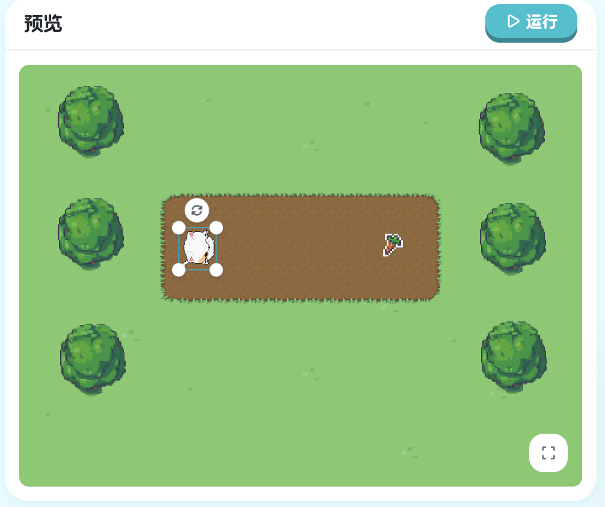

## 第五章：函数调用 - 使用内置功能

在前四章中，我们学会了编程的基础工具：移动、循环、变量。但是，有些任务用这些基础工具很难完成。比如：

- 如何计算 Kiko 到萝卜的距离？
- 如何生成一个随机数？
- 如何判断是否碰到了某个对象？

幸运的是，XBuilder 已经为我们准备好了很多**内置功能**，这些功能被封装成**函数**（Function）。我们只需要**调用**它们，就能轻松完成复杂的任务！

### 命令 vs 函数

在开始之前，我们需要理解**命令**和**函数**的区别：

#### 命令（Command）

我们之前学过的都是命令：

```go
step 100        // 命令：参数通常不用括号
turn Right      // 命令：参数通常不用括号
turnTo 萝卜     // 命令：参数通常不用括号
```

**命令的特点**：
- 主要用于**执行操作**（做某事）
- 通常**没有返回值**
- 参数一般不用括号

#### 函数（Function）

函数是一种特殊的功能：

```go
var distance = distanceTo(萝卜)    // 函数：参数必须用括号
var n = rand(1, 10)         // 函数：参数必须用括号
```

**函数的特点**：
- 主要用于**计算或查询**（获取信息）
- **有返回值**（返回计算结果）
- 参数**必须**用括号括起来

#### 为什么函数要用括号？

这是因为函数有返回值：

```go
// 函数有返回值，必须用括号
var distance = distanceTo(萝卜)  // ✓ 正确

// 如果不用括号，编译器会混淆
var distance = distanceTo 萝卜   // ✗ 错误，编译器不知道这是函数调用
```

括号是函数调用的**标志**，告诉编译器："这是一个函数，请执行它并返回结果"。

#### 对比总结

| 特性 | 命令 | 函数 |
|------|------|------|
| 括号 | 通常不用 | 必须用 |
| 返回值 | 无 | 有 |
| 用途 | 执行操作（做事） | 计算/查询（获取信息） |
| 示例 | `step 100` | `distanceTo(萝卜)` |

**记忆技巧**：
- **命令**：让对象"做事"→ `step 100`
- **函数**：获取"信息"→ `distanceTo(萝卜)`

### 5.1 距离计算

#### 学习目标

想象一下这个场景：Kiko 要走到萝卜那里，但我们不知道萝卜有多远。如果用 `step 100`，可能走不到；用 `step 200`，可能走过头。

怎么办？我们需要**先计算距离**，然后根据距离来移动！

这一节，我们将学习第一个内置函数：`distanceTo`（距离到）。它可以帮我们精确计算到任何对象的距离。

#### 新的挑战：精确到达目标

看看这次的场景，Kiko 需要走到萝卜那里。但萝卜的位置可能每次都不同！我们需要：
1. 计算 Kiko 到萝卜的距离
2. 用这个距离作为步数
3. 精确到达萝卜


> 课程地址：https://x.qiniu.com/project/curator/Coding-Course-30-1

**完整代码：**
```go
onStart => {
    var n = distanceTo(萝卜)
    step n
}
```

#### 代码详解

**认识 distanceTo 函数**

```go
distanceTo(萝卜)
```

这是一个**函数调用**（Function Call）：
- `distanceTo`：函数名（距离到）
- `(萝卜)`：函数参数（目标对象）
- 括号**必须**有！

**函数的作用**：
- 计算 Kiko 到萝卜的**直线距离**
- 返回一个数值（距离）
- 这个数值可以存储在变量中或直接使用

**完整语句分析**

```go
var n = distanceTo(萝卜)
```

让我们拆解这行代码：

| 部分 | 作用 | 说明 |
|------|------|------|
| `var n` | 定义变量 | 创建一个名为 n 的变量 |
| `=` | 赋值 | 把右边的值赋给左边的变量 |
| `distanceTo(萝卜)` | 函数调用 | 计算到萝卜的距离并返回 |

**执行过程**：
1. 调用 `distanceTo(萝卜)` 函数
2. 函数计算 Kiko 到萝卜的距离（比如 150）
3. 函数**返回**这个距离值（150）
4. 把返回值存入变量 `n`
5. 现在 `n = 150`

**使用距离**

```go
step n
```

- 读取变量 `n` 的值（150）
- 执行 `step 150`
- Kiko 向前走 150 步
- 正好到达萝卜！

#### 为什么需要 distanceTo？

**对比：不用函数 vs 用函数**

**不用函数（猜测距离）：**
```go
onStart => {
    step 150  // 猜测距离是 150
}
```

问题：
- 如果萝卜在 100 步的位置：走过头了
- 如果萝卜在 200 步的位置：走不到
- 每次萝卜位置变化，都要重新猜测和修改代码

**使用函数（精确计算）：**
```go
onStart => {
    var n = distanceTo(萝卜)  // 精确计算距离
    step n
}
```

优势：
- 自动计算距离，无需猜测
- 无论萝卜在哪里都能精确到达
- 萝卜位置改变，代码不需要修改
- 代码更智能、更可靠

#### 函数返回值

**什么是返回值？**

函数执行后会**返回一个值**（Return Value）：

```go
var distance = distanceTo(萝卜)
//    ↑           ↑
//    │           └─ 函数返回一个数值（比如 150）
//    └──────────── 把返回值存入变量
```

返回值就像：
- 你问朋友"现在几点？"
- 朋友回答"3点"
- "3点"就是返回值

**返回值的使用方式**

**方式 1：存入变量（推荐，清晰）**
```go
var n = distanceTo(萝卜)  // 先存入变量
step n                     // 再使用变量
```

**方式 2：直接使用（简洁）**
```go
step distanceTo(萝卜)  // 直接使用返回值
```

两种方式效果相同，但方式 1 更清晰，特别是当逻辑复杂时。

**返回值可以参与计算**

返回值是一个普通的数值，可以参与各种计算：

```go
// 走一半的距离
var halfDistance = distanceTo(萝卜) / 2
step halfDistance

// 走两倍的距离
var doubleDistance = distanceTo(萝卜) * 2
step doubleDistance

// 在距离基础上加 50
var extraDistance = distanceTo(萝卜) + 50
step extraDistance

// 减去 30 步
var lessDistance = distanceTo(萝卜) - 30
step lessDistance
```

#### distanceTo 的工作原理

**如何计算距离？**

`distanceTo` 使用**勾股定理**（Pythagorean Theorem）计算直线距离：

```
距离 = √[(x2-x1)² + (y2-y1)²]
```

**示例计算**：

假设：
- Kiko 的位置：(0, 0)
- 萝卜的位置：(30, 40)

计算过程：
```
距离 = √[(30-0)² + (40-0)²]
     = √[30² + 40²]
     = √[900 + 1600]
     = √2500
     = 50
```

所以 `distanceTo(萝卜)` 会返回 `50`。

**好消息**：我们不需要手动计算这些复杂的数学！`distanceTo` 函数会自动完成所有计算，我们只需要调用它就可以了。

**距离是直线距离**

重要提示：`distanceTo` 计算的是**直线距离**：

```
Kiko ·········· 萝卜
      ↑
      直线距离
```

如果中间有障碍物：
```
Kiko ─┐
      │ 绕路距离
      └──→ 萝卜
      
直线距离 < 实际行走距离
```

`distanceTo` 返回的是直线距离，不考虑障碍物。

**内置函数 vs 自定义函数**

- **内置函数**：XBuilder 系统提供的（如 `distanceTo`, `rand`）
- **自定义函数**：我们自己定义的（第十章会学）

#### 函数调用的语法

**基本语法**

```go
函数名(参数1, 参数2, ...)
```

**单个参数**：
```go
distanceTo(萝卜)
```

**多个参数**（下一节会学）：
```go
rand(1, 10)  // 两个参数：最小值1，最大值10
```

**无参数**（可能的情况）：
```go
timer()  // 无参数，但括号仍然必须有
```

**正确的写法**

```go
// ✓ 正确：有括号
var n = distanceTo(萝卜)

// ✓ 正确：直接使用返回值
step distanceTo(萝卜)

// ✓ 正确：参与计算
var n = distanceTo(萝卜) + 10

// ✓ 正确：作为另一个函数的参数
println distanceTo(萝卜)
```

**错误的写法**

```go
// ✗ 错误：缺少括号
var n = distanceTo 萝卜

// ✗ 错误：拼写错误
var n = distanceto(萝卜)   // 注意大小写

// ✗ 错误：对象名错误
var n = distanceTo(胡萝卜)  // 如果没有"胡萝卜"对象
```

#### 本节重点

| 概念 | 说明 | 示例 |
|------|------|------|
| 函数 | 封装的可重用代码，有返回值 | `distanceTo` |
| 函数调用 | 使用函数获取结果 | `distanceTo(萝卜)` |
| 参数 | 传给函数的输入 | `萝卜` 是参数 |
| 返回值 | 函数返回的输出 | 距离数值（如 150） |
| 括号 | 函数参数必须用括号 | `(萝卜)` 不能省略 |
| 直线距离 | 两点间的最短距离 | 不考虑障碍物 |

#### 恭喜你！

你现在已经掌握了：
- 理解命令和函数的区别
- 调用 `distanceTo` 函数计算距离
- 理解函数参数和返回值的概念
- 使用返回值进行计算和操作
- 将函数应用到实际游戏场景

函数让编程变得更强大和高效！你已经学会了使用编程"工具箱"中的第一个工具。

---

**下一节预告**：`distanceTo` 让我们能够精确计算距离，但游戏中还需要另一个重要功能：**随机性**。如果游戏中的一切都是固定的，就会变得很无聊。下一节将学习 `rand` 函数，让游戏充满惊喜和变化！

#### 5.1.1 练习：距离计算

练习使用距离计算函数：

> 课程地址：https://x.qiniu.com/editor/curator/Coding-Course-30-4/sprites/Kiko/code

**练习内容：**
掌握如何使用 `distanceTo` 函数计算精灵到目标对象的距离。

### 5.2 随机数生成

#### 学习目标

想象一下，如果每次玩游戏都是一样的：
- 敌人总是出现在同一个位置
- 宝石总是掉落相同的数量
- 角色总是走相同的路径

这样的游戏会很无聊！好的游戏需要**随机性**（Randomness），让每次游戏体验都不同。

这一节，我们将学习第二个内置函数：`rand`（随机）。它可以生成随机数，让游戏充满变化和惊喜！

#### 新的挑战：创造不可预测的移动

看看这次的场景，我们要让 Kiko：
1. 先随机走一段距离（10 到 20 步之间）
2. 然后精确走到萝卜1

关键是第一步：每次运行游戏，Kiko 走的距离都会不同！有时走 10 步，有时走 15 步，有时走 20 步。这让游戏变得有趣和不可预测。


> 课程地址：https://x.qiniu.com/project/curator/Coding-Course-30-2

**完整代码：**
```go
onStart => {
    var x = rand(10, 20)
    step x
    var n = distanceTo(萝卜1)
    step n
}
```

#### 代码详解

**认识 rand 函数**

```go
rand(10, 20)
```

这是一个**随机数生成函数**：
- `rand`：函数名（random 的缩写，随机）
- `(10, 20)`：两个参数
  - 第一个参数 `10`：最小值
  - 第二个参数 `20`：最大值
- 返回：10 到 20 之间的一个随机整数

**完整语句分析**

```go
var x = rand(10, 20)
```

执行过程：
1. 调用 `rand(10, 20)` 函数
2. 函数生成一个 10 到 20 之间的随机数（比如 15）
3. 函数**返回**这个随机数（15）
4. 把返回值存入变量 `x`
5. 现在 `x = 15`

**每次运行都不同**

这是随机函数的关键特性：

```go
// 第1次运行
var x = rand(10, 20)  // x 可能是 12

// 第2次运行
var x = rand(10, 20)  // x 可能是 18

// 第3次运行
var x = rand(10, 20)  // x 可能是 10

// 第4次运行
var x = rand(10, 20)  // x 可能是 20
```

每次运行游戏，`x` 的值都可能不同！

**代码执行流程**

```go
onStart => {
    var x = rand(10, 20)      // 第1步：生成随机数（比如15）
    step x                     // 第2步：随机前进（走15步）
    var n = distanceTo(萝卜1)  // 第3步：计算到萝卜的距离（比如120）
    step n                     // 第4步：精确到达萝卜（走120步）
}
```

**运行效果**：
- 第一段：随机距离（可能是 10、15、20 或之间的任何值）
- 第二段：精确距离（根据实际位置计算）
- 每次运行，第一段距离都不同，但最终都能到达萝卜

#### rand 函数详解

**参数说明**

```go
rand(最小值, 最大值)
```

- **最小值**：可能生成的最小数字
- **最大值**：可能生成的最大数字
- **返回值**：最小值到最大值之间的随机整数（**包括**最小值和最大值）

**范围示例**

```go
rand(1, 10)    // 可能返回：1, 2, 3, 4, 5, 6, 7, 8, 9, 10
rand(0, 5)     // 可能返回：0, 1, 2, 3, 4, 5
rand(50, 100)  // 可能返回：50, 51, 52, ..., 99, 100
rand(-5, 5)    // 可能返回：-5, -4, -3, ..., 4, 5
```

**重要特性**

1. **包含边界**：最小值和最大值都可能被选中
   ```go
   rand(1, 10)  // 1 和 10 都可能出现
   ```

2. **均匀分布**：每个数字被选中的概率相同
   ```go
   rand(1, 10)  // 1 到 10 每个数字概率都是 10%
   ```

3. **返回整数**：返回的是整数，不是小数
   ```go
   rand(1, 10)  // 返回 5，不会返回 5.5
   ```

#### 本节重点

| 概念 | 说明 | 示例 |
|------|------|------|
| `rand` | 生成随机数的函数 | `rand(10, 20)` |
| 随机数 | 不可预测的数值 | 每次运行可能不同 |
| 范围 | 最小值到最大值 | `(10, 20)` 表示 10-20 |
| 包含边界 | 最小值和最大值都可能出现 | 10 和 20 都可能 |
| 函数组合 | 同时使用多个函数 | `rand` + `distanceTo` |

#### 恭喜你！

你已经完成了第五章的所有内容！现在你掌握了：
- 理解命令和函数的区别（有无返回值）
- 使用 `distanceTo` 计算距离
- 使用 `rand` 生成随机数
- 组合使用多个函数
- 平衡游戏的随机性和确定性

函数是编程的强大工具，让你能够轻松实现复杂的功能！

#### 5.2.1 练习：随机数生成

练习使用随机数生成函数：

> 课程地址：https://x.qiniu.com/editor/curator/Coding-Course-30-5/sprites/Kiko/code

**练习内容：**
掌握如何使用 `rand` 函数生成随机数并应用到游戏中。
