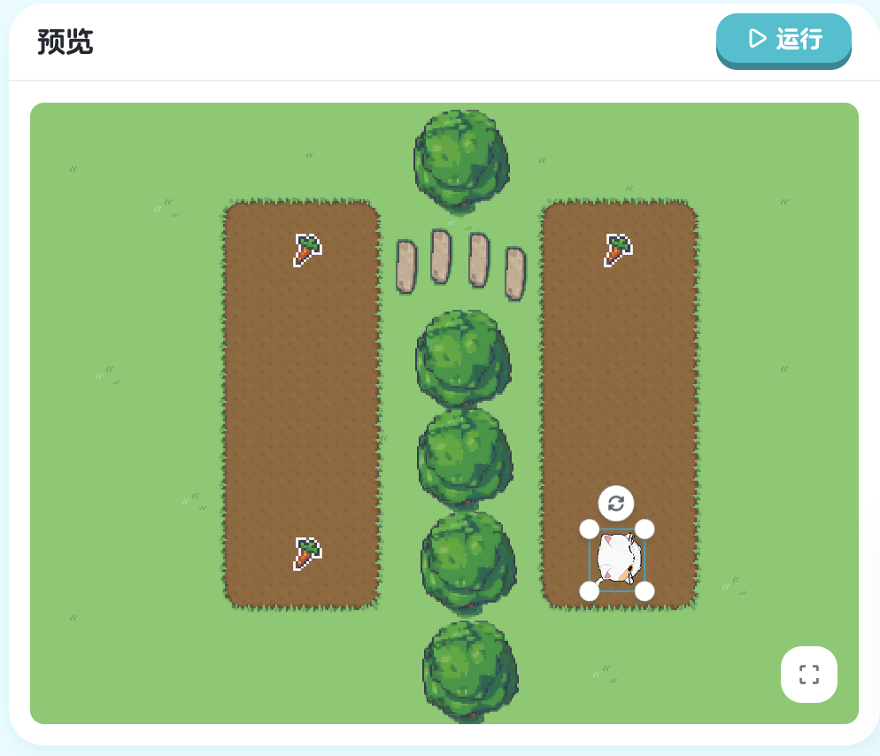

## 第六章：数组 - 管理多个对象

在前面的学习中，我们使用变量来存储单个数据：

```xgo
var score = 100        // 存储一个分数
var distance = 50      // 存储一个距离
var name = "Kiko"      // 存储一个名字
```

但是，如果要存储**多个**相关的数据怎么办？比如：
- 游戏中有 10 个萝卜，如何记录它们？
- 有 5 个敌人，如何管理它们？
- 有 3 个萝卜，如何依次访问它们？

如果用普通变量，需要这样写：

```xgo
var radish1 = "萝卜"
var radish2 = "萝卜2"
var radish3 = "萝卜3"
// 如果有 100 个萝卜呢？太麻烦了！
```

有没有更好的方法？答案是：**数组**（Array）！

数组就像一个**有编号的盒子**，可以存储多个相同类型的数据。想象一下：
- 普通变量：一个盒子装一个东西
- 数组：一排盒子，每个盒子有编号（0、1、2...），可以装很多东西

### 6.1 通过索引访问元素

#### 学习目标

这一节，我们将学习数组的基础：
- 如何创建数组
- 如何通过索引访问数组中的元素
- 理解"索引从 0 开始"的规则
- 在实际游戏中使用数组

#### 新的挑战：选择性收集萝卜

看看这次的场景，游戏中有三个萝卜：
- 萝卜（已成熟，可以采摘）
- 萝卜2（未成熟，不能采摘）
- 萝卜3（已成熟，可以采摘）

我们需要让 Kiko：
1. 只采摘成熟的萝卜（萝卜 和 萝卜3）
2. 跳过未成熟的萝卜（萝卜2）

如果一个一个写，代码会很长。但用数组，我们可以把所有萝卜放在一起管理，然后选择性地访问！


> 课程地址：https://x.qiniu.com/editor/curator/Coding-Course-30-3/sprites/Kiko/code

**完整代码：**
```xgo
onStart => {
    var radishs = ["萝卜", "萝卜2", "萝卜3"]
    
    turnTo radishs[0]
    stepTo radishs[0]

    turnTo radishs[2]
    stepTo radishs[2]
}
```

#### 代码详解

**创建数组**

```xgo
var radishs = ["萝卜", "萝卜2", "萝卜3"]
```

这行代码创建了一个数组：
- `var radishs`：定义一个名为 `radishs` 的变量
- `=`：赋值
- `["萝卜", "萝卜2", "萝卜3"]`：数组字面量

**数组字面量的语法**：

```xgo
[元素1, 元素2, 元素3, ...]
```

- 用**方括号** `[]` 包围
- 元素之间用**逗号** `,` 分隔
- 元素可以是任何类型（这里是字符串）

**数组的结构**

我们创建的数组可以这样理解：

```
索引：    0        1         2
       ┌────────┬─────────┬─────────┐
值：   │ "萝卜" │ "萝卜2" │ "萝卜3" │
       └────────┴─────────┴─────────┘
```

- **索引**（Index）：每个元素的编号
- **值**（Value）：存储的实际数据
- **重要**：索引从 **0** 开始，不是从 1！

**为什么索引从 0 开始？**

这是编程中的惯例：
- 第 1 个元素的索引是 0
- 第 2 个元素的索引是 1
- 第 3 个元素的索引是 2
- 以此类推...

记忆技巧：**索引 = 位置 - 1**

**访问数组元素**

```xgo
radishs[0]  // 访问第 1 个元素："萝卜"
```

语法：`数组名[索引]`

- `radishs`：数组名
- `[0]`：索引，用方括号包围
- 返回：该索引位置的元素值

**完整访问示例**：

```xgo
var radishs = ["萝卜", "萝卜2", "萝卜3"]

radishs[0]  // 返回 "萝卜"（第1个）
radishs[1]  // 返回 "萝卜2"（第2个）
radishs[2]  // 返回 "萝卜3"（第3个）
```

**在命令中使用数组元素**

数组元素可以像普通变量一样使用：

```xgo
// 访问第1个元素（索引0）
turnTo radishs[0]  // 转向"萝卜"
stepTo radishs[0]  // 走向"萝卜"

// 访问第3个元素（索引2）
turnTo radishs[2]  // 转向"萝卜3"
stepTo radishs[2]  // 走向"萝卜3"
```

**为什么跳过索引 1？**

```xgo
radishs[1]  // 这是"萝卜2"，未成熟，不能采摘
```

我们故意不访问索引 1，因为萝卜2 还没成熟！这就是数组的灵活性：可以选择性地访问特定元素。

#### 数组的基本操作

**1. 创建数组**

```xgo
// 字符串数组
var names = ["Kiko", "Bob", "Alice"]

// 数字数组
var scores = [100, 85, 92, 78]

// 对象名数组
var objects = ["萝卜", "萝卜", "星星"]

// 空数组
var empty = []
```

**2. 访问元素**

```xgo
var fruits = ["苹果", "香蕉", "橙子"]

var first = fruits[0]   // "苹果"
var second = fruits[1]  // "香蕉"
var third = fruits[2]   // "橙子"
```

**3. 使用元素**

```xgo
var targets = ["目标1", "目标2", "目标3"]

// 直接使用
turnTo targets[0]

// 先存入变量
var firstTarget = targets[0]
turnTo firstTarget
```

**4. 数组长度**

虽然我们还没详细学习，但可以预览：

```xgo
var radishs = ["萝卜", "萝卜2", "萝卜3"]
// radishs 的长度是 3（有3个元素）
```

#### 索引的规则

**有效索引**

对于长度为 n 的数组，有效索引是 **0 到 n-1**：

```xgo
var items = ["A", "B", "C", "D", "E"]
// 长度：5
// 有效索引：0, 1, 2, 3, 4

items[0]  // ✓ 有效："A"
items[4]  // ✓ 有效："E"
items[5]  // ✗ 错误：超出范围！
```

**索引对照表**

| 位置 | 索引 | 元素 |
|------|------|------|
| 第1个 | 0 | "萝卜" |
| 第2个 | 1 | "萝卜2" |
| 第3个 | 2 | "萝卜3" |

记住：**位置 = 索引 + 1**

**数组 vs 变量**

| 特性 | 普通变量 | 数组 |
|------|---------|------|
| 存储 | 单个值 | 多个值 |
| 访问 | 直接用变量名 | 用索引 |
| 示例 | `var x = 5` | `var arr = [1, 2, 3]` |

**索引的数学意义**

索引从 0 开始有数学原因：
- 索引表示"偏移量"（从起始位置偏移多少）
- 第1个元素偏移 0（不偏移）
- 第2个元素偏移 1（偏移1个位置）

#### 本节重点

| 概念 | 说明 | 示例 |
|------|------|------|
| 数组 | 存储多个元素的数据结构 | `["萝卜", "萝卜2", "萝卜3"]` |
| 数组字面量 | 创建数组的语法 | `[元素1, 元素2, ...]` |
| 索引 | 元素的编号（从0开始） | `0, 1, 2, ...` |
| 访问元素 | 通过索引获取元素 | `arr[0]` |
| 方括号 | 用于创建和访问数组 | `[]` |

#### 恭喜你！

你现在已经掌握了：
- 创建数组存储多个元素
- 理解索引从 0 开始的规则
- 通过索引访问数组元素
- 在游戏中使用数组管理对象
- 选择性地访问数组中的元素

数组让你能够高效管理多个相关数据！

---

**下一节预告**：我们已经学会了通过索引访问数组元素，但如果要访问数组中的**所有**元素怎么办？一个一个写 `arr[0]`, `arr[1]`, `arr[2]`... 太麻烦了！下一节将学习**遍历数组**，用循环自动访问数组中的每一个元素！

### 6.2 遍历数组

#### 学习目标

在上一节中，我们学会了通过索引访问数组元素：

```xgo
radishs[0]  // 访问第1个
radishs[1]  // 访问第2个
radishs[2]  // 访问第3个
```

但是，如果数组有 10 个元素，甚至 100 个元素，难道要写 100 行代码吗？

```xgo
radishs[0]
radishs[1]
radishs[2]
// ... 写到手酸！
radishs[99]
```

当然不用！编程中有一个强大的工具：**遍历**（Traverse）。遍历可以自动访问数组中的每一个元素，无论数组有多少个元素！

这一节，我们将学习 `for...in` 循环，它是专门用来遍历数组的。

#### 新的挑战：收集所有萝卜

看看这次的场景，游戏中有三个萝卜：萝卜1、萝卜2、萝卜3。我们要让 Kiko 依次收集所有的萝卜。

如果用索引访问：

```xgo
turnTo radishs[0]
stepTo radishs[0]
turnTo radishs[1]
stepTo radishs[1]
turnTo radishs[2]
stepTo radishs[2]
```

6 行代码，而且如果有更多萝卜，代码会更长！

用 `for...in` 循环，只需要 4 行代码，无论有多少个萝卜！


> 课程地址：https://x.qiniu.com/editor/curator/Coding-Course-18/sprites/Kiko/code

**完整代码：**
```xgo
onStart => {
    for v in ["萝卜1", "萝卜2", "萝卜3"] {
        turnTo v
        stepTo v
    }
}
```

#### 代码详解

**认识 for...in 循环**

```xgo
for v in ["萝卜1", "萝卜2", "萝卜3"] {
    turnTo v
    stepTo v
}
```

这是一个**遍历循环**，让我们拆解它的语法：

**完整语法**：
```xgo
for 变量名 in 数组 {
    循环体
}
```

**各部分说明**：

| 部分 | 名称 | 作用 | 示例中的值 |
|------|------|------|-----------|
| `for` | 关键字 | 表示"对于每一个" | `for` |
| `v` | 循环变量 | 存储当前元素 | `v` |
| `in` | 关键字 | 表示"在...中" | `in` |
| `[...]` | 数组 | 要遍历的数组 | `["萝卜1", "萝卜2", "萝卜3"]` |
| `{}` | 循环体 | 对每个元素执行的代码 | `turnTo v; stepTo v` |

**注意**：`for...in` 循环不使用 `=> {}`，而是直接用 `{}`！

**循环变量 v**

`v` 是一个特殊的变量：
- 它会在每次循环中自动被赋值
- 第1次循环：`v = "萝卜1"`
- 第2次循环：`v = "萝卜2"`
- 第3次循环：`v = "萝卜3"`
- 你可以给它起任何名字（`v`, `item`, `radish` 等）

**执行流程详解**

让我们看看这段代码是如何一步步执行的：

```xgo
for v in ["萝卜1", "萝卜2", "萝卜3"] {
    turnTo v
    stepTo v
}
```

**第 1 次循环**：
1. `v` 被赋值为 `"萝卜1"`（数组的第1个元素）
2. 执行 `turnTo v`，即 `turnTo "萝卜1"`
3. 执行 `stepTo v`，即 `stepTo "萝卜1"`
4. Kiko 走到萝卜1

**第 2 次循环**：
1. `v` 被赋值为 `"萝卜2"`（数组的第2个元素）
2. 执行 `turnTo v`，即 `turnTo "萝卜2"`
3. 执行 `stepTo v`，即 `stepTo "萝卜2"`
4. Kiko 走到萝卜2

**第 3 次循环**：
1. `v` 被赋值为 `"萝卜3"`（数组的第3个元素）
2. 执行 `turnTo v`，即 `turnTo "萝卜3"`
3. 执行 `stepTo v`，即 `stepTo "萝卜3"`
4. Kiko 走到萝卜3

**循环结束**：数组中的所有元素都访问完了。

**循环变量的变化**

```
开始循环
  ↓
v = "萝卜1" → 执行循环体 → Kiko走到萝卜1
  ↓
v = "萝卜2" → 执行循环体 → Kiko走到萝卜2
  ↓
v = "萝卜3" → 执行循环体 → Kiko走到萝卜3
  ↓
循环结束
```

#### 循环变量的命名

`v` 是循环变量，你可以给它起任何名字：

**常见命名**：

```xgo
// 使用 v（value 的缩写）
for v in radishs {
    turnTo v
}

// 使用 item（项）
for item in radishs {
    turnTo item
}

// 使用具体名称
for radish in radishs {
    turnTo radish
}

// 使用 r（radish 的缩写）
for r in radishs {
    turnTo r
}
```

**命名建议**：
- 单个字母（`v`, `i`, `x`）：简短但不够清晰
- 缩写（`r`, `rad`）：较简短，稍清晰
- 完整单词（`radish`, `item`）：清晰但较长

选择取决于代码复杂度和个人偏好。

#### 本节重点

| 概念 | 说明 | 示例 |
|------|------|------|
| 遍历 | 访问数组中的每个元素 | `for v in arr {}` |
| `for...in` | 遍历数组的循环语法 | `for v in [1,2,3] {}` |
| 循环变量 | 存储当前遍历到的元素 | `v` |
| 自动迭代 | 自动移动到下一个元素 | 无需手动控制索引 |
| 直接用 `{}` | 不使用 `=> {}` | 注意语法差异 |

#### for...in 的语法要点

**正确的写法**

```xgo
// ✓ 正确：标准语法
for v in ["A", "B", "C"] {
    turnTo v
}

// ✓ 正确：遍历变量
var items = ["A", "B", "C"]
for v in items {
    turnTo v
}

// ✓ 正确：有意义的变量名
for item in items {
    turnTo item
}
```

**错误的写法**

```xgo
// ✗ 错误：使用了 => {}
for v in ["A", "B", "C"], => {
    turnTo v
}

// ✗ 错误：缺少 in 关键字
for v ["A", "B", "C"] {
    turnTo v
}

// ✗ 错误：缺少循环变量
for in ["A", "B", "C"] {
    turnTo v  // v 未定义
}

// ✗ 错误：缺少大括号
for v in ["A", "B", "C"]
    turnTo v
```

#### 编程小知识

**什么是"迭代"？**

遍历也叫**迭代**（Iteration）：
- 每次循环是一次迭代
- 迭代器自动移动到下一个元素
- 不需要手动管理索引

**for...in vs 手动索引**

**手动索引方式**：
```xgo
var arr = ["A", "B", "C"]
var i = 0

repeat 3, => {
    turnTo arr[i]
    i = i + 1  // 手动增加索引
}
```

**for...in 方式**：
```xgo
for v in ["A", "B", "C"] {
    turnTo v  // 自动处理索引
}
```

`for...in` 自动处理所有索引管理，更简单！

**遍历是一种模式**

遍历是编程中的常见模式：
- 处理列表中的每一项
- 对集合中的每个元素执行相同操作
- 在很多编程语言中都有类似的语法

#### 本节重点总结

| 概念 | 说明 | 示例 |
|------|------|------|
| `for...in` | 遍历数组的循环 | `for v in arr {}` |
| 循环变量 | 自动存储当前元素 | `v` |
| 自动迭代 | 自动访问每个元素 | 无需手动索引 |
| 语法特点 | 直接用 `{}`，不用 `=> {}` | `for v in arr {}` |
| 适用场景 | 需要处理数组所有元素时 | 收集所有物品 |

#### 恭喜你！

你已经完成了第六章的所有内容！现在你掌握了：
- 创建和使用数组
- 通过索引访问特定元素
- 使用 `for...in` 遍历数组
- 理解循环变量的工作方式
- 在实际游戏中应用数组

数组是管理多个数据的强大工具，你已经完全掌握了它！

#### 6.2.1 练习：遍历数组1

练习遍历数组的使用：

> 课程地址：https://x.qiniu.com/editor/curator/Coding-Course-17/sprites/Kiko/code

**练习内容：**
掌握如何使用 `for...in` 循环遍历数组中的所有元素。

#### 6.2.2 练习：遍历数组2

进阶遍历数组练习：

> 课程地址：https://x.qiniu.com/editor/curator/Coding-Course-30/sprites/Kiko/code

**练习内容：**
在更复杂的场景中运用数组遍历技巧。
