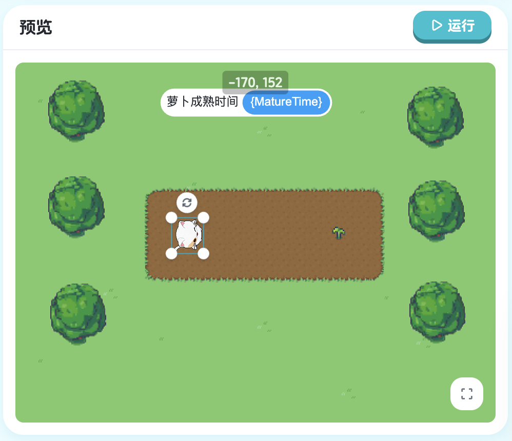
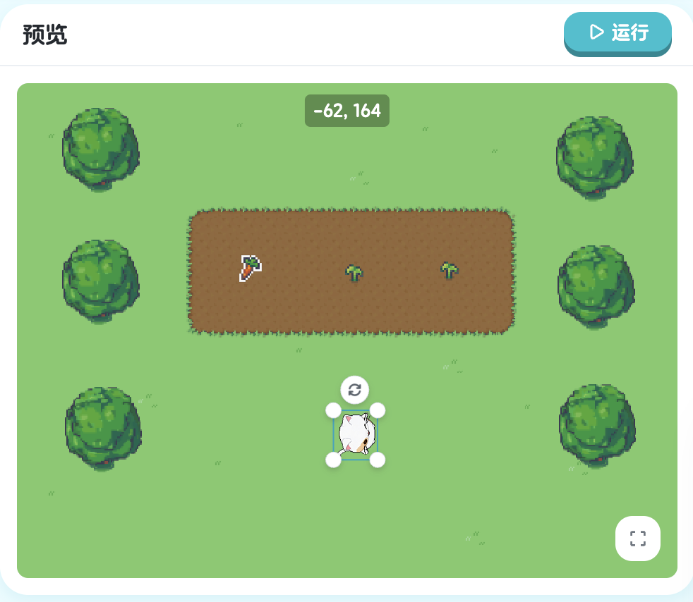
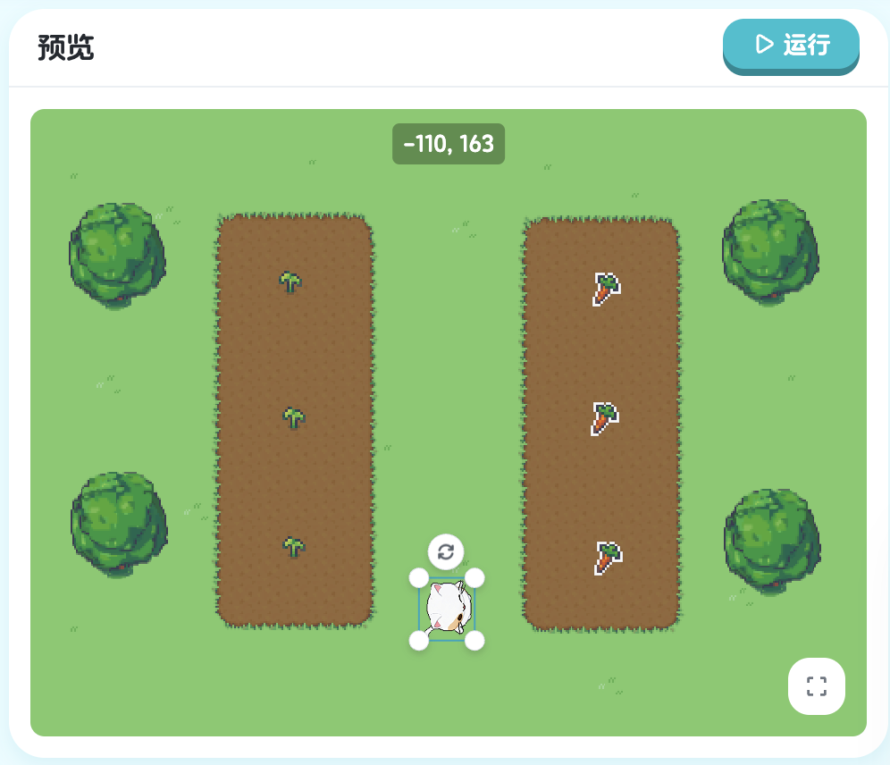

## 第七章：条件 - 根据情况做决定

条件语句让程序可以根据不同情况执行不同的代码。

### 7.1 简单条件


> 课程地址：https://x.qiniu.com/editor/curator/Coding-Course-31/sprites/Kiko/code

```xgo
onStart => {
    if 萝卜1.IsMature() {
        turnTo 萝卜1
        stepTo 萝卜1
    }
}
```

**命令解释：**
- `if 萝卜1.IsMature()`: 条件语句，如果"萝卜1"对象已经成熟则执行花括号内的代码
- `萝卜1.IsMature()`: 函数调用，检查"萝卜1"对象是否成熟，返回布尔值
- `turnTo 萝卜1`: 让精灵转向"萝卜1"对象
- `stepTo 萝卜1`: 让精灵移动到"萝卜1"对象位置
 
### 7.2 条件与循环结合


> 课程地址：https://x.qiniu.com/editor/curator/Coding-Course-32/sprites/Kiko/code

```xgo
onStart => {
    var radishs []Radish = [萝卜1, 萝卜2, 萝卜3]
    for v in radishs {
        if v.IsMature() {
            turnTo v
            stepTo v
        }
    }
}
```

**命令解释：**
- `var radishs []Radish = [萝卜1, 萝卜2, 萝卜3]`: 定义一个Radish类型的数组，包含三个萝卜对象
- `for v in radishs`: 遍历数组中的每个萝卜对象，每次将对象赋值给变量v
- `if v.IsMature()`: 条件语句，如果当前萝卜对象已经成熟则执行花括号内的代码
- `v.IsMature()`: 函数调用，检查当前萝卜对象是否成熟
- `turnTo v`: 让精灵转向当前萝卜对象
- `stepTo v`: 让精灵移动到当前萝卜对象位置

#### 7.2.1 练习：条件与循环结合1

练习条件语句与循环的组合使用：

> 课程地址：https://x.qiniu.com/editor/curator/Coding-Course-33/sprites/Kiko/code

**练习内容：**
掌握在循环中使用条件判断控制程序流程。

#### 7.2.2 练习：条件与循环结合2

进阶条件与循环结合练习：

> 课程地址：https://x.qiniu.com/editor/curator/Coding-Course-34/sprites/Kiko/code

**练习内容：**
在更复杂的场景中运用条件与循环结合的技巧。

### 7.3 复杂条件处理


> 课程地址：https://x.qiniu.com/editor/curator/Coding-Course-35/sprites/Kiko/code

```xgo
onStart => {
    var radishs []Radish = [萝卜1, 萝卜2, 萝卜3]
    for v in radishs {
        if v.IsMature() {
            turnTo v
            stepTo v
        } else {
            turnTo v
            step distanceTo(v)-20
            v.Water()
            animateAndWait "浇花"
        }
    }

    for v in radishs {
        waitUntil v.IsMature()
        turnTo v
        stepTo v
    }
}
```

**命令解释：**
- `var radishs []Radish = [萝卜1, 萝卜2, 萝卜3]`: 定义一个Radish类型的数组
- `for v in radishs`: 遍历数组中的每个萝卜对象
- `if v.IsMature()`: 如果萝卜成熟了
- `else`: 否则（如果萝卜没有成熟）
- `turnTo v`: 让精灵转向萝卜对象
- `step distanceTo(v)-20`: 让精灵前进到距离萝卜20步的位置
- `distanceTo(v)`: 函数，计算精灵到萝卜对象的距离
- `v.Water()`: 调用萝卜对象的浇水方法
- `animateAndWait "浇花"`: 播放"浇花"动画并等待动画完成
- `waitUntil v.IsMature()`: 等待直到萝卜对象成熟
- `stepTo v`: 让精灵移动到萝卜对象位置

#### 7.3.1 练习：复杂条件处理

练习复杂条件处理的综合应用：

> 课程地址：https://x.qiniu.com/editor/curator/Coding-Course-36/sprites/Kiko/code

**练习内容：**
掌握复杂条件判断和多层嵌套逻辑的处理技巧。
