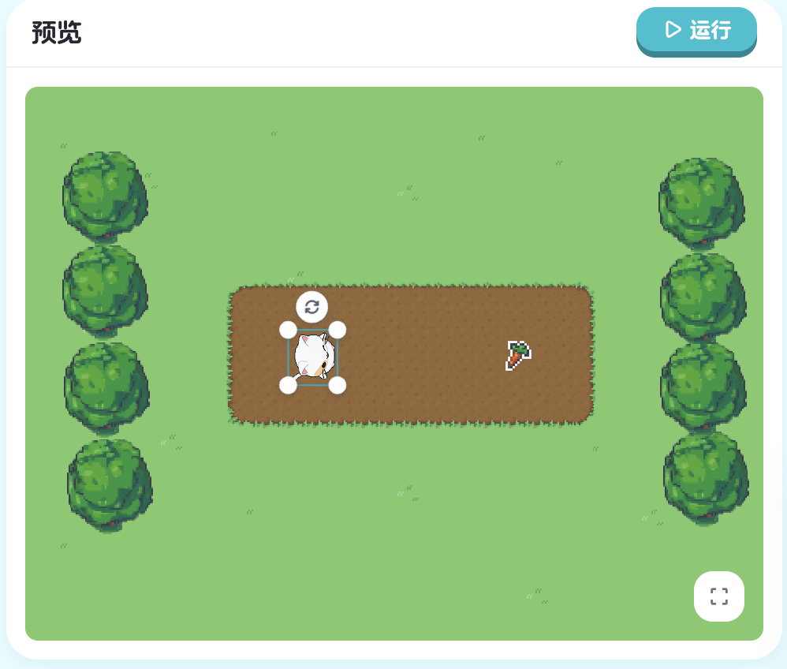
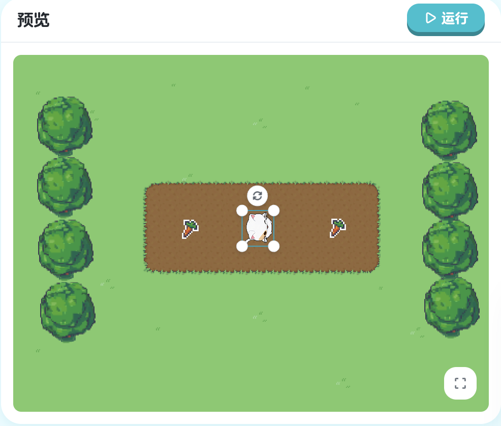
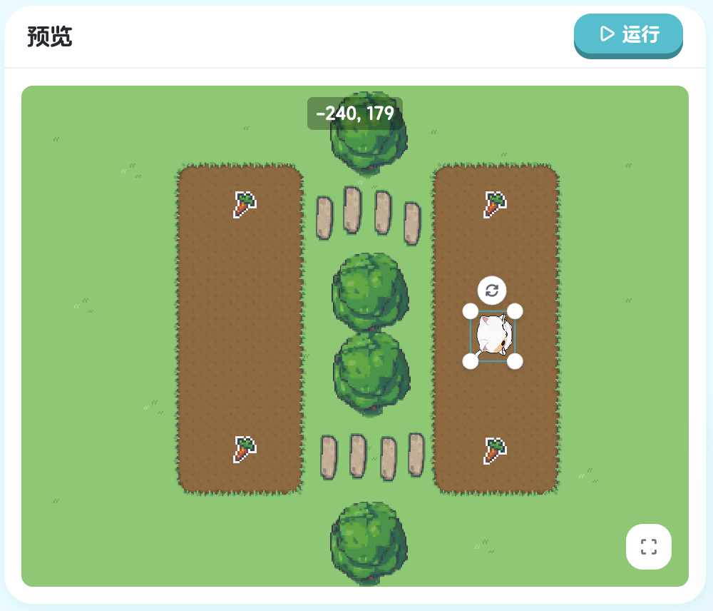
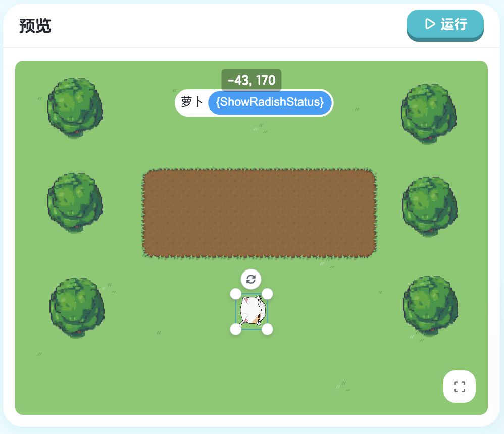

## 第八章：事件 - 响应用户操作

到目前为止，我们的程序都是在游戏开始时（`onStart`）自动执行的：

```xgo
onStart => {
    step 100
    turn Right
    step 50
}
```

这种程序的特点：
- 游戏一开始就自动运行
- 玩家只能看，不能控制
- 像看动画，不像玩游戏

但真正的游戏需要**玩家参与**！玩家应该能够：
- 按键盘控制角色移动
- 点击鼠标发射子弹
- 触摸屏幕让角色跳跃

这种"玩家操作，游戏响应"的机制，就是**事件**（Event）！

**什么是事件？**

**事件**是指"发生的事情"：
- 玩家按下键盘（onKey） → 键盘事件
- 玩家点击鼠标 (onClick) → 鼠标事件
- 两个对象碰撞 (onTouchStart) → 碰撞事件
- 当收到某个消息 (onMsg) → 消息事件

当事件发生时，我们可以执行相应的代码来**响应**这个事件。这就是**事件驱动编程**（Event-Driven Programming）。

### 8.1 键盘事件

#### 学习目标

这一节，我们将学习最常用的事件：**键盘事件**。你将学会：
- 如何监听键盘按键
- 如何响应按键操作
- 让玩家用键盘控制角色

掌握键盘事件后，你就能创建真正可玩的游戏了！

#### 新的挑战：用键盘控制移动

看看这次的场景，我们要让玩家用键盘控制 Kiko：
- 按下**右箭头键**，Kiko 向前走
- 不按键，Kiko 不动

这就是游戏的基本交互！玩家通过按键来控制角色，而不是看角色自动移动。


> 课程地址：https://x.qiniu.com/editor/curator/Coding-Course-41/sprites/Kiko/code

**完整代码：**
```xgo
onKey KeyRight, => {
    step 10
}
```

#### 代码详解

**认识 onKey 事件处理器**

```xgo
onKey KeyRight, => {
    step 10
}
```

这是一个**事件处理器**（Event Handler）：
- `onKey`：监听键盘事件
- `KeyRight`：具体的按键（右箭头键）
- `, =>`：语法符号（注意有逗号）
- `{}`：事件发生时执行的代码

**完整语法**：
```xgo
onKey 按键名称, => {
    响应代码
}
```

**onKey 的工作原理**

`onKey` 会一直"监听"键盘：

```
游戏运行中...
  ↓
监听键盘 → 有按键吗？
  ├─ 否 → 继续监听
  │       ↓
  │     监听键盘 → 有按键吗？
  │       ├─ 否 → 继续监听
  │       └─ 是 → 是 KeyRight 吗？
  │               ├─ 是 → 执行 step 10
  │               └─ 否 → 继续监听
  └─ 是 → 是 KeyRight 吗？
          ├─ 是 → 执行 step 10
          └─ 否 → 继续监听
```

**KeyRight 键码常量**

`KeyRight` 是一个**键码常量**（Key Code Constant）：
- 代表键盘上的"右箭头键"
- 首字母必须大写
- 是 XGo 预定义的特殊值

**常用的键码常量**：

| 键码常量 | 对应按键 | 说明 |
|---------|---------|------|
| `KeyUp` | ↑ | 上箭头键 |
| `KeyDown` | ↓ | 下箭头键 |
| `KeyLeft` | ← | 左箭头键 |
| `KeyRight` | → | 右箭头键 |
| `KeySpace` | 空格 | 空格键 |
| `KeyEnter` | 回车 | 回车键 |
| `KeyA` - `KeyZ` | A-Z | 字母键 |
| `Key0` - `Key9` | 0-9 | 数字键 |

#### 执行流程

**游戏开始**：
```
1. 程序启动
2. onKey 开始监听键盘
3. 等待玩家按键...
```

**玩家按下右箭头键**：
```
1. onKey 检测到 KeyRight 被按下
2. 执行事件处理器中的代码
3. 执行 step 10
4. Kiko 向前走 10 步
5. 继续监听...
```

**玩家再次按下右箭头键**：
```
1. onKey 再次检测到 KeyRight
2. 再次执行 step 10
3. Kiko 再向前走 10 步
4. 继续监听...
```

**玩家按下其他键（比如左箭头）**：
```
1. onKey 检测到按键
2. 但不是 KeyRight
3. 不执行代码
4. 继续监听...
```

**关键特性**：
- `onKey` 可以**多次触发**
- 每次按键都会执行一次
- 按多少次，执行多少次

#### onKey vs onStart

让我们对比这两种事件处理器：

**onStart（自动执行）：**
```xgo
onStart => {
    step 100
}
```
- 游戏开始时自动执行
- **只执行一次**
- 不需要玩家操作
- 用于初始化

**onKey（响应按键）：**
```xgo
onKey KeyRight, => {
    step 10
}
```
- 等待玩家按键
- **可以执行多次**
- 需要玩家操作
- 用于交互控制

#### 为什么每次只走 10 步？

你可能注意到，我们用 `step 10` 而不是 `step 100`。为什么？

**如果用 step 100**：
```xgo
onKey KeyRight, => {
    step 100  // 每次按键走很远
}
```
- 按一次键，走 100 步
- 控制不精确
- 可能走过头

**使用 step 10**：
```xgo
onKey KeyRight, => {
    step 10  // 每次按键走一小段
}
```
- 按一次键，走 10 步
- 控制精确
- 可以通过多次按键精确控制位置

**连续按键的效果**：
```
按1次 → 走10步
按2次 → 走20步
按3次 → 走30步
按10次 → 走100步
```

这给了玩家**精确控制**的能力！

#### 多个键盘事件

可以同时监听多个按键：

```xgo
// 监听右箭头
onKey KeyRight, => {
    step 10
}

// 监听左箭头
onKey KeyLeft, => {
    step -10
}

// 监听上箭头
onKey KeyUp, => {
    turn Up
    step 10
}

// 监听下箭头
onKey KeyDown, => {
    turn Down
    step 10
}
```

这样，玩家就可以用四个箭头键控制角色向四个方向移动！

#### 本节重点

| 概念 | 说明 | 示例 |
|------|------|------|
| 事件 | 发生的事情 | 按键、点击、碰撞 |
| `onKey` | 键盘事件处理器 | `onKey KeyRight, => {}` |
| 键码常量 | 代表具体按键 | `KeyRight`, `KeySpace` |
| 事件驱动 | 等待并响应事件 | 按键才执行 |
| 回调函数 | 事件发生时被调用的函数 | `=> { step 10 }` |
| 可重复触发 | 事件可以多次发生 | 按多次键 |

#### 恭喜你！

你现在已经掌握了：
- 使用 `onKey` 监听键盘事件
- 理解键码常量
- 让玩家控制角色移动
- 理解事件驱动编程的概念
- 创建可交互的游戏

你的游戏开始变得可玩了！

---

**下一节预告**：我们已经学会了响应单个按键，但如果要实现完整的方向控制呢？玩家需要能够控制角色向上、下、左、右四个方向移动。下一节将学习如何实现**完整的方向控制系统**！

### 8.2 方向控制

#### 学习目标

在上一节中，我们学会了响应单个按键让 Kiko 向前移动。但在真实的游戏中，角色需要能够**改变方向**并移动到不同的地方。

这一节，我们将学习如何让玩家控制角色的**左右移动**。你将学会：
- 使用 `setHeading` 设置角色朝向
- 实现左右双向控制
- 让玩家自由控制角色移动方向

#### 新的挑战：收集两边的萝卜

看看这次的场景，Kiko 的前面和后面各有一个萝卜：
- **右边**有一个萝卜
- **左边**有一个萝卜

我们需要让玩家能够：
1. 按**右箭头键**：Kiko 转向右边并前进，收集右边的萝卜
2. 按**左箭头键**：Kiko 转向左边并前进，收集左边的萝卜

这样玩家就能自由选择先收集哪个萝卜！


> 课程地址：https://x.qiniu.com/editor/curator/Coding-Course-42/sprites/Kiko/code

#### 分步教学

**步骤 1：实现右键控制**

首先，我们来实现向右移动的功能：

**当前代码：**
```xgo
onKey KeyRight, => {
    setHeading Right
    step 20
}

// 补充朝左的代码
```

**运行并测试**：
- 点击运行
- 按下右箭头键
- 观察 Kiko 是否转向右边并前进
- 检查是否能收集到右边的萝卜

**步骤 2：添加左键控制**

确认右键功能正常后，添加左键控制：

**完整代码：**
```xgo
onKey KeyRight, => {
    setHeading Right
    step 20
}

onKey KeyLeft, => {
    setHeading Left
    step 20
}
```

**运行并测试**：
- 点击运行
- 先按右箭头键，收集右边的萝卜
- 再按左箭头键，收集左边的萝卜
- 检查两个萝卜是否都能收集到

#### 代码详解

**右键事件处理器**

```xgo
onKey KeyRight, => {
    setHeading Right  // 第1步：设置朝向为右
    step 20           // 第2步：向右走20步
}
```

**工作流程**：
1. 玩家按下右箭头键
2. 触发 `onKey KeyRight` 事件
3. 执行 `setHeading Right`：Kiko 转向右边
4. 执行 `step 20`：Kiko 向右走 20 步
5. 如果右边有萝卜，就会收集到

**左键事件处理器**

```xgo
onKey KeyLeft, => {
    setHeading Left   // 第1步：设置朝向为左
    step 20           // 第2步：向左走20步
}
```

**工作流程**：
1. 玩家按下左箭头键
2. 触发 `onKey KeyLeft` 事件
3. 执行 `setHeading Left`：Kiko 转向左边
4. 执行 `step 20`：Kiko 向左走 20 步
5. 如果左边有萝卜，就会收集到

#### 认识 setHeading 命令

**什么是 setHeading？**

`setHeading` 是"设置朝向"命令：
- `set`：设置
- `Heading`：朝向、方向
- 作用：直接把角色的朝向设置为指定方向

**语法**：
```xgo
setHeading 方向常量
```

**可用的方向常量**：
- `Up`：向上
- `Down`：向下
- `Left`：向左
- `Right`：向右

**示例**：
```xgo
setHeading Up      // 设置朝向为上
setHeading Right   // 设置朝向为右
setHeading Down    // 设置朝向为下
setHeading Left    // 设置朝向为左
```

#### setHeading vs turn

这是一个重要的区别，让我们详细对比：

**turn（相对转向）：**
```xgo
turn Right  // 在当前朝向基础上，向右转90度
```

**行为**：
- 假设 Kiko 当前朝上
- 执行 `turn Right`
- Kiko 向右转 90 度，现在朝右

- 假设 Kiko 当前朝右
- 执行 `turn Right`
- Kiko 向右转 90 度，现在朝下

**特点**：
- 基于当前朝向
- 相对改变
- 结果不确定（取决于当前朝向）

**setHeading（绝对朝向）：**
```xgo
setHeading Right  // 直接设置朝向为右
```

**行为**：
- 无论 Kiko 当前朝哪里
- 执行 `setHeading Right`
- Kiko 都会朝向右边

**特点**：
- 不管当前朝向
- 绝对设置
- 结果确定（总是朝指定方向）

**对比表格**：

| 场景 | 初始朝向 | `turn Right` 结果 | `setHeading Right` 结果 |
|------|---------|------------------|----------------------|
| 场景1 | 上 (↑) | 右 (→) | 右 (→) |
| 场景2 | 右 (→) | 下 (↓) | 右 (→) |
| 场景3 | 下 (↓) | 左 (←) | 右 (→) |
| 场景4 | 左 (←) | 上 (↑) | 右 (→) |

#### 游戏流程

**完整的游戏体验**：

1. **游戏开始**：
   - Kiko 站在中间
   - 左右各有一个萝卜
   - 等待玩家操作

2. **玩家按右键**：
   - Kiko 转向右边
   - 向右走 20 步
   - 继续按右键，继续向右走
   - 最终收集到右边的萝卜

3. **玩家按左键**：
   - Kiko 转向左边
   - 向左走 20 步
   - 继续按左键，继续向左走
   - 最终收集到左边的萝卜

4. **任务完成**：
   - 两个萝卜都被收集
   - 玩家可以选择收集顺序

#### 本节重点

| 概念 | 说明 | 示例 |
|------|------|------|
| `setHeading` | 设置绝对朝向 | `setHeading Right` |
| 多事件处理 | 监听多个不同按键 | 同时监听左键和右键 |
| 绝对朝向 | 直接设置为指定方向 | 不基于当前朝向 |
| 双向控制 | 左右两个方向 | 基础的方向控制 |
| 分步实现 | 先实现一个，再添加另一个 | 逐步完善功能 |

#### 恭喜你！

你现在已经掌握了：
- 使用 `setHeading` 设置绝对朝向
- 实现左右双向控制
- 理解绝对朝向和相对转向的区别
- 分步实现和测试功能
- 创建可交互的游戏控制

你的游戏已经可以让玩家控制角色左右移动了！

---

**下一节预告**：我们已经实现了左右控制，但完整的方向控制需要**四个方向**：上、下、左、右。下一节将添加上下控制，实现完整的四方向控制系统，让玩家能够自由地在游戏世界中移动！

### 8.3 完整的方向控制

#### 学习目标

在上一节中，我们实现了左右双向控制。但这还不够！在大多数游戏中，角色需要能够**向四个方向移动**：上、下、左、右。

这一节，我们将完成完整的四方向控制系统，并学习一个新技巧：**优化朝向设置**。你将学会：
- 实现上下左右四个方向的控制
- 使用条件判断优化代码
- 创建流畅的移动体验

#### 新的挑战：收集四周的萝卜

看看这次的场景，Kiko 的周围有多个萝卜，分布在不同方向：
- **右边**有萝卜
- **左边**有萝卜
- **上面**有萝卜
- **下面**可能也有萝卜

我们需要让玩家能够：
1. 按**右箭头键**：向右移动
2. 按**左箭头键**：向左移动
3. 按**上箭头键**：向上移动
4. 按**下箭头键**：向下移动

这样玩家就能自由地在游戏世界中移动，收集所有萝卜！


> 课程地址：https://x.qiniu.com/editor/curator/Coding-Course-43/sprites/Kiko/code

#### 分步教学

**步骤 1：回顾左右控制**

我们已经有了左右控制：

**当前代码：**
```xgo
onKey KeyRight, => {
    // 如果当前方向已经是朝右，就不需要再修改了
    if heading != Right {
        setHeading Right
    }
    step 20
}

onKey KeyLeft, => {
    if heading != Left {
        setHeading Left
    }
    step 20
}

// 继续补充`上`,`下` 键盘事件
```

**运行并测试**：
- 测试右键和左键是否正常工作
- 观察朝向优化是否有效

**步骤 2：添加上键控制**

现在添加向上移动的功能：

```xgo
onKey KeyUp, => {
    if heading != Up {
        setHeading Up
    }
    step 20
}
```

**运行并测试**：
- 按上箭头键
- 观察 Kiko 是否向上移动
- 检查能否收集到上方的萝卜

**步骤 3：添加下键控制**

最后添加向下移动的功能：

**完整代码：**
```xgo
onKey KeyRight, => {
    if heading != Right {
        setHeading Right
    }
    step 20
}

onKey KeyLeft, => {
    if heading != Left {
        setHeading Left
    }
    step 20
}

onKey KeyUp, => {
    if heading != Up {
        setHeading Up
    }
    step 20
}

onKey KeyDown, => {
    if heading != Down {
        setHeading Down
    }
    step 20
}
```

**运行并测试**：
- 测试所有四个方向键
- 尝试向各个方向移动
- 检查是否能收集到所有萝卜

#### 代码详解

**新增的上键处理器**

```xgo
onKey KeyUp, => {
    if heading != Up {
        setHeading Up
    }
    step 20
}
```

**工作流程**：
1. 玩家按下上箭头键
2. 检查当前朝向是否已经是向上
3. 如果不是向上，设置朝向为向上
4. 向前走 20 步（现在是向上走）

**新增的下键处理器**

```xgo
onKey KeyDown, => {
    if heading != Down {
        setHeading Down
    }
    step 20
}
```

**工作流程**：
1. 玩家按下下箭头键
2. 检查当前朝向是否已经是向下
3. 如果不是向下，设置朝向为向下
4. 向前走 20 步（现在是向下走）

#### 朝向优化详解

**什么是 heading 属性？**

```xgo
heading
```

`heading` 是 Kiko 的**朝向属性**：
- 存储 Kiko 当前面向的方向
- 可能的值：`Up`, `Down`, `Left`, `Right`
- 这是系统内置属性，所有精灵都有

**为什么要检查朝向？**

注意每个事件处理器中都有这段代码：

```xgo
if heading != Right {
    setHeading Right
}
```

**这段代码的作用**：
- `heading != Right`：判断当前朝向是否**不是**向右
- 如果不是向右：执行 `setHeading Right`（设置为向右）
- 如果已经是向右：跳过设置（不需要重复设置）

**为什么要这样做？**

**没有优化的版本**：
```xgo
onKey KeyRight, => {
    setHeading Right  // 每次都设置
    step 20
}
```

**问题**：
- 如果 Kiko 已经朝右
- 再按右键，还是会执行 `setHeading Right`
- 虽然结果相同，但做了不必要的操作

**优化后的版本**：
```xgo
onKey KeyRight, => {
    if heading != Right {  // 先检查
        setHeading Right   // 只在需要时设置
    }
    step 20
}
```

**优势**：
- 避免不必要的朝向设置
- 代码更高效
- 视觉效果更流畅（不会有重复转向的闪烁）

**对比示例**

假设 Kiko 当前朝向右：

**没有检查**：
```
按右键 → setHeading Right（设置为右，虽然已经是右）→ step 20
按右键 → setHeading Right（再次设置）→ step 20
按右键 → setHeading Right（又设置）→ step 20
```

**有检查**：
```
按右键 → 检查：已经是右 → 跳过设置 → step 20
按右键 → 检查：已经是右 → 跳过设置 → step 20
按右键 → 检查：已经是右 → 跳过设置 → step 20
```

更高效！

#### != 运算符

**什么是 !=？**

`!=` 是**不等于**运算符（Not Equal）：
- 用于比较两个值是否不相等
- 如果不相等，返回 `true`
- 如果相等，返回 `false`

**示例**：

```xgo
heading != Right  // 当前朝向不是向右？

// 如果 heading 是 Up：
// heading != Right → Up != Right → true（不相等）

// 如果 heading 是 Right：
// heading != Right → Right != Right → false（相等）
```

**常用比较运算符**：

| 运算符 | 意思 | 示例 | 说明 |
|--------|------|------|------|
| `==` | 等于 | `heading == Right` | 朝向是否为右 |
| `!=` | 不等于 | `heading != Right` | 朝向是否不是右 |
| `>` | 大于 | `xpos > 100` | x坐标大于100 |
| `<` | 小于 | `xpos < 50` | x坐标小于50 |
| `>=` | 大于等于 | `xpos >= 100` | x坐标大于或等于100 |
| `<=` | 小于等于 | `xpos <= 50` | x坐标小于或等于50 |

#### 完整的四方向控制

**代码结构分析**

四个事件处理器的结构完全相同，只是方向不同：

```xgo
// 模式：
onKey Key方向, => {
    if heading != 方向 {
        setHeading 方向
    }
    step 20
}

// 应用到四个方向：
右：onKey KeyRight, => { if heading != Right { setHeading Right } step 20 }
左：onKey KeyLeft, => { if heading != Left { setHeading Left } step 20 }
上：onKey KeyUp, => { if heading != Up { setHeading Up } step 20 }
下：onKey KeyDown, => { if heading != Down { setHeading Down } step 20 }
```

**对称性**

四个方向的代码是**对称**的：
- 结构相同
- 只有方向常量不同
- 这种对称性让代码容易理解和维护

#### 本节重点

| 概念 | 说明 | 示例 |
|------|------|------|
| 四方向控制 | 上下左右完整控制 | 四个 `onKey` 处理器 |
| `heading` 属性 | 精灵当前朝向 | 系统内置属性 |
| `!=` 运算符 | 不等于比较 | `heading != Right` |
| 朝向优化 | 避免重复设置朝向 | 先检查再设置 |
| 对称代码 | 四个方向结构相同 | 便于理解和维护 |

#### 恭喜你！

你现在已经掌握了：
- 实现完整的四方向控制
- 使用 `heading` 属性检查当前朝向
- 使用 `!=` 运算符进行不等于比较
- 优化代码避免不必要的操作
- 创建流畅的游戏控制体验

你已经拥有了一个完整的游戏控制系统！

---

**下一节预告**：我们已经实现了键盘控制，但游戏还需要另一种重要的交互方式：**鼠标点击**。下一节将学习如何响应鼠标点击事件，让玩家既能用键盘，也能用鼠标来玩游戏！

### 8.4 方向控制和功能键

#### 学习目标

在前面的课程中，我们学会了用方向键控制角色移动。但真正的游戏不仅仅是移动，还需要**执行各种动作**！

这一节，我们将制作一个**迷你农场游戏**，学习如何：
- 结合方向键和功能键
- 使用字母键触发游戏动作
- 实现种植和浇水功能
- 与游戏对象交互
- 创建完整的游戏循环

#### 游戏设定：Kiko 的农场

**游戏目标**：
- 控制 Kiko 在农场中移动
- 找到空地，种植萝卜
- 给萝卜浇水，让它们成熟

**操作方式**：
- **方向键**（↑↓←→）：控制 Kiko 移动
- **Q 键**：种植萝卜
- **W 键**：给萝卜浇水

**游戏流程**：
1. 用方向键移动到空地附近
2. 按 Q 键种植萝卜
3. 用方向键移动到萝卜附近
4. 按 W 键浇水
5. 重复以上步骤，种植更多萝卜


> 课程地址：https://x.qiniu.com/editor/curator/Coding-Course-44/sprites/Kiko/code

#### 分步教学

**步骤 1：确认方向控制**

首先确认四方向控制已经完成：

**当前代码：**
```xgo
onKey KeyRight, => {
    if heading != Right {
        setHeading Right
    }
    step 20
}

onKey KeyLeft, => {
    if heading != Left {
        setHeading Left
    }
    step 20
}

onKey KeyUp, => {
    if heading != Up {
        setHeading Up
    }
    step 20
}

onKey KeyDown, => {
    if heading != Down {
        setHeading Down
    }
    step 20
}

onKey KeyQ, => {
    // 找一个 离Kiko 最近的可以种萝卜的地方
    rad, ok := Farmland.planting(xpos, ypos)
    if ok {
        // 种植萝卜：1. 走到萝卜；2.rad 显示（rad.show）
    }
}

onKey KeyW, => {
    // 找一个离 Kiko 最近的已种植的萝卜
    rad, ok := Farmland.findPlant(xpos, ypos)
    if ok && !rad.IsMature() {
        // 给萝卜浇水：1. 走到萝卜，2. rad.Water() // 萝卜成熟需要时间减少，3. 播放浇水动画
    }
}
```

**测试**：
- 用方向键移动 Kiko
- 确认能够自由移动到农场各处

**步骤 2：实现种植功能**

完成 Q 键的种植功能：

```xgo
onKey KeyQ, => {
    // 找一个 离Kiko 最近的可以种萝卜的地方
    rad, ok := Farmland.planting(xpos, ypos)
    if ok {
        turnTo rad        // 转向种植位置
        step distanceTo(rad)-20  // 走到种植位置
        rad.show          // 显示萝卜
    }
}
```

**测试**：
- 移动到空地附近
- 按 Q 键
- 观察 Kiko 是否走到空地并种下萝卜

**步骤 3：实现浇水功能**

完成 W 键的浇水功能：

**完整代码：**
```xgo
onKey KeyRight, => {
    if heading != Right {
        setHeading Right
    }
    step 20
}

onKey KeyLeft, => {
    if heading != Left {
        setHeading Left
    }
    step 20
}

onKey KeyUp, => {
    if heading != Up {
        setHeading Up
    }
    step 20
}

onKey KeyDown, => {
    if heading != Down {
        setHeading Down
    }
    step 20
}

onKey KeyQ, => {
    // 找一个 离Kiko 最近的可以种萝卜的地方
    rad, ok := Farmland.planting(xpos, ypos)
    if ok {
        turnTo rad
        step distanceTo(rad)-20
        rad.show
    }
}

onKey KeyW, => {
    // 找一个离 Kiko 最近的已种植的萝卜
    rad, ok := Farmland.findPlant(xpos, ypos)
    if ok && !rad.IsMature() {
        turnTo rad
        step distanceTo(rad)-20
        rad.Water()
        animateAndWait "浇水"
    }
}
```

**测试**：
- 移动到已种植的萝卜附近
- 按 W 键
- 观察 Kiko 是否走到萝卜旁边并浇水

#### 代码详解

**种植功能（Q 键）**

```xgo
onKey KeyQ, => {
    // 第1步：查找最近的可种植位置
    rad, ok := Farmland.planting(xpos, ypos)
    
    // 第2步：如果找到了
    if ok {
        turnTo rad                    // 转向种植位置
        step distanceTo(rad)-20       // 走到种植位置（保持20步距离）
        rad.show                      // 显示萝卜
    }
}
```

**工作流程**：

1. **查找种植位置**：
   ```xgo
   rad, ok := Farmland.planting(xpos, ypos)
   ```
   - `Farmland.planting`：农田对象的种植方法
   - `xpos, ypos`：Kiko 当前的位置
   - 返回两个值：
     - `rad`：找到的萝卜对象
     - `ok`：是否找到（true/false）

2. **检查是否找到**：
   ```xgo
   if ok {
   ```
   - 只有找到空地才执行后续操作
   - 如果没找到，什么都不做

3. **转向目标**：
   ```xgo
   turnTo rad
   ```
   - `turnTo`：转向指定对象
   - Kiko 会转向萝卜的位置

4. **走到目标**：
   ```xgo
   step distanceTo(rad)-20
   ```
   - `distanceTo(rad)`：计算到萝卜的距离
   - `-20`：保持 20 步的距离（不要走到萝卜上）
   - Kiko 会走到萝卜附近

5. **显示萝卜**：
   ```xgo
   rad.show
   ```
   - 让萝卜可见
   - 表示种植成功

**浇水功能（W 键）**

```xgo
onKey KeyW, => {
    // 第1步：查找最近的已种植萝卜
    rad, ok := Farmland.findPlant(xpos, ypos)
    
    // 第2步：如果找到了且萝卜未成熟
    if ok && !rad.IsMature() {
        turnTo rad                    // 转向萝卜
        step distanceTo(rad)-20       // 走到萝卜旁边
        rad.Water()                   // 给萝卜浇水
        animateAndWait "浇水"          // 播放浇水动画
    }
}
```

**工作流程**：

1. **查找萝卜**：
   ```xgo
   rad, ok := Farmland.findPlant(xpos, ypos)
   ```
   - `Farmland.findPlant`：查找已种植的萝卜
   - 返回最近的萝卜对象

2. **检查条件**：
   ```xgo
   if ok && !rad.IsMature() {
   ```
   - `ok`：是否找到萝卜
   - `!rad.IsMature()`：萝卜是否未成熟
   - `!` 是"非"运算符，表示"不是"
   - 只有找到未成熟的萝卜才浇水

3. **走到萝卜旁**：
   ```xgo
   turnTo rad
   step distanceTo(rad)-20
   ```
   - 和种植时一样，走到萝卜附近

4. **执行浇水**：
   ```xgo
   rad.Water()
   ```
   - 调用萝卜的浇水方法
   - 萝卜的成熟时间会减少

5. **播放动画**：
   ```xgo
   animateAndWait "浇水"
   animate "默认", true
   ```
   - 先播放浇水动画并等待完成
   - 然后恢复默认动画的循环播放

#### 多值返回

**什么是多值返回？**

注意这行代码：
```xgo
rad, ok := Farmland.planting(xpos, ypos)
```

这个函数返回**两个值**：
- `rad`：萝卜对象
- `ok`：是否成功

**为什么需要两个返回值？**

**只返回一个值的问题**：
```xgo
// 假设只返回萝卜对象
rad := Farmland.planting(xpos, ypos)

// 问题：如果没找到空地，rad 是什么？
// 无法判断是否成功
```

**返回两个值的好处**：
```xgo
rad, ok := Farmland.planting(xpos, ypos)

if ok {
    // ok 是 true，表示找到了
    // rad 是有效的萝卜对象
} else {
    // ok 是 false，表示没找到
    // 不要使用 rad
}
```

**常见的多值返回模式**：

```xgo
// 模式 1：对象 + 是否成功
rad, ok := Farmland.planting(xpos, ypos)
if ok {
    // 使用 rad
}

// 模式 2：值 + 错误
result, err := someFunction()
if err == nil {
    // 使用 result
}
```

#### 逻辑运算符

**&& - 逻辑与（AND）**

```xgo
if ok && !rad.IsMature() {
```

**含义**：
- 两个条件**都要**满足
- `ok` **并且** `!rad.IsMature()`

**真值表**：

| 条件1 | 条件2 | 结果 |
|-------|-------|------|
| true  | true  | true |
| true  | false | false |
| false | true  | false |
| false | false | false |

**示例**：
```xgo
// 找到萝卜 且 萝卜未成熟
if ok && !rad.IsMature() {
    // 两个条件都满足才执行
}

// 示例场景
ok = true, rad.IsMature() = false → !rad.IsMature() = true → true && true = true ✓
ok = true, rad.IsMature() = true  → !rad.IsMature() = false → true && false = false ✗
ok = false, rad.IsMature() = false → !rad.IsMature() = true → false && true = false ✗
```

**! - 逻辑非（NOT）**

```xgo
!rad.IsMature()
```

**含义**：
- 取反，把 true 变成 false，把 false 变成 true
- "不是成熟的"

**示例**：
```xgo
rad.IsMature()     // 是否成熟？
!rad.IsMature()    // 是否不成熟？

// 如果 IsMature() 返回 true（已成熟）
!rad.IsMature() → !true → false

// 如果 IsMature() 返回 false（未成熟）
!rad.IsMature() → !false → true
```

**常见逻辑运算符**：

| 运算符 | 名称 | 示例 | 说明 |
|--------|------|------|------|
| `&&` | 与（AND） | `a && b` | 两个都为真才为真 |
| `\|\|` | 或（OR） | `a \|\| b` | 至少一个为真就为真 |
| `!` | 非（NOT） | `!a` | 取反 |

**组合使用**：
```xgo
// 找到萝卜 且 (未成熟 或 需要浇水)
if ok && (!rad.IsMature() || rad.NeedsWater()) {
    // 复杂的条件判断
}
```

#### 本节重点

| 概念 | 说明 | 示例 |
|------|------|------|
| 功能键 | 除方向键外的游戏操作键 | Q 键种植，W 键浇水 |
| 多值返回 | 函数返回多个值 | `rad, ok := ...` |
| 逻辑运算 | &&（与）、\|\|（或）、!（非） | `ok && !rad.IsMature()` |
| turnTo | 转向指定对象 | `turnTo rad` |
| distanceTo | 计算距离 | `distanceTo(rad)` |
| animateAndWait | 播放动画并等待 | `animateAndWait "浇水"` |
| 对象交互 | 调用对象的方法 | `rad.Water()` |

#### 实用建议

**设计功能键时**：
1. 选择易于操作的按键位置
2. 功能键要有逻辑关联
3. 避免与系统键冲突
4. 考虑玩家的操作习惯

**实现交互功能时**：
1. 先检查条件是否满足
2. 提供清晰的视觉反馈
3. 保持一致的交互距离
4. 添加必要的动画效果

**组织代码时**：
1. 把相关功能放在一起
2. 使用注释分隔不同部分
3. 保持代码风格一致
4. 避免不必要的重复

#### 恭喜你！

你现在已经掌握了：
- 结合方向键和功能键创建完整游戏
- 使用多值返回处理查找结果
- 使用逻辑运算符组合多个条件
- 使用 turnTo 和 distanceTo 实现智能移动
- 使用 animateAndWait 播放动画
- 实现对象之间的交互
- 创建有趣的游戏循环

你已经能够制作一个完整的小游戏了！

---

**下一节预告**：我们已经学会了键盘事件，接下来将学习另一种重要的交互方式：**消息广播**。通过消息系统，不同的游戏对象可以互相通信，创建更复杂的游戏逻辑！

#### 8.4.1 练习：事件章节练习1

练习事件处理的基础应用：

> 课程地址：https://x.qiniu.com/editor/curator/Coding-Course-45/sprites/Kiko/code

**练习内容：**
综合运用键盘事件和方向控制完成交互式游戏任务。

#### 8.4.2 练习：事件章节练习2

进阶事件处理练习：

> 课程地址：https://x.qiniu.com/editor/curator/Coding-Course-46/sprites/Kiko/code

**练习内容：**
掌握复杂事件组合和多种交互方式的实现技巧。
